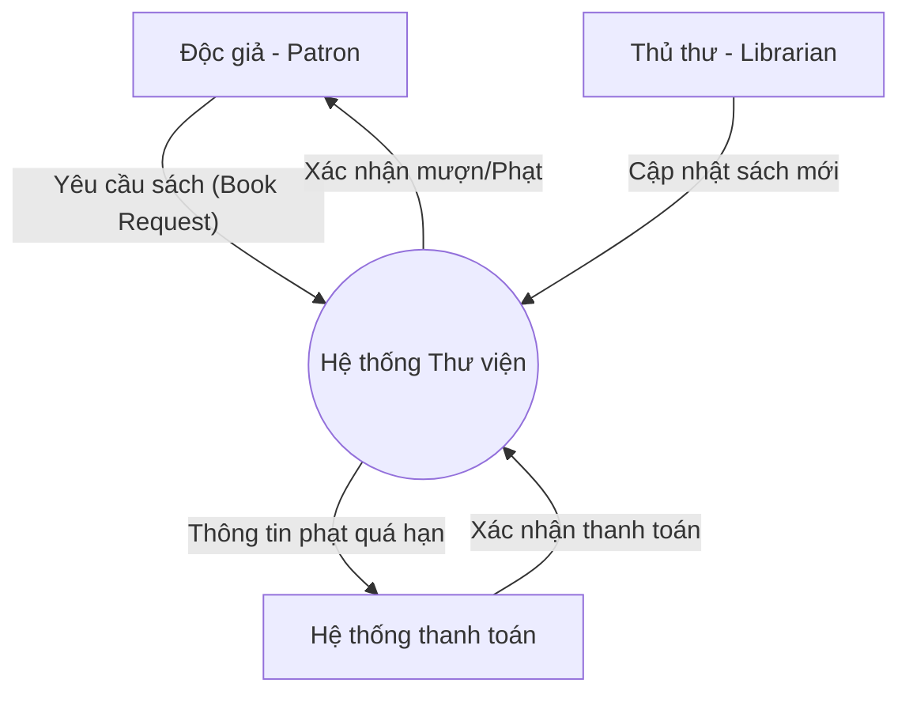
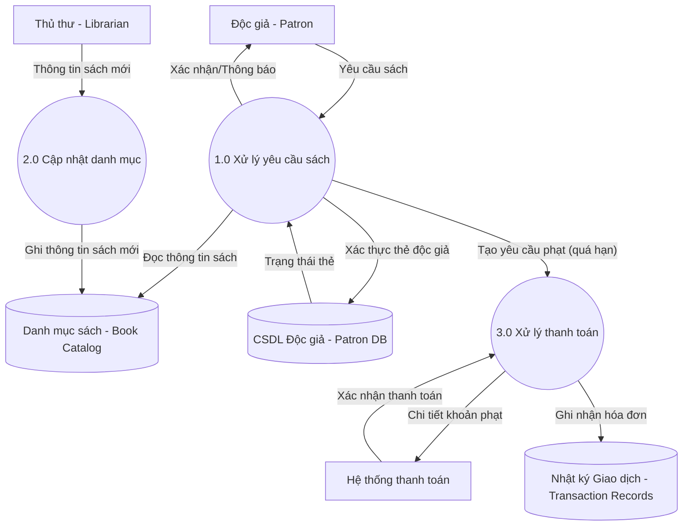
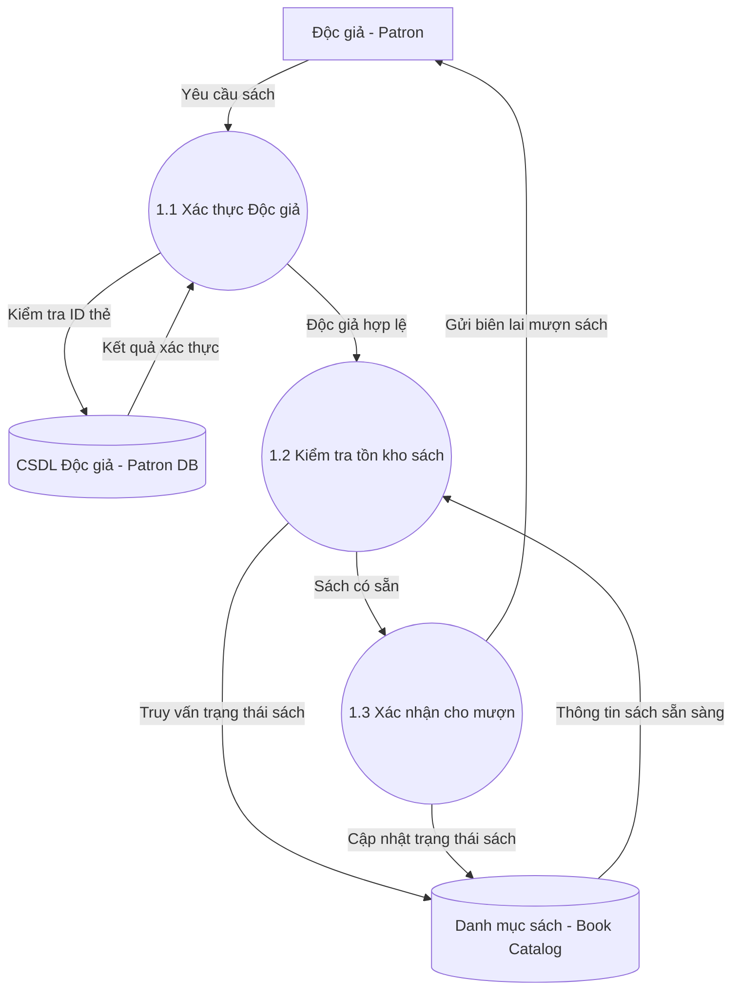

# Hướng dẫn Xây dựng Sơ đồ Luồng Dữ liệu (Constructing DFDs)

## 1. Quy trình 5 bước xây dựng DFD
Để xây dựng một DFD chính xác và phản ánh đúng chức năng hệ thống, cần thực hiện theo các bước hệ thống sau:

### **Bước 1: Xác định các thực thể ngoài (External Entities)**
* Xác định tất cả đối tượng/hệ thống bên ngoài có tương tác với hệ thống (cung cấp đầu vào hoặc nhận đầu ra).
* *Ví dụ (Hệ thống thư viện):* Độc giả (Patron), Thủ thư (Librarian), và Hệ thống thanh toán (Payment System).

### **Bước 2: Xác định các quy trình xử lý (Processes)**
* Phân rã hệ thống thành các chức năng chính để xử lý/biến đổi dữ liệu.
* Quy tắc đặt tên: Sử dụng cụm **Động từ - Danh từ** (ví dụ: "Xác thực tài khoản độc giả", "Cập nhật danh mục sách").
* Mỗi quy trình phải có ít nhất một đầu vào và một đầu ra.

### **Bước 3: Xác định các kho lưu trữ dữ liệu (Data Stores)**
* Xác định nơi lưu trữ dữ liệu lâu dài (cơ sở dữ liệu, tệp tin, nhật ký lưu trữ).
* *Ví dụ (Hệ thống thư viện):* Danh mục sách (Book Catalog), Cơ sở dữ liệu độc giả (Patron Database), Nhật ký giao dịch (Transaction Records).

### **Bước 4: Xác định các luồng dữ liệu (Data Flows)**
* Vẽ luồng di chuyển của dữ liệu có hướng (mũi tên) giữa các thực thể ngoài, quy trình, và kho dữ liệu.
* Quy tắc đặt tên: Mô tả rõ ràng loại dữ liệu di chuyển (ví dụ: "Yêu cầu mượn sách", "Kết quả thanh toán"). Tránh đặt tên chung chung như "Dữ liệu".

### **Bước 5: Xây dựng các cấp độ DFD phân cấp (Hierarchical Levels)**
* **Sơ đồ ngữ cảnh (Context Diagram):** Xem toàn bộ hệ thống là một quy trình duy nhất.
* **Sơ đồ cấp 0 (Level 0 DFD):** Phân rã hệ thống thành các quy trình, kho dữ liệu và luồng dữ liệu chính.
* **Sơ đồ cấp 1 (Level 1 DFD):** Tiếp tục chia nhỏ các quy trình phức tạp từ cấp 0 thành các quy trình con nhỏ hơn.

---

## 2. Quy tắc và Thực hành tốt nhất (Best Practices)
1. **Sử dụng ký pháp chuẩn:** Thống nhất sử dụng ký pháp Yourdon & Coad (quy trình: hình tròn, thực thể: hình chữ nhật) hoặc Gane & Sarson.
2. **Giữ sơ đồ rõ ràng, dễ đọc:** Không nên nhồi nhét quá nhiều quy trình trên một sơ đồ. Giới hạn lý tưởng là **từ 5 đến 7 quy trình** trên mỗi sơ đồ.
3. **Xác thực luồng dữ liệu (Rất quan trọng):**
   * Mọi quy trình xử lý phải có ít nhất một luồng dữ liệu vào (Input) và một luồng ra (Output).
   * **Kho lưu trữ dữ liệu chỉ được phép kết nối trực tiếp với Quy trình xử lý.** Không được kết nối trực tiếp giữa hai kho dữ liệu, hoặc giữa kho dữ liệu và thực thể ngoài mà không qua xử lý.
4. **Xem xét và tinh chỉnh:** Kiểm tra và đánh giá lại sơ đồ cùng các bên liên quan (stakeholders) để phát hiện lỗ hổng hay điểm thiếu hiệu quả.

---

## 3. Các công cụ hỗ trợ vẽ DFD
* **Lucidchart** (Hỗ trợ thư viện hình học DFD kéo thả kéo thả tiện lợi)
* **draw.io** (Miễn phí, dễ sử dụng)
* **Microsoft Visio** (Phù hợp cho doanh nghiệp lớn)

---

## 4. Ví dụ Thực tế: Hệ thống Quản lý Thư viện (Online Library System)

Dưới đây là mô hình phân cấp DFD cho Hệ thống quản lý thư viện trực tuyến được thể hiện bằng Mermaid:

### a. Sơ đồ Ngữ cảnh (Context Diagram)
Hệ thống được coi như một quy trình lớn trung tâm kết nối trực tiếp với 3 thực thể ngoài.

### b. Sơ đồ cấp 0 (Level 0 DFD)
Hệ thống thư viện được tách thành 3 quy trình cốt lõi và liên kết tới 3 kho dữ liệu tương ứng.

### c. Sơ đồ cấp 1 (Level 1 DFD) - Phân rã Quy trình "1.0 Xử lý yêu cầu sách"
Quy trình con phân tích chi tiết các bước xác thực người dùng và kiểm tra tính khả dụng của sách trước khi cho mượn.

