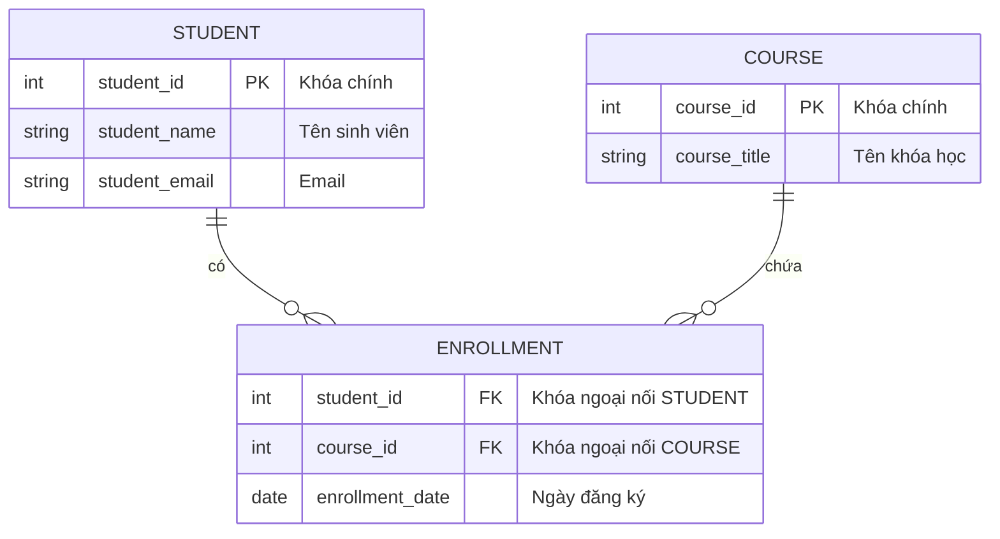

# Xây dựng Sơ đồ ERD trong Thiết kế Hệ thống (Developing ERDs)

## 1. Vai trò của Quy tắc Nghiệp vụ (Business Rules)
Quy tắc nghiệp vụ là các chính sách, ràng buộc và hướng dẫn vận hành của tổ chức, quyết định cấu trúc và mối liên kết của dữ liệu.
* *Ví dụ (Hệ thống Đại học):*
  * "Mỗi sinh viên có thể đăng ký nhiều khóa học."
  * "Mỗi khóa học được giảng dạy bởi duy nhất một giảng viên."
  * "Mỗi sinh viên phải có một mã số ID duy nhất."
* Việc phân tích kỹ các quy tắc này là bước đầu tiên để xác định thực thể (Entities), thuộc tính (Attributes) và mối quan hệ (Relationships) cho sơ đồ ERD.

---

## 2. Cardinality & Ký pháp chân chim (Crow's Foot Notation)
Bản số (Cardinality) thể hiện số lượng bản ghi của thực thể này liên kết với thực thể khác. Trong ký pháp chân chim:
* **Chính xác 1 (Mandatory One):** Ký hiệu bằng 2 vạch thẳng đứng song song (`||`).
* **Không hoặc 1 (Optional One):** Ký hiệu bằng 1 hình tròn và 1 vạch đứng (`o|`).
* **Một hoặc nhiều (Mandatory Many):** Ký hiệu bằng 1 vạch đứng và chân chim (`|{`).
* **Không hoặc nhiều (Optional Many):** Ký hiệu bằng 1 hình tròn và chân chim (`o{`).

---

## 3. Chuẩn hóa Cơ sở dữ liệu (Database Normalization)
Chuẩn hóa là quá trình tổ chức dữ liệu nhằm **loại bỏ dư thừa** và **ngăn chặn các bất thường (anomalies)** khi Thêm, Sửa, Xóa dữ liệu.

### **Các dạng chuẩn chính (Normal Forms):**
1. **Dạng chuẩn 1 (1NF - First Normal Form):**
   * Đảm bảo mỗi bảng có khóa chính (Primary Key).
   * Tất cả các thuộc tính phải chứa các giá trị nguyên tố (atomic/indivisible values) - không chứa thuộc tính đa trị.
   * *Ví dụ:* Nếu bảng Sinh viên có thuộc tính đa trị `PhoneNumbers`, ta phải tách các số điện thoại ra thành các hàng riêng biệt ở một bảng liên kết mới là `StudentPhoneNumbers`.
2. **Dạng chuẩn 2 (2NF - Second Normal Form):**
   * Phải đạt chuẩn 1NF.
   * Loại bỏ các phụ thuộc bán phần (partial dependencies) - tất cả các thuộc tính không phải khóa phải phụ thuộc hoàn toàn vào toàn bộ khóa chính.
   * *Ví dụ:* Nếu một bảng lưu cả thông tin Sinh viên và Khóa học, ta phải tách thành bảng `Student` và bảng `Course` riêng biệt để tránh phụ thuộc một phần.
3. **Dạng chuẩn 3 (3NF - Third Normal Form):**
   * Phải đạt chuẩn 2NF.
   * Loại bỏ phụ thuộc bắc cầu (transitive dependencies) - các thuộc tính không phải khóa không được phụ thuộc vào các thuộc tính không phải khóa khác.
   * *Ví dụ:* Nếu bảng Khóa học chứa `InstructorName` và `InstructorDepartment` (phòng ban phụ thuộc vào giảng viên), ta cần chuyển thông tin phòng ban sang bảng `Instructor` riêng.

---

## 4. Quy trình 5 bước xây dựng và phát triển ERD
1. **Thu thập yêu cầu (Requirements Gathering):** Phỏng vấn các bên liên quan để thu thập quy tắc nghiệp vụ và xác định thực thể, thuộc tính.
2. **Phác thảo ERD ban đầu (Draft the ERD):** Vẽ sơ đồ sơ khai kết nối thực thể, thuộc tính và xác định khóa chính.
3. **Xác thực các mối quan hệ (Validate Relationships):** Áp dụng ký pháp chân chim để làm rõ ràng tính bắt buộc/tùy chọn của mối quan hệ.
4. **Chuẩn hóa cấu trúc (Normalize):** Áp dụng lần lượt các dạng chuẩn 1NF, 2NF, 3NF để tối ưu hóa hiệu năng lưu trữ.
5. **Đánh giá và tinh chỉnh (Review & Refine):** Xác nhận lại sơ đồ với các bên liên quan để đảm bảo đáp ứng đúng nhu cầu nghiệp vụ.

### **Công cụ hỗ trợ:** Lucidchart, draw.io, MySQL Workbench.

---

## 5. Minh họa Giải quyết Mối quan hệ Nhiều-Nhiều (M:N) trong Chuẩn hóa

Trong giai đoạn thiết kế ban đầu, mối quan hệ giữa Sinh viên (Student) và Khóa học (Course) là Nhiều-Nhiều (M:N):

Để đưa về dạng chuẩn hóa và lập trình được trong Cơ sở dữ liệu quan hệ, mối quan hệ Nhiều-Nhiều được giải quyết bằng cách thêm một **Bảng trung gian (Junction Table)** tên là `ENROLLMENT` (Đăng ký học):

*(Lúc này, mối quan hệ Nhiều-Nhiều đã được chuyển đổi thành hai mối quan hệ Một-Nhiều: `STUDENT` 1-N `ENROLLMENT` và `COURSE` 1-N `ENROLLMENT`)*
