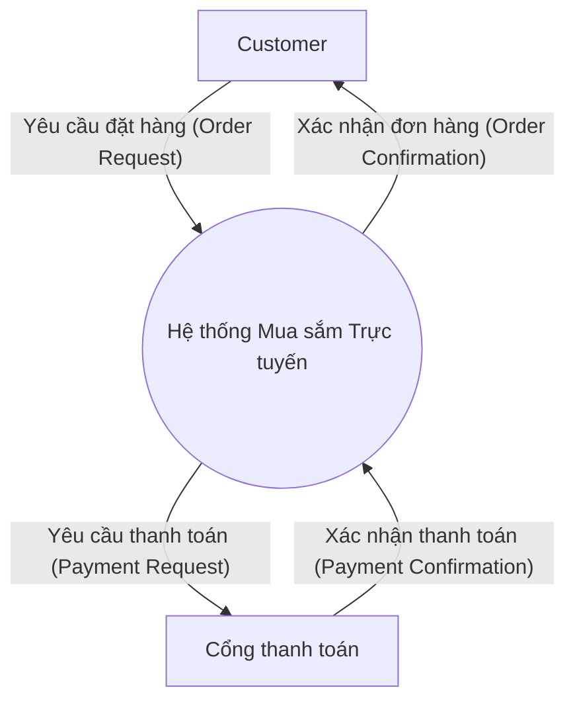
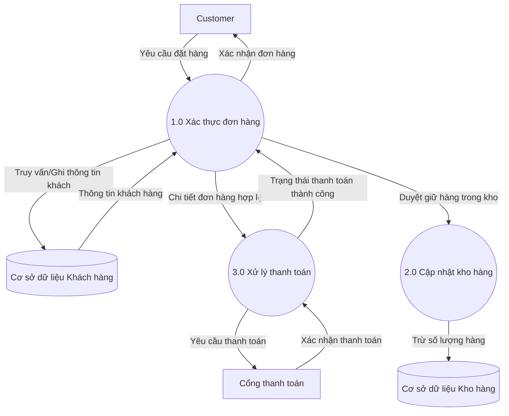
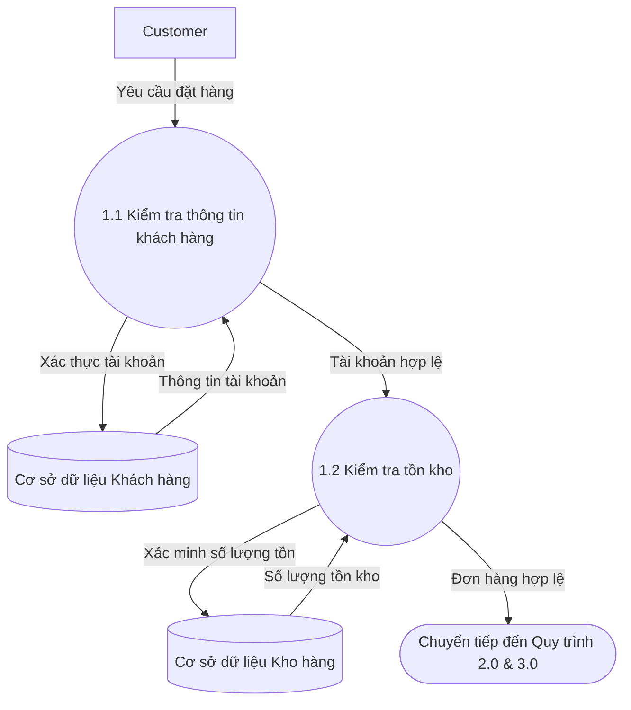

# Giới thiệu về Sơ đồ Luồng Dữ liệu (Data Flow Diagrams - DFDs)

## 1. Khái niệm & Mục tiêu của DFD
* **Định nghĩa:** DFD là công cụ trực quan mạnh mẽ dùng trong thiết kế hệ thống để minh họa cách dữ liệu di chuyển trong hệ thống, bao gồm các quy trình (processes), kho lưu trữ dữ liệu (data stores), đầu vào (inputs), đầu ra (outputs) và các thực thể ngoài (external entities).
* **Mục tiêu chính:**
  * Giúp phân tích, tối ưu hóa hệ thống IT bằng cách phát hiện các nút thắt cổ chai (bottlenecks), sự dư thừa (redundancies) và các cơ hội tối ưu hóa.
  * Tập trung hoàn toàn vào **luồng dữ liệu và chức năng của hệ thống**, lược bỏ các chi tiết triển khai kỹ thuật phức tạp để giao tiếp hiệu quả hơn với các bên liên quan không chuyên về kỹ thuật (non-technical stakeholders).
  * Hỗ trợ và bổ sung cho các phương pháp mô hình hóa khác như **ERD** (thiết kế cơ sở dữ liệu) và **UML** (kiến trúc hệ thống).

---

## 2. Ký hiệu Tiêu chuẩn trong DFD (Theo ký pháp Yourdon và Coad)
DFD sử dụng 4 ký hiệu cơ bản sau:
1. **Thực thể ngoài (External Entity) - Hình chữ nhật hoặc hình vuông:** Đại diện cho nguồn cung cấp dữ liệu hoặc đích nhận dữ liệu nằm ngoài hệ thống (ví dụ: Khách hàng, Hệ thống thanh toán bên thứ ba).
2. **Quy trình (Process) - Hình tròn hoặc hình oval:** Đại diện cho các hàm hoặc các bước biến đổi, xử lý dữ liệu (ví dụ: "Xử lý đơn hàng"). Mỗi quy trình nhận đầu vào, thực hiện xử lý và tạo ra đầu ra.
3. **Luồng dữ liệu (Data Flow) - Mũi tên có nhãn:** Chỉ ra hướng di chuyển của dữ liệu giữa các thực thể ngoài, quy trình và kho dữ liệu (ví dụ: luồng "Thông tin đơn hàng" đi từ Khách hàng đến Quy trình xử lý).
4. **Kho lưu trữ dữ liệu (Data Store) - Hai đường thẳng song song:** Nơi dữ liệu được lưu trữ để xử lý (ví dụ: Cơ sở dữ liệu khách hàng, file lưu trữ).

---

## 3. Cấu trúc phân cấp của DFD (Hierarchical Levels)
DFD được tổ chức theo cấp độ từ tổng quan đến chi tiết, đảm bảo tính nhất quán (consistency) giữa sơ đồ cha và sơ đồ con:

* **Sơ đồ ngữ cảnh (Context Diagram - Level 0):**
  * Cung cấp góc nhìn ở cấp độ cao nhất.
  * Toàn bộ hệ thống được gom lại thành một quy trình duy nhất (hình tròn lớn).
  * Hiển thị cách các thực thể ngoài tương tác với hệ thống qua các luồng dữ liệu đầu vào và đầu ra.
  * Giúp xác định ranh giới (boundaries) và phạm vi (scope) của hệ thống.
* **Sơ đồ cấp 0 (Level 0 Diagram - Fundamental System Model):**
  * Phân rã quy trình duy nhất ở sơ đồ ngữ cảnh thành các quy trình chính bên trong hệ thống, kèm theo các kho lưu trữ dữ liệu và luồng dữ liệu kết nối chúng.
  * Cho cái nhìn tổng quát về hoạt động nội bộ của hệ thống.
* **Sơ đồ cấp 1 (Level 1 Diagram):**
  * Phân rã cụ thể từng quy trình chính từ sơ đồ cấp 0 thành các quy trình con chi tiết hơn (ví dụ: Quy trình "Xác thực đơn hàng" phân rã thành "Kiểm tra kho" và "Kiểm tra thông tin khách hàng").
* **Sơ đồ cấp 2, 3... (Level 2, 3, etc.):**
  * Tiếp tục phân rã chi tiết đối với các quy trình phức tạp hơn nữa.

---

## 4. Ví dụ Thực tế: Hệ thống Mua sắm Trực tuyến (Online Shopping System)

Để hiểu rõ hơn về cách phân rã các cấp độ DFD, dưới đây là ví dụ minh họa bằng sơ đồ Mermaid:

### a. Sơ đồ ngữ cảnh (Context Diagram - Level 0)
Sơ đồ này xem toàn bộ hệ thống mua sắm trực tuyến như một quy trình duy nhất và chỉ ra các tương tác của nó với thế giới bên ngoài (Khách hàng và Cổng thanh toán).

### b. Sơ đồ cấp 0 (Level 0 Diagram)
Phân rã "Hệ thống Mua sắm Trực tuyến" thành 3 quy trình chính: Xác thực đơn hàng, Cập nhật kho, và Xử lý thanh toán.

### c. Sơ đồ cấp 1 (Level 1 Diagram) - Phân rã quy trình "1.0 Xác thực đơn hàng"
Chi tiết hóa quy trình `1.0 Xác thực đơn hàng` thành các quy trình con: Kiểm tra thông tin khách hàng và Kiểm tra kho.

