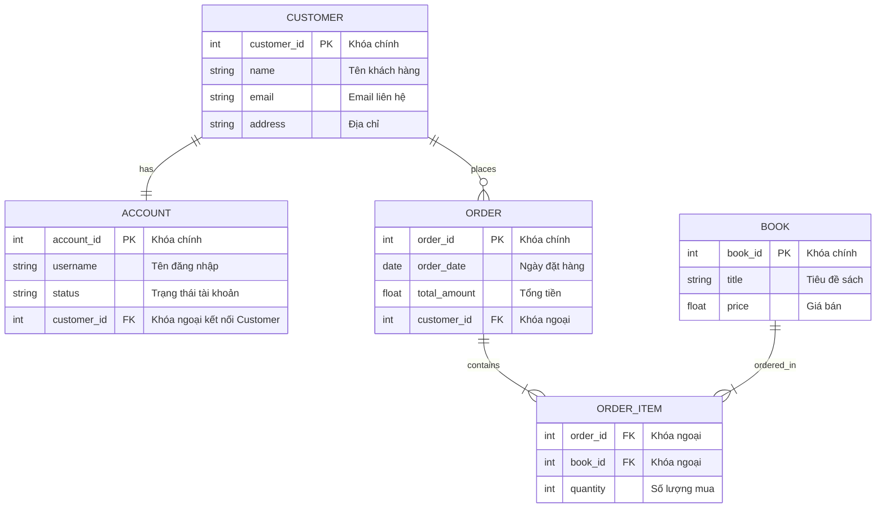

# Giới thiệu về Sơ đồ Mối quan hệ Thực thể (Entity-Relationship Diagrams - ERDs)

## 1. Khái niệm & Mục tiêu của ERD
* **Định nghĩa:** ERD là công cụ trực quan hóa cấu trúc dữ liệu và mối quan hệ giữa các thực thể trong một hệ thống. Đây là bản thiết kế (blueprint) quan trọng nhất trong thiết kế và xây dựng cơ sở dữ liệu quan hệ (relational databases).
* **Mục tiêu chính:**
  * Xác định cách dữ liệu được tổ chức, lưu trữ và truy cập.
  * Loại bỏ dư thừa dữ liệu (data redundancy) và đảm bảo tính toàn vẹn dữ liệu (data integrity).
  * Giúp các nhà phân tích nghiệp vụ, lập trình viên và các bên liên quan dễ dàng trao đổi về yêu cầu dữ liệu trước khi xây dựng thực tế.

---

## 2. Các thành phần cốt lõi của ERD
ERD được xây dựng dựa trên 4 thành phần nền tảng:

### **a. Thực thể (Entities)**
* Là các đối tượng hoặc khái niệm trong thế giới thực cần được theo dõi trong hệ thống. Mỗi thực thể tương ứng với một **Bảng (Table)** trong cơ sở dữ liệu.
* Ký hiệu: **Hình chữ nhật** có tên thực thể bên trong.
* **Phân loại thực thể:**
  * **Thực thể mạnh (Strong Entity):** Tồn tại độc lập và có thuộc tính định danh duy nhất (khóa chính - Primary Key). *Ví dụ:* Khách hàng (Customer) với thuộc tính định danh `CustomerID`.
  * **Thực thể yếu (Weak Entity):** Phụ thuộc vào một thực thể khác và không có khóa chính độc lập. *Ví dụ:* Chi tiết đơn hàng (OrderItem) phụ thuộc vào Đơn hàng (Order).

### **b. Thuộc tính (Attributes)**
* Là các đặc điểm hoặc tính chất của thực thể, tương ứng với các **Cột (Columns)** trong bảng.
* Ký hiệu truyền thống: **Hình oval** kết nối trực tiếp với thực thể của nó.
* **Phân loại thuộc tính:**
  * **Đơn giản (Simple):** Không thể chia nhỏ hơn nữa. *Ví dụ:* Tên (Name), Giá sản phẩm (Price).
  * **Phức hợp (Composite):** Có thể phân rã thành các phần nhỏ hơn. *Ví dụ:* Địa chỉ (Address) -> Đường, Thành phố, Mã bưu chính.
  * **Đa trị (Multivalued):** Có thể chứa nhiều giá trị cùng lúc. *Ví dụ:* Danh sách số điện thoại (PhoneNumbers).
  * **Kết xuất/Phái sinh (Derived):** Được tính toán từ các thuộc tính khác. *Ví dụ:* Tuổi (Age) được tính từ Ngày sinh (BirthDate).

### **c. Mối quan hệ (Relationships)**
* Mô tả cách các thực thể kết nối và tương tác với nhau.
* Ký hiệu truyền thống: **Hình kim cương** nối giữa các thực thể, chứa một động từ mô tả (ví dụ: Khách hàng *Đặt* Đơn hàng).
* **Phân loại mối quan hệ:**
  * **Một-Một (1:1):** Mỗi bản ghi ở thực thể này liên kết với duy nhất một bản ghi ở thực thể kia. *Ví dụ:* Một Khách hàng có duy nhất một Tài khoản (Account).
  * **Một-Nhiều (1:N):** Một bản ghi ở thực thể này có thể liên kết với nhiều bản ghi ở thực thể kia. *Ví dụ:* Một Khách hàng có thể đặt nhiều Đơn hàng (Orders).
  * **Nhiều-Nhiều (M:N):** Nhiều bản ghi ở thực thể này liên kết với nhiều bản ghi ở thực thể kia. *Ví dụ:* Nhiều Sách (Books) có thể xuất hiện trong nhiều Đơn hàng (Orders). Mối quan hệ này thường được giải quyết bằng một **Bảng trung gian (Junction Table)** như `OrderItems`.

### **d. Bản số / Tính kết hợp (Cardinality)**
* Xác định số lượng tối thiểu và tối đa các thể hiện của một thực thể liên kết với một thể hiện của thực thể khác.
* **Điều kiện tham gia (Participation):**
  * **Bắt buộc (Mandatory):** Số lượng tối thiểu là 1 (ví dụ: mọi Đơn hàng phải liên kết với 1 Khách hàng).
  * **Tùy chọn (Optional):** Số lượng tối thiểu là 0 (ví dụ: một Khách hàng mới có thể chưa có Đơn hàng nào).
* Ký pháp trực quan phổ biến nhất là **Ký pháp chân chim (Crow’s Foot Notation)** sử dụng các đường kẻ, vòng tròn và biểu tượng nhánh để mô tả quy tắc kết hợp.

---

## 3. Ví dụ Thực tế: Hệ thống Nhà sách Trực tuyến (Online Bookstore)

Sơ đồ ERD dưới đây minh họa thiết kế cơ sở dữ liệu cho một hệ thống nhà sách trực tuyến bằng ký pháp chân chim chuẩn hóa thông qua Mermaid:

*(Giải thích ký pháp chân chim: `||--||` là Quan hệ 1-1 bắt buộc; `||--o{` là Quan hệ 1-Nhiều tùy chọn; `||--|{` là Quan hệ 1-Nhiều bắt buộc)*
