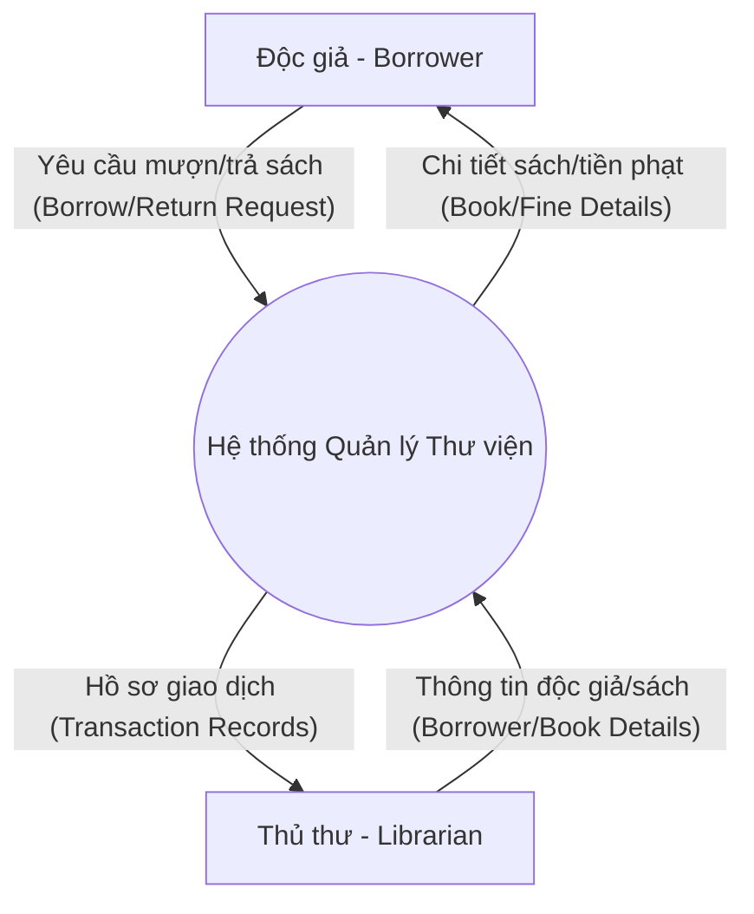
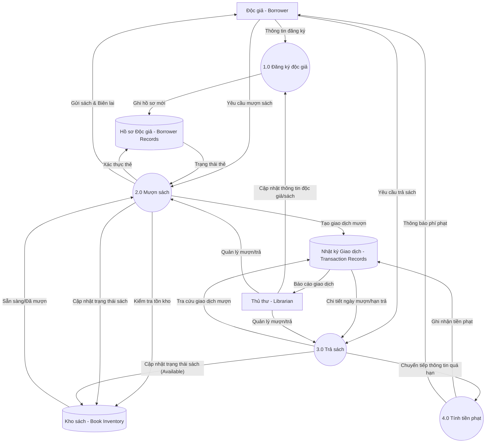
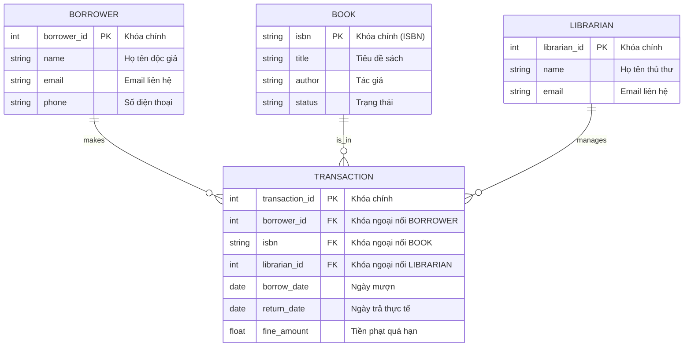

# Bài Thực hành: Xây dựng Mô hình Hệ thống Thư viện (Lab - Build a System Model)

Tài liệu này tổng hợp toàn bộ hướng dẫn, các thành phần kỹ thuật và giải pháp thiết kế cho hệ thống quản lý thư viện nhỏ bằng sơ đồ trực quan (DFD & ERD).

---

## 1. Mục tiêu bài thực hành
* Xây dựng sơ đồ luồng dữ liệu (DFD) cấp độ ngữ cảnh (Context Diagram) và cấp độ 1 (Level 1 DFD) để trực quan hóa luồng dữ liệu của hệ thống.
* Thiết kế sơ đồ mối quan hệ thực thể (ERD) đạt dạng chuẩn 2 (2NF) làm nền tảng cho cơ sở dữ liệu quan hệ.

---

## 2. Phần 1: Sơ đồ luồng dữ liệu (Data Flow Diagram - DFD)

### **Task 1: Sơ đồ ngữ cảnh (Context Diagram - Level 0 DFD)**
Mô tả toàn bộ hệ thống như một quy trình duy nhất tương tác với hai thực thể ngoài: **Độc giả (Borrower)** và **Thủ thư (Librarian)**.

---

### **Task 2: Sơ đồ cấp 1 (Level 1 DFD)**
Decompose (phân rã) quy trình trung tâm thành 4 quy trình xử lý, 3 kho lưu trữ dữ liệu và các luồng thông tin kết nối chúng:
* **4 Quy trình xử lý:**
  1. `1.0 Đăng ký độc giả` (Register Borrower)
  2. `2.0 Mượn sách` (Borrow Book)
  3. `3.0 Trả sách` (Return Book)
  4. `4.0 Tính tiền phạt` (Calculate Fine)
* **3 Kho dữ liệu:**
  * `Hồ sơ Độc giả` (Borrower Records)
  * `Kho sách` (Book Inventory)
  * `Nhật ký Giao dịch` (Transaction Records)

---

## 3. Phần 2: Sơ đồ Mối quan hệ Thực thể (Entity-Relationship Diagram - ERD)

### **Task 3: Thiết kế cấu trúc ERD**
ERD này đã được thiết kế chuẩn hóa đạt dạng chuẩn **2NF**, giải quyết mối quan hệ Nhiều-Nhiều giữa Sinh viên và Sách qua bảng giao dịch trung gian.

#### **Cấu trúc Thuộc tính & Thực thể:**
1. **Borrower (Độc giả):** `BorrowerID` (PK), `Name`, `Email`, `Phone`.
2. **Book (Sách):** `ISBN` (PK), `Title`, `Author`, `Status` (Available/Borrowed).
3. **Librarian (Thủ thư):** `LibrarianID` (PK), `Name`, `Email`.
4. **Transaction (Giao dịch):** `TransactionID` (PK), `BorrowerID` (FK), `ISBN` (FK), `LibrarianID` (FK), `BorrowDate`, `ReturnDate`, `FineAmount`.

#### **Sơ đồ ERD sử dụng Ký pháp Chân chim (Crow's Foot Notation):**

*(Giải thích Cardinality: Một Độc giả/Sách/Thủ thư có thể xuất hiện trong nhiều (0 hoặc nhiều - `||--o{`) giao dịch mượn sách. Mỗi bản ghi Giao dịch mượn sách bắt buộc phải tham chiếu chính xác đến 1 Độc giả, 1 Sách và 1 Thủ thư xử lý).*
