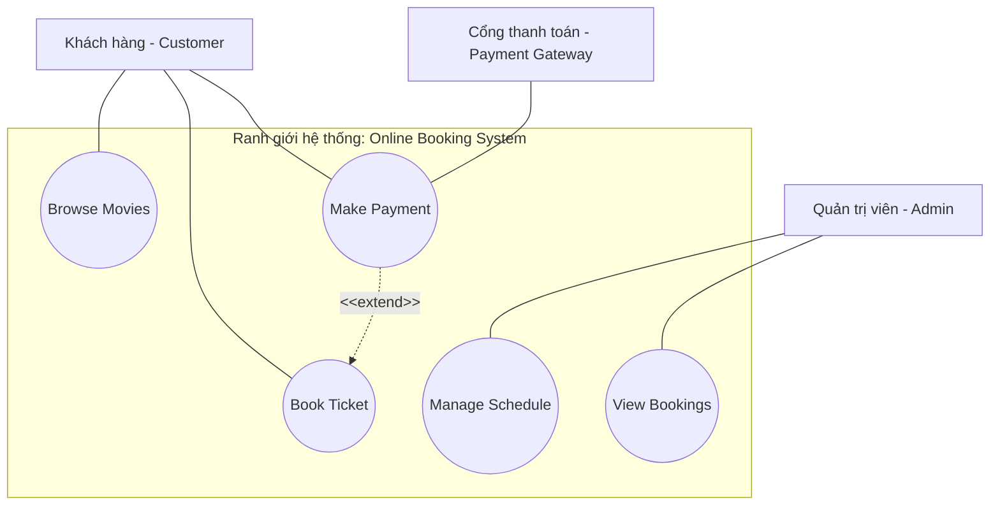
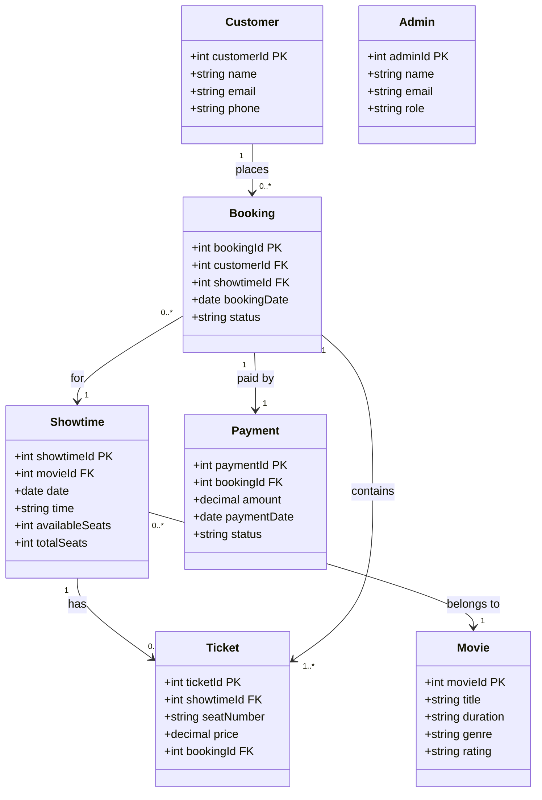
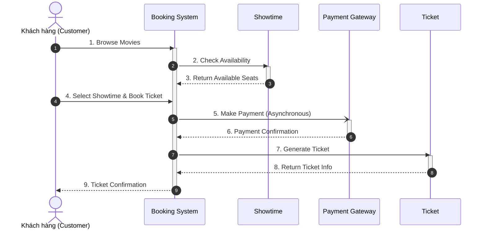
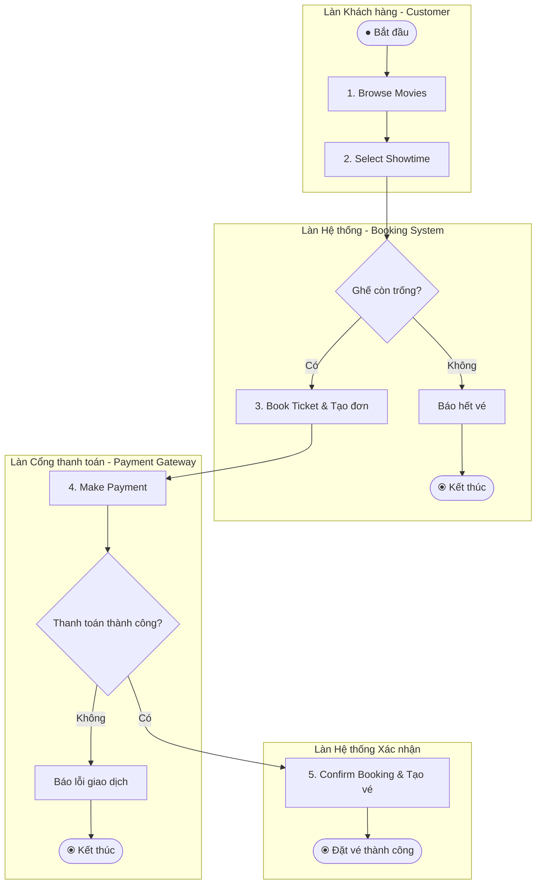

# Bài Thực hành: Thiết kế Hệ thống Đặt vé Trực tuyến bằng Sơ đồ UML (Lab - Design MovieGo Booking System)

Tài liệu này tổng hợp toàn bộ hướng dẫn, thông số kỹ thuật và 4 bản vẽ thiết kế sơ đồ UML hoàn chỉnh cho nền tảng đặt vé xem phim trực tuyến **MovieGo**.

---

## 1. Tổng quan Kịch bản (Scenario - MovieGo)
Hệ thống đặt vé xem phim **MovieGo** phục vụ 3 nhóm đối tượng:
* **Khách hàng (Customer):** Tìm kiếm phim, chọn suất chiếu, đặt vé và thanh toán qua cổng thanh toán bảo mật.
* **Quản trị viên (Admin):** Quản lý lịch chiếu phim và theo dõi danh sách các đơn đặt vé.
* **Cổng thanh toán (Payment Gateway):** Hệ thống bên thứ ba xử lý giao dịch tài chính an toàn.

Hệ thống cần 4 mô hình UML chuẩn hóa để làm tài liệu kiến trúc và hướng dẫn phát triển:
1. **Sơ đồ Use Case:** Xác định phạm vi và các chức năng của từng tác nhân.
2. **Sơ đồ Lớp (Class Diagram):** Thiết kế cấu trúc tĩnh, thuộc tính và liên kết cơ sở dữ liệu.
3. **Sơ đồ Tuần tự (Sequence Diagram):** Mô tả thứ tự gửi message trong quy trình "Đặt vé".
4. **Sơ đồ Hoạt động (Activity Diagram):** Thể hiện luồng tiến trình, rẽ nhánh điều kiện và phân làn trách nhiệm (Swimlanes).

---

## 2. Phần 1: Sơ đồ Use Case (Use Case Diagram)

### **Thành phần thiết kế:**
* **Ranh giới hệ thống:** `Online Booking System`
* **Tác nhân (Actors):** Customer, Admin, Payment Gateway.
* **Use Cases:**
  * *Customer:* Browse Movies (Xem danh mục phim), Book Ticket (Đặt vé), Make Payment (Thanh toán).
  * *Admin:* Manage Schedule (Quản lý lịch chiếu), View Bookings (Xem đơn đặt vé).
  * *Payment Gateway:* Liên kết với Use Case `Make Payment`.
* **Mối quan hệ:** `Make Payment` mở rộng (`<<extend>>`) từ `Book Ticket`.

---

## 3. Phần 2: Sơ đồ Lớp (Class Diagram)

### **Cấu trúc Lớp, Thuộc tính và Bản số (Multiplicity):**
* **Customer:** `CustomerID` : int (PK), `Name` : string, `Email` : string, `Phone` : string
* **Admin:** `AdminID` : int (PK), `Name` : string, `Email` : string, `Role` : string
* **Movie:** `MovieID` : int (PK), `Title` : string, `Duration` : string, `Genre` : string, `Rating` : string
* **Showtime:** `ShowtimeID` : int (PK), `MovieID` : int (FK), `Date` : date, `Time` : string, `AvailableSeats` : int, `TotalSeats` : int
* **Ticket:** `TicketID` : int (PK), `ShowtimeID` : int (FK), `SeatNumber` : string, `Price` : decimal, `BookingID` : int (FK)
* **Booking:** `BookingID` : int (PK), `CustomerID` : int (FK), `ShowtimeID` : int (FK), `BookingDate` : date, `Status` : string
* **Payment:** `PaymentID` : int (PK), `BookingID` : int (FK), `Amount` : decimal, `PaymentDate` : date, `Status` : string

### **Mối quan hệ (Multiplicity theo đáp án Coursera):**
* `Customer` **1 : N** `Booking`
* `Showtime` **N : 1** `Movie`
* `Showtime` **1 : N** `Ticket`
* `Booking` **1 : N** `Ticket`
* `Booking` **N : 1** `Showtime`
* `Booking` **1 : 1** `Payment`

---

## 4. Phần 3: Sơ đồ Tuần tự (Sequence Diagram) - Kịch bản "Book Ticket"

### **Luồng tương tác các đối tượng:**
1. Khách hàng duyệt phim trên Booking System.
2. Booking System kiểm tra ghế trống với đối tượng Showtime.
3. Khách hàng chọn suất chiếu và yêu cầu đặt vé.
4. Booking System gửi yêu cầu thanh toán (bất đồng bộ) tới Cổng thanh toán.
5. Cổng thanh toán gửi phản hồi xác nhận thanh toán.
6. Booking System gọi Ticket để khởi tạo vé.
7. Booking System gửi xác nhận đặt vé thành công tới Khách hàng.

---

## 5. Phần 4: Sơ đồ Hoạt động (Activity Diagram) - Quy trình "Book Ticket"

### **Phân làn trách nhiệm (Swimlanes) & Điểm quyết định:**
* **Làn Customer:** Tìm phim, chọn suất chiếu.
* **Làn Booking System:** Kiểm tra ghế, đặt vé, gửi xác nhận.
* **Làn Payment Gateway:** Xử lý giao dịch thanh toán.
* **Điểm quyết định 1:** Ghế còn trống không? (Nếu Không -> Kết thúc).
* **Điểm quyết định 2:** Thanh toán thành công không? (Nếu Không -> Kết thúc).

---

## 6. Tổng kết
Bài thực hành đã cung cấp giải pháp thiết kế kiến trúc toàn diện cho hệ thống **MovieGo**:
* Phân định rõ chức năng và phạm vi qua **Use Case Diagram**.
* Định hình khung cơ sở dữ liệu quan hệ và mô hình hướng đối tượng qua **Class Diagram**.
* Xác lập luồng API và message tuần tự qua **Sequence Diagram**.
* Trực quan hóa quy trình nghiệp vụ và các điểm kiểm tra lỗi rẽ nhánh qua **Activity Diagram**.
