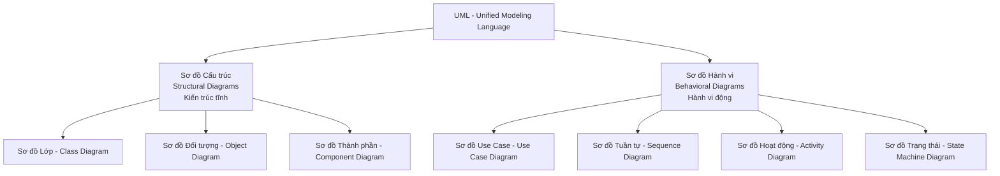

# Tổng quan về Ngôn ngữ Mô hình hóa Thống nhất (Unified Modeling Language - UML)

## 1. Khái niệm UML là gì?
* **Lịch sử & Phát triển:** Phát triển vào những năm 1990 bởi Grady Booch, Ivar Jacobson, và James Rumbaugh. Hiện được duy trì chuẩn hóa bởi Tổ chức Quản lý Đối tượng (Object Management Group - OMG).
* **Định nghĩa:** UML là ngôn ngữ mô hình hóa tiêu chuẩn dùng trong thiết kế hệ thống để trực quan hóa, xác định chi tiết, xây dựng và lập tài liệu về kiến trúc cũng như hành vi của hệ thống phần mềm.
* **Vai trò:** Đóng vai trò làm cầu nối ngôn ngữ chung giữa đội ngũ kỹ thuật (lập trình viên, phân tích hệ thống) và các bên liên quan phi kỹ thuật (khách hàng, quản lý doanh nghiệp).

---

## 2. Phân loại các nhóm Sơ đồ UML

Sơ đồ UML được chia làm hai nhóm chính: **Sơ đồ cấu trúc** và **Sơ đồ hành vi**.

---

## 3. Các loại Sơ đồ UML phổ biến nhất

1. **Sơ đồ Use Case (Use Case Diagram):**
   * Mô tả cách người dùng (Actors) tương tác với hệ thống để thực hiện các yêu cầu chức năng.
   * *Ví dụ:* Trong hệ thống Ngân hàng, Khách hàng tương tác với chức năng "Xem số dư", "Chuyển tiền".
2. **Sơ đồ Lớp (Class Diagram):**
   * Biểu diễn cấu trúc tĩnh của hệ thống gồm các lớp (Classes), thuộc tính (Attributes), phương thức (Methods) và mối quan hệ giữa chúng (Kế thừa, liên kết).
   * *Ví dụ:* Lớp `Book` có mối quan hệ liên kết với lớp `Patron`.
3. **Sơ đồ Tuần tự (Sequence Diagram):**
   * Mô hình hóa sự tương tác giữa các đối tượng theo trình tự thời gian, thể hiện thứ tự các thông điệp hoặc lời gọi hàm được truyền đi.
   * *Ví dụ:* Quy trình thanh toán thương mại điện tử từ Khách hàng -> Giỏ hàng -> Cổng thanh toán.
4. **Sơ đồ Hoạt động (Activity Diagram):**
   * Biểu diễn luồng quy trình nghiệp vụ hoặc quy trình hệ thống, bao gồm các điểm đưa ra quyết định (rẽ nhánh) và các hoạt động song song.
   * *Ví dụ:* Quy trình xử lý đơn hàng gồm: Xác thực đơn hàng -> Kiểm tra kho -> Gửi hàng.
5. **Sơ đồ Thành phần (Component Diagram):**
   * Chỉ ra cách các thành phần vật lý/logic của phần mềm (như các module, thư viện, hoặc APIs) được tổ chức và liên kết với nhau.
6. **Sơ đồ Trạng thái (State Machine Diagram):**
   * Biểu diễn các trạng thái thay đổi của một đối tượng đơn lẻ khi phản hồi lại các sự kiện cụ thể.
   * *Ví dụ:* Trạng thái hồ sơ Khoản vay chuyển đổi từ "Được yêu cầu" -> "Đang duyệt" -> "Đã phê duyệt".

---

## 4. Lợi ích của việc áp dụng UML trong thiết kế
* **Cải thiện giao tiếp:** Đơn giản hóa các khái niệm kỹ thuật phức tạp thông qua hình ảnh trực quan.
* **Lập tài liệu yêu cầu sớm:** Hạn chế hiểu lầm về nghiệp vụ ngay từ giai đoạn đầu.
* **Bản thiết kế kỹ thuật (Blueprint):** Định hướng cấu trúc code đồng bộ cho lập trình viên.
* **Khả năng mở rộng và bảo trì tốt:** Giúp nhà thiết kế xây dựng hệ thống có tính module cao và dễ tái sử dụng.
* **Phát hiện lỗi sớm:** Tìm ra các nút thắt cổ chai hoặc thiếu sót trong luồng xử lý trước khi viết code.
* **Tương thích cao:** Hỗ trợ cả mô hình Agile và Waterfall; bổ trợ hoàn hảo cho **DFD** và **ERD** để tạo ra bộ tài liệu thiết kế hệ thống toàn diện.

---

## 5. Nguyên tắc và Thực hành tốt nhất (Best Practices)
* **Bắt đầu đơn giản (Start simple):** Phác thảo các sơ đồ cấp cao trước (như Use Case) trước khi đi sâu vào chi tiết (như Sequence).
* **Tránh rác thông tin (Focus on clarity):** Chỉ đưa các thành phần thực sự cần thiết vào sơ đồ để tránh rối mắt.
* **Sử dụng công cụ phù hợp:** Sử dụng các công cụ chuyên dụng như Lucidchart, draw.io, Enterprise Architect để đảm bảo các mẫu vẽ đạt chuẩn UML.
* **Đánh giá liên tục (Iterate and validate):** Thường xuyên xem xét lại các sơ đồ cùng các bên liên quan để cập nhật thiết kế chính xác.
