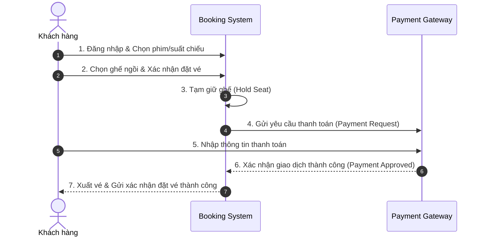
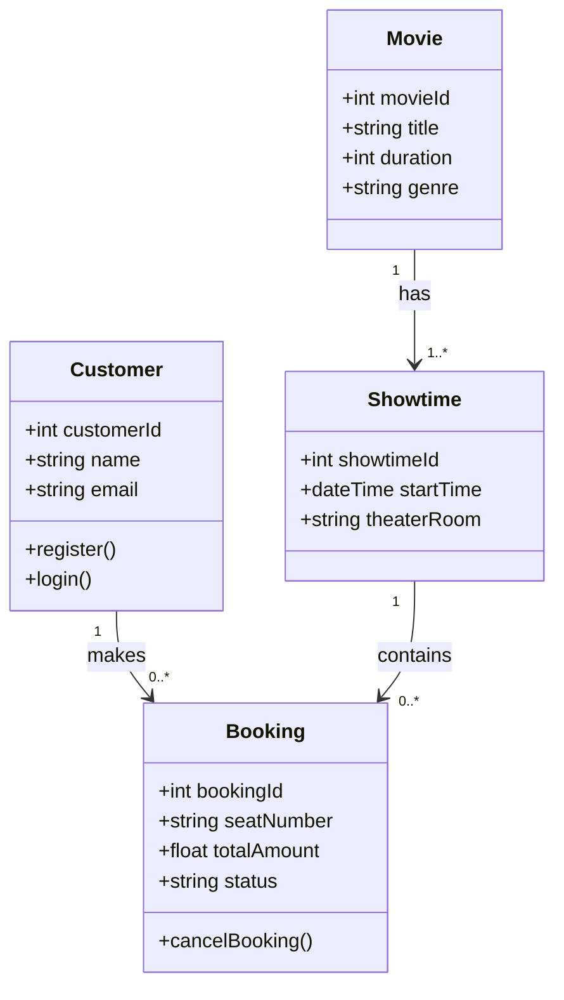
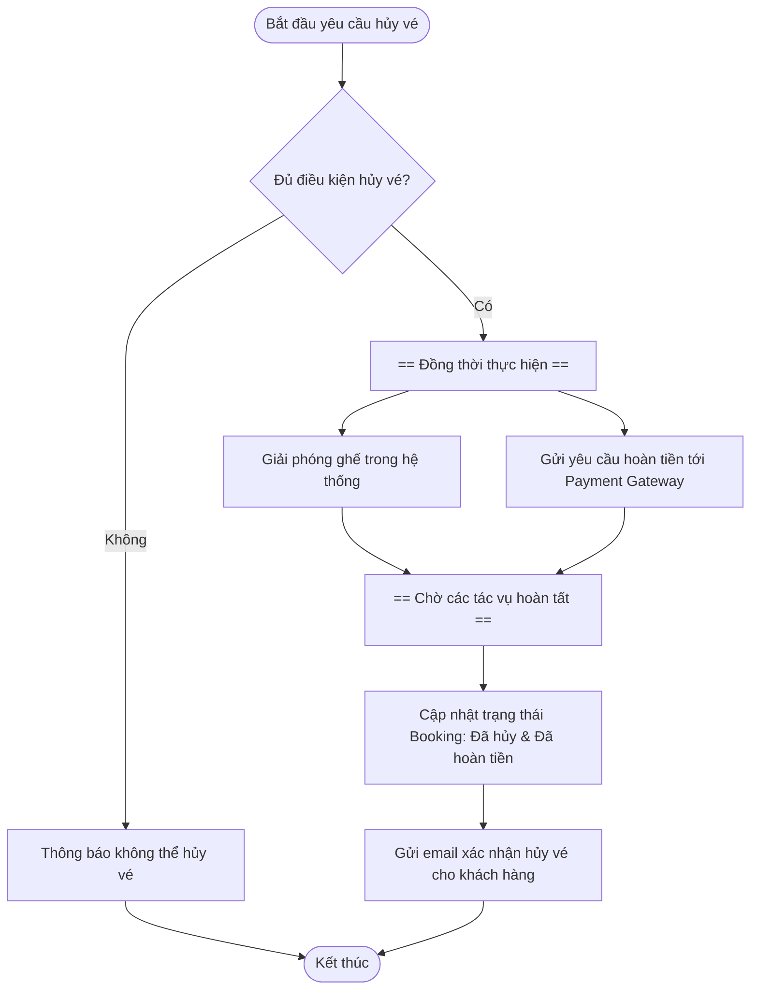

# Ứng dụng Sơ đồ UML cho Hệ thống Đặt vé Trực tuyến (Online Booking System)

Tài liệu này tổng hợp toàn bộ nội dung đối thoại về cách áp dụng các loại sơ đồ UML khác nhau để mô hình hóa hệ thống và truyền đạt yêu cầu nghiệp vụ hiệu quả qua kịch bản **Hệ thống Đặt vé Xem phim Trực tuyến (Movie Theater Booking System)**.

---

## 1. Xác định Tác nhân (Actors) và Use Cases

### **a. Các Tác nhân chính (Actors):**
* **Customer (Khách hàng):** Người dùng tương tác trực tiếp để tìm kiếm phim, chọn suất chiếu, đặt vé và thanh toán.
* **Admin (Quản trị viên / Nhân viên rạp):** Quản lý danh mục phim, lịch chiếu, phòng chiếu và xem báo cáo doanh thu.
* **Payment Gateway (Cổng thanh toán bên thứ ba):** Hệ thống ngoại vi xử lý các giao dịch tài chính trực tuyến an toàn.

### **b. Phân bổ Use Cases theo Tác nhân:**
* **Customer:** Tìm kiếm phim (Browse movies), Chọn suất chiếu (Select showtime), Đặt vé (Book ticket), Thanh toán (Make payment), Hủy đặt vé (Cancel booking).
* **Admin:** Thêm/sửa phim (Add/update movies), Quản lý lịch chiếu (Manage showtimes), Xem báo cáo (Generate reports).
* **Payment Gateway:** Xử lý thanh toán (Process payment), Xác nhận giao dịch (Confirm transaction), Hoàn tiền (Issue refund).

---

## 2. Ma trận Lựa chọn Sơ đồ UML Phù hợp (Selecting UML Diagrams)

| Loại sơ đồ UML | Phân loại | Trọng tâm thể hiện | Trường hợp sử dụng điển hình trong hệ thống |
| :--- | :--- | :--- | :--- |
| **Use Case Diagram** | Hành vi (Behavioral) | Phạm vi hệ thống, Tác nhân & Chức năng | Xác định các tính năng mà Customer và Admin có thể thực hiện. |
| **Sequence Diagram** | Hành vi (Behavioral) | Thứ tự tương tác theo thời gian | Quy trình **Đặt vé (Book ticket)** và trao đổi message với Payment Gateway. |
| **Class Diagram** | Cấu trúc (Structural) | Cấu trúc tĩnh, Lớp, Thuộc tính & Bản số | Mô hình hóa mối quan hệ giữa `Movie`, `Showtime`, `Customer`, `Booking`. |
| **Activity Diagram** | Hành vi (Behavioral) | Luồng công việc, Rẽ nhánh & Xử lý song song | Quy trình phức tạp như **Hủy vé & Hoàn tiền (Cancel & Refund)**. |

---

## 3. Trực quan hóa các Luồng xử lý và Cấu trúc qua Sơ đồ Mermaid

### **a. Sơ đồ Tuần tự (Sequence Diagram) - Quy trình Đặt vé**
Minh họa thứ tự các thông điệp gửi giữa Customer, Hệ thống Đặt vé và Cổng thanh toán:

---

### **b. Sơ đồ Lớp (Class Diagram) - Cấu trúc Dữ liệu**
Mô hình hóa cấu trúc tĩnh và mối quan hệ kèm bản số (Cardinality):

---

### **c. Sơ đồ Hoạt động (Activity Diagram) - Quy trình Hủy vé & Hoàn tiền**
Mô tả điểm quyết định điều kiện hoàn tiền và các tác vụ diễn ra song song (Fork/Join):

---

## 4. Vai trò của UML trong Giao tiếp Hiệu quả (UML for Effective Communication)

Sự kết hợp của bộ sơ đồ UML tạo nên chiếc cầu nối hoàn chỉnh giữa **Yêu cầu Nghiệp vụ** và **Triển khai Kỹ thuật**:

* **Đối với Đội ngũ Kỹ thuật (Developers & Architects):**
  * Sơ đồ Lớp (Class Diagram) và Sơ đồ Tuần tự (Sequence Diagram) đóng vai trò như **Bản thiết kế kiến trúc (Technical Blueprint)**, định rõ các class, API endpoints, thứ tự truyền message và cách xử lý ngoại lệ.
* **Đối với Các bên liên quan Nghiệp vụ (Business Stakeholders):**
  * Sơ đồ Use Case và Sơ đồ Hoạt động (Activity Diagram) cung cấp **Góc nhìn trực quan cấp cao**, giúp doanh nghiệp dễ dàng kiểm chứng toàn bộ luồng vận hành và hành trình khách hàng mà không cần hiểu mã nguồn.
