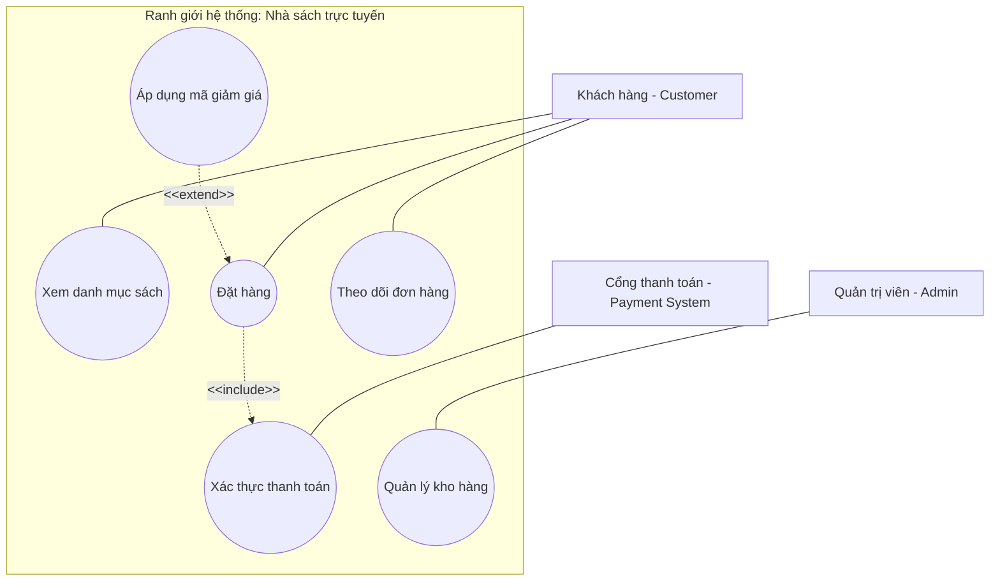

# Hướng dẫn về Sơ đồ Use Case (Use Case Diagrams)

## 1. Khái niệm & Mục tiêu của Sơ đồ Use Case
* **Định nghĩa:** Sơ đồ Use Case (Use Case Diagram) là một loại sơ đồ hành vi trong Ngôn ngữ Mô hình hóa Thống nhất (UML), trực quan hóa các yêu cầu chức năng của hệ thống dưới góc nhìn của tác nhân bên ngoài.
* **Mục tiêu:**
  * Mô tả cách các tác nhân bên ngoài (người dùng hoặc hệ thống khác) tương tác với hệ thống và các chức năng hệ thống cung cấp để đạt được mục tiêu đó.
  * Đóng vai trò là cầu nối giao tiếp quan trọng giữa đội ngũ kỹ thuật (lập trình viên) và các bên liên quan phi kỹ thuật (khách hàng, quản lý).

---

## 2. Các thành phần cốt lõi của Sơ đồ Use Case

Sơ đồ Use Case được cấu thành từ 3 thành phần chính:

### **a. Tác nhân (Actors)**
* Biểu diễn bằng hình người que (stick figure). Là các đối tượng bên ngoài tương tác trực tiếp với hệ thống.
* *Phân loại:* Con người (ví dụ: Khách hàng, Quản trị viên) hoặc hệ thống ngoại vi (ví dụ: Cổng thanh toán, Hệ thống gửi SMS).

### **b. Use Case (Trường hợp sử dụng)**
* Biểu diễn bằng hình oval. Đại diện cho một chức năng, dịch vụ hoặc tác vụ hoàn chỉnh mà hệ thống thực hiện để giúp tác nhân đạt được mục tiêu (ví dụ: "Đặt hàng", "Xem số dư").

### **c. Mối quan hệ (Relationships)**
Các đường nối giữa tác nhân và Use Case hoặc giữa các Use Case với nhau:
* **Association (Hiệp hội):** Đường kẻ nét liền biểu thị sự tương tác trực tiếp giữa tác nhân và Use Case (ví dụ: Khách hàng liên kết với "Đặt hàng").
* **Include (Bao gồm):** Mũi tên nét đứt có nhãn `<<include>>`. Chỉ ra một Use Case bắt buộc phải sử dụng chức năng của Use Case khác (ví dụ: "Đặt hàng" bao gồm bước "Xác thực thanh toán"). Mũi tên hướng từ Use Case cơ sở sang Use Case được bao gồm.
* **Extend (Mở rộng):** Mũi tên nét đứt có nhãn `<<extend>>`. Biểu thị tính năng bổ sung, tùy chọn hoặc có điều kiện để mở rộng cho Use Case cơ sở (ví dụ: "Áp mã giảm giá" mở rộng cho "Đặt hàng"). Mũi tên hướng từ Use Case mở rộng về Use Case cơ sở.
* **Generalization (Khái quát hóa/Kế thừa):** Mũi tên nét liền có đầu tam giác rỗng. Thể hiện sự kế thừa giữa các tác nhân hoặc giữa các Use Case (ví dụ: "Khách hàng VIP" kế thừa các thuộc tính và hành vi của "Khách hàng thường").

---

## 3. Ranh giới hệ thống (System Boundary)
Ranh giới hệ thống thường được vẽ dưới dạng một **hình chữ nhật** bao quanh toàn bộ các Use Case bên trong hệ thống.
* Nó giúp phân định rõ ràng những chức năng gì nằm trong phạm vi (scope) thiết kế của hệ thống và những tác nhân nào nằm ngoài hệ thống.

---

## 4. Quy trình 5 bước xây dựng Sơ đồ Use Case
1. **Xác định các tác nhân (Actors):** Tìm tất cả người dùng và hệ thống bên ngoài sẽ tương tác với hệ thống.
2. **Xác định các Use Case:** Liệt kê các mục tiêu nghiệp vụ mà tác nhân muốn đạt được thông qua hệ thống.
3. **Thiết lập các mối quan hệ:** Nối tác nhân với Use Case tương ứng và xác định mối quan hệ `<<include>>`, `<<extend>>` hoặc kế thừa.
4. **Vẽ sơ đồ:** Đưa các Use Case vào trong ranh giới hệ thống, đặt các tác nhân ở bên ngoài và kết nối chúng bằng công cụ UML.
5. **Xác thực với các bên liên quan:** Kiểm tra lại sơ đồ với các bên liên quan để đảm bảo phản ánh chính xác yêu cầu chức năng.

---

## 5. Ví dụ Thực tế: Hệ thống Nhà sách Trực tuyến (Online Bookstore System)

Sơ đồ dưới đây mô phỏng mối quan hệ của Khách hàng, Quản trị viên và Cổng thanh toán với các tính năng của nhà sách trực tuyến:

*(Lưu ý: Mũi tên nét đứt `<<include>>` hướng từ "Đặt hàng" tới "Xác thực thanh toán", trong khi `<<extend>>` hướng từ "Áp dụng mã giảm giá" về "Đặt hàng").*
