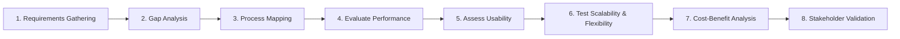

# Assessing System Fit for Business Needs

> **Nguồn:** IBM System Design – Module 2: IT Systems Analysis and Review  
> **Ngày lưu:** 2026-08-14

---

## 🎯 Mục tiêu học tập

- Định nghĩa **System Fit (Độ phù hợp của hệ thống)** và tầm quan trọng của việc gắn kết giải pháp CNTT với nhu cầu kinh doanh.
- Liệt kê các bước trong **Quy trình đánh giá có cấu trúc (Structured System Fit Assessment)**.
- Nhận diện **6 yếu tố cốt lõi (Core Factors)** quyết định mức độ phù hợp của hệ thống.

---

## 💡 System Fit Là Gì & Tại Sao Lại Quan Trọng?

**System Fit (Độ phù hợp của hệ thống)** là mức độ mà một giải pháp công nghệ (hiện hữu hoặc đề xuất mới) đáp ứng và tương thích với:
- **Mục tiêu tổ chức (Organizational goals)**
- **Nhu cầu vận hành thực tế (Operational demands)**
- **Định hướng chiến lược dài hạn (Strategic direction)**

> **Hậu quả khi hệ thống không "Fit":**  
> - Bệnh viện: Bác sĩ mất thời gian tra cứu bệnh án $\rightarrow$ Ảnh hưởng tính mạng bệnh nhân.  
> - E-commerce: Không đồng bộ tồn kho thời gian thực $\rightarrow$ Khách mua hàng hết tồn $\rightarrow$ Hủy đơn, mất doanh thu và uy tín.

---

## 🧭 Quy Trình Đánh Giá 8 Bước (Structured Assessment Workflow)

| Bước | Hành động cụ thể | Ví dụ / Công cụ |
|---|---|---|
| **1. Requirements Gathering** | Thu thập yêu cầu từ Ban lãnh đạo, nhân viên, khách hàng để xác định mục tiêu cốt lõi. | Bán lẻ: Thanh toán nhanh, checkout mượt. |
| **2. Gap Analysis** | So sánh năng lực hiện tại của hệ thống với nhu cầu thực tế để tìm lỗ hổng tính năng hoặc độ trễ. | CRM phản hồi chậm khi tìm kiếm khách hàng. |
| **3. Process Mapping** | Dùng sơ đồ DFD hoặc Activity Diagram để map workflow từ đầu đến cuối (End-to-End). | DFD phát hiện bước kiểm tra thủ công thừa thãi. |
| **4. Evaluate Performance** | Đo lường Response Time, Throughput, Uptime dưới điều kiện thực tế. | Giám sát bằng Prometheus, New Relic. |
| **5. Assess Usability** | Thu thập phản hồi từ người dùng qua khảo sát hoặc Hands-on Testing. | Đánh giá độ trực quan, số lượt click để hoàn thành tác vụ. |
| **6. Test Scalability & Flexibility**| Kiểm tra khả năng chịu tải đỉnh và khả năng thích ứng khi thêm nghiệp vụ mới. | Thêm danh mục sản phẩm mới vào sàn E-commerce. |
| **7. Cost-Benefit Analysis (ROI)** | So sánh tổng chi phí sở hữu (TCO) với lợi ích kinh doanh mang lại. | Tính toán ROI xem có nên nâng cấp/thay mới không. |
| **8. Stakeholder Validation** | Xác nhận lại kết quả đánh giá với các bên liên quan để thống nhất ưu tiên. | Trình bày báo cáo giải pháp cho Ban điều hành. |

---

## 🔑 6 Yếu Tố Cốt Lõi Quyết Định System Fit

| Yếu tố | Tiêu chí đánh giá |
|---|---|
| **1. Functional Alignment** | Hệ thống phải hỗ trợ đầy đủ các quy trình nghiệp vụ yêu cầu (VD: CRM quản lý Lead, Phân khúc khách hàng, Báo cáo). |
| **2. Smooth User Experience (UX)** | Giao diện trực quan, thao tác nhanh. UX kém (quá nhiều bước click) sẽ cản trở tỷ lệ chấp nhận của người dùng. |
| **3. Integration Capabilities** | Khả năng kết nối liền mạch qua API với Cổng thanh toán, ERP... để xóa bỏ các ốc đảo dữ liệu (Data Silos). |
| **4. Scalability** | Đảm bảo hệ thống duy trì hiệu năng khi lưu lượng tăng vọt (VD: Mùa siêu sale bán lẻ). |
| **5. Cost Efficiency** | Tổng chi phí vận hành/bảo trì phải tương xứng với giá trị kinh doanh tạo ra. |
| **6. Compliance & Security** | Tuân thủ các chuẩn an toàn thông tin bắt buộc và bảo vệ dữ liệu nhạy cảm (GDPR, HIPAA trong Y tế, Tài chính). |

---

## 📈 Lợi Ích Của Việc Đánh Giá System Fit Chuẩn Xác

- **Gắn kết chặt chẽ với mục tiêu kinh doanh (Stronger Alignment).**
- **Gia tăng hiệu suất vận hành (Increased Efficiency).**
- **Tối ưu hóa chi phí đầu tư CNTT (Optimized Costs / Smarter Investments).**
- **Sẵn sàng cho tương lai (Future Readiness).**
- **Giảm thiểu tối đa rủi ro vận hành (Reduced Operational Risk).**

---

## 📝 Tóm Tắt Nhanh

- **System Fit** = Đảm bảo công nghệ phục vụ đúng mục tiêu kinh doanh và trải nghiệm người dùng.
- **Đánh giá toàn diện qua 8 bước:** Thu thập yêu cầu $\rightarrow$ Gap Analysis $\rightarrow$ Sơ đồ hóa DFD $\rightarrow$ Đo hiệu năng & Usability $\rightarrow$ Thử nghiệm Scale $\rightarrow$ Tính ROI $\rightarrow$ Thống nhất cùng Stakeholders.
- **6 Tiêu chí vàng:** Functionality, UX, Integration, Scalability, Cost Efficiency, Security & Compliance.
