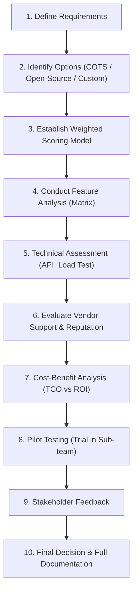

# Comparing IT Solutions

> **Nguồn:** IBM System Design – Module 2: IT Systems Analysis and Review  
> **Ngày lưu:** 2026-08-14

---

## 🎯 Mục tiêu học tập

- Xác định lý do tại sao việc so sánh các giải pháp CNTT là bắt buộc trong thiết kế hệ thống.
- Mô tả phương pháp đánh giá có cấu trúc (từ xác định yêu cầu đến thử nghiệm Pilot).
- Phân tích và so sánh các lựa chọn (COTS, Open-source, Custom-build) dựa trên bộ tiêu chí chuẩn.
- Đánh giá năng lực hỗ trợ của nhà cung cấp (Vendor support), khả năng tương thích và **Tổng chi phí sở hữu (Total Cost of Ownership - TCO)**.

---

## 💡 Tầm Quan Trọng Của Việc So Sánh Giải Pháp CNTT

Lựa chọn giải pháp CNTT mà **không qua so sánh bài bản** sẽ dẫn đến:
- **Lệch pha với mục tiêu kinh doanh:** Hệ thống không đáp ứng được yêu cầu thực tế.
- **Chi phí phát sinh ngoài tầm kiểm soát:** Chi phí ẩn về bảo trì, tích hợp, nâng cấp.
- **Hình thành "Ốc đảo dữ liệu" (Data Silos):** VD: Chọn CRM không thể kết nối API với ERP hiện tại.

> **Mục đích:** Đảm bảo giải pháp chọn lựa vừa vặn với ngân sách, hạ tầng kỹ thuật hiện có, đồng thời sẵn sàng mở rộng cho tương lai (Cloud, AI, Microservices).

---

## 🧭 Quy Trình Đánh Giá & So Sánh 10 Bước



| Bước | Nội dung chi tiết | Công cụ / Hành động |
|---|---|---|
| **1. Define Requirements** | Thu thập yêu cầu nghiệp vụ và kỹ thuật từ stakeholders. | Workshops, User Stories |
| **2. Identify Options** | Lập danh sách: Phần mềm thương mại đóng gói (COTS như SAP, Salesforce), Open-source hoặc Tự build (Custom). | Nghiên cứu thị trường (Gartner, Capterra) |
| **3. Weighted Scoring Model** | Xây dựng mô hình chấm điểm có trọng số theo mức độ ưu tiên của doanh nghiệp. | Bảng ma trận trọng số (Excel/Sheets) |
| **4. Feature Analysis** | Đối chiếu tính năng thực tế với ma trận yêu cầu. | Feature Checklist Matrix |
| **5. Technical Assessment** | Kiểm tra tương thích API, kiến trúc bảo mật và đo tải. | Postman (API), Apache JMeter (Tải) |
| **6. Evaluate Vendor Support** | Đánh giá uy tín vendor, SLA hỗ trợ 24/7, lộ trình cập nhật và tài liệu đào tạo. | Gartner Magic Quadrant, SLA Contract |
| **7. Cost-Benefit & TCO** | Tính toán tổng chi phí sở hữu (Licensing, Setup, Maintenance, Training) so với ROI. | Bảng phân tích TCO 3-5 năm |
| **8. Pilot Testing** | Thử nghiệm giải pháp trên môi trường kiểm soát (nhóm nhỏ) trước khi rollout. | Pilot với 1 nhóm Sales/Phòng ban |
| **9. Stakeholder Feedback** | Thu thập phản hồi từ người dùng thực tế và IT về UX, độ trễ và sự thuận tiện. | Khảo sát, phỏng vấn trực tiếp |
| **10. Decision & Documentation** | Tổng hợp điểm số, lập báo cáo minh bạch và bảo vệ trước Ban lãnh đạo. | Evaluation Report, ADR Document |

---

## ⚖️ 7 Tiêu Chí Cốt Lõi So Sánh Giải Pháp (Evaluation Criteria)

| Tiêu chí | Nội dung cần đánh giá |
|---|---|
| **1. Functionality** | Đáp ứng đầy đủ các module và tính năng nghiệp vụ cốt lõi hay không? |
| **2. Scalability** | Có mở rộng dễ dàng khi lượng user/data tăng đột biến không? (Ưu thế Cloud/SaaS). |
| **3. Integration** | Khả năng tích hợp REST API, Webhooks, Middleware với các hệ thống hiện hữu (ERP, Payment). |
| **4. Usability (UX)** | Giao diện có trực quan, dễ học không? (UI phức tạp sẽ làm giảm tỷ lệ chấp nhận của nhân viên). |
| **5. Total Cost of Ownership (TCO)** | Toàn bộ chi phí vòng đời: Bản quyền (License), Triển khai (Setup), Đào tạo (Training), Vận hành & Nâng cấp (Maintenance). |
| **6. Security & Compliance** | Đáp ứng chuẩn bảo mật và pháp lý quốc tế (GDPR, HIPAA, ISO 27001, SOC2). |
| **7. Vendor Support & SLA** | Dịch vụ hỗ trợ kỹ thuật, cam kết thời gian khắc phục sự cố, tài liệu hướng dẫn và cộng đồng. |

---

## 🏆 Lợi Ích Của Quy Trình So Sánh Có Cấu Trúc

1. **Tối ưu hóa vốn đầu tư (Optimized Investment):** Đạt ROI cao nhất, tránh mua nhầm giải pháp không dùng được.
2. **Nâng cao hiệu suất vận hành (Enhanced Efficiency):** Quy trình trơn tru, không bị gián đoạn dữ liệu.
3. **Tăng tỷ lệ người dùng chấp nhận (Improved User Adoption):** Người dùng hài lòng vì giao diện phù hợp và dễ sử dụng.
4. **Sẵn sàng cho tương lai (Future-readiness):** Khả năng nâng cấp, tích hợp AI/Cloud trong 5-10 năm tới.
5. **Giảm thiểu rủi ro (Risk Mitigation):** Phát hiện sớm các lỗ hổng bảo mật và xung đột kỹ thuật trước khi ký hợp đồng.
6. **Minh bạch và đồng thuận (Stakeholder Confidence):** Tạo niềm tin vững chắc cho Ban điều hành dựa trên dữ liệu định lượng.

---

## ⚠️ Thách Thức & Best Practices

```
[Challenges]
├── Yêu cầu ban đầu không đầy đủ/mơ hồ (Incomplete requirements)
├── Đánh giá nhà cung cấp thiếu khách quan, cảm tính (Vendor bias)
└── Bỏ qua các chi phí ẩn dài hạn (Overlooking hidden TCO)

[Best Practices]
├── Tham vấn đa dạng các bên (Users, Tech Leads, Finance, Executives)
├── Dùng mô hình chấm điểm có trọng số (Objective Weighted Scoring)
├── Luôn coi trọng năng lực Scale và API Integration
├── Triển khai thử nghiệm Pilot bắt buộc trước khi ký hợp đồng lớn
└── Tài liệu hóa chi tiết toàn bộ quá trình ra quyết định (ADR)
```

---

## 📝 Tóm Tắt Nhanh

- **So sánh giải pháp CNTT** là quyết định mang tính sống còn đối với kiến trúc hệ thống doanh nghiệp.
- **Quy trình chuẩn:** Xác định nhu cầu $\rightarrow$ Chấm điểm trọng số $\rightarrow$ Đánh giá kỹ thuật (API/Load) $\rightarrow$ Tính TCO $\rightarrow$ Thử nghiệm Pilot $\rightarrow$ Quyết định & Tài liệu hóa.
- **TCO > Chi phí mua ban đầu:** Phải tính cả chi phí đào tạo, vận hành, bảo trì và tích hợp suốt vòng đời hệ thống.
