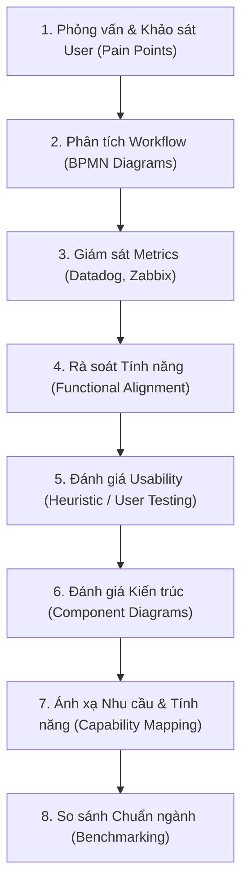

# Identifying System Inefficiencies and Gaps

> **Nguồn:** IBM System Design – Module 2: IT Systems Analysis and Review  
> **Ngày lưu:** 2026-08-14

---

## 🎯 Mục tiêu học tập

- Định nghĩa các chiến lược cốt lõi để nhận diện sự kém hiệu quả (Inefficiencies) và các khoảng trống/thiếu sót (Gaps) trong hệ thống CNTT.
- Giải thích các lợi ích đạt được từ việc phát hiện sớm các vấn đề này.
- Nhận diện các **Best Practices** để vượt qua thách thức trong quá trình rà soát và đánh giá hệ thống.

---

## 💡 Tại Sao Phải Nhận Diện Inefficiencies & Gaps?

Quá trình xử lý chậm, quy trình dư thừa, thiếu tính năng nghiệp vụ và giao diện kém trực quan sẽ:
- Làm giảm năng suất làm việc của nhân sự.
- Đẩy chi phí vận hành tăng cao.
- Gây ức chế cho người dùng cuối và giảm tính cạnh tranh của doanh nghiệp.

> **Thời điểm vàng cần thực hiện:** Trong các đợt **kiểm toán hệ thống (System Audits)**, **nâng cấp công nghệ (Tech Upgrades)**, hoặc khi **chuẩn bị mở rộng quy mô (Scaling Operations)**.

---

## 🎯 3 Trọng Tâm Cốt Lõi Của Quá Trình Đánh Giá (3 Critical Areas)

| Trọng tâm | Yêu cầu | Ví dụ về lỗ hổng / khoảng trống |
|---|---|---|
| **1. System Architecture** | Kiến trúc phải có khả năng mở rộng (Scalable) và dễ bảo trì (Maintainable). | Hệ thống Legacy nguyên khối, thành phần cứng nhắc, không thể tích hợp REST APIs hiện đại. |
| **2. Features & Functionality** | Tính năng phải hỗ trợ đầy đủ các tác vụ nghiệp vụ quan trọng. | Hệ thống quản lý kho thiếu tính năng cảnh báo tồn kho dự đoán (Predictive stock alerts). |
| **3. UI / UX** | Giao diện phải trực quan (Intuitive) và tối ưu thao tác (Efficient). | Công cụ nhập đơn hàng bắt người dùng chuyển qua quá nhiều màn hình/click chuột phức tạp. |

---

## 🧭 8 Chiến Lược Nhận Diện Inefficiencies & Gaps (Key Strategies)

1. **User Interviews & Surveys:** Khảo sát nhân viên/khách hàng để tìm pain point thực tế (VD: Nhân viên kinh doanh mất nhiều thời gian tra cứu data).
2. **Workflow Analysis via BPMN:** Dùng sơ đồ BPMN để phát hiện các bước trùng lặp (VD: Kiểm tra tồn kho lặp lại 2 lần).
3. **Performance Monitoring:** Dùng **Datadog, Zabbix** theo dõi Latency, Error rates và Resource usage (CPU, RAM).
4. **Functional Review:** Đối chiếu xem phần mềm có hỗ trợ tự động hóa các tác vụ cốt lõi không (VD: CRM có tự động follow-up khách hàng không).
5. **Usability Testing:** Đánh giá Heuristic và test người dùng thực tế để phát hiện UX rối rắm (VD: Dashboard tài chính quá tải thông tin).
6. **Architecture Evaluation:** Dùng Component Diagrams để tìm các module lỗi thời cản trở khả năng mở rộng.
7. **Business Capability Mapping:** Ánh xạ năng lực hệ thống với yêu cầu nghiệp vụ để tìm tính năng còn thiếu (VD: Nền tảng Marketing thiếu module Analytics).
8. **Competitor Benchmarking:** So sánh tính năng và hiệu năng với đối thủ cạnh tranh trên thị trường (VD: Thiếu tính năng xuất báo cáo thời gian thực).

---

## 🏆 Lợi Ích Của Việc Nhận Diện Sớm

| Lợi ích | Giá trị mang lại |
|---|---|
| **Streamlining Operations** | Giải quyết triệt để query DB chậm $\rightarrow$ Tăng tốc độ hệ thống và năng suất lao động. |
| **Enhanced UX** | Đơn giản hóa form nhập liệu $\rightarrow$ Tăng tỷ lệ người dùng sử dụng thành thạo và mức độ hài lòng. |
| **Cost Reduction** | Cắt bỏ quy trình thừa thãi, tối ưu tài nguyên hạ tầng $\rightarrow$ Giảm chi phí vận hành. |
| **Strategic Alignment** | Đảm bảo hệ thống công nghệ luôn phục vụ đúng mục tiêu kinh doanh (phản hồi khách nhanh hơn). |
| **Future Readiness & Scalability** | Phát hiện sớm lỗi kiến trúc $\rightarrow$ Sẵn sàng tích hợp công nghệ mới (Cloud, AI). |
| **Risk Mitigation** | Nhận diện sớm quy trình dễ gây lỗi $\rightarrow$ Phòng ngừa gián đoạn hệ thống và mất mát dữ liệu. |

---

## 🛡️ Best Practices Khắc Phục Thách Thức

- **Involve Diverse Stakeholders:** Lôi kéo sự tham gia của nhiều đối tượng (End-user, Tech Lead, Quản lý nghiệp vụ) để có góc nhìn đa chiều.
- **Use Standardized Tools:** Sử dụng các công cụ và sơ đồ chuẩn hóa (**BPMN, UML Component Diagrams**) để phân tích chính xác.
- **Prioritize High-Impact Issues:** Tập trung nguồn lực xử lý các điểm nghẽn ảnh hưởng trực tiếp đến khách hàng và hoạt động kinh doanh cốt lõi.
- **Automate Monitoring:** Ứng dụng các công cụ giám sát chủ động (**Datadog, Zabbix, Prometheus**) để phát hiện bất thường ngay lập tức.
- **Conduct Regular System Reviews:** Thường xuyên đánh giá và kiểm tra định kỳ để hệ thống luôn bắt kịp tốc độ tăng trưởng của doanh nghiệp.

---

## 📝 Tóm Tắt Nhanh

- **Nhận diện Inefficiencies & Gaps** là bước bắt buộc để giữ cho hệ thống luôn khỏe mạnh, nhanh chóng và đúng định hướng kinh doanh.
- **3 Trụ cột đánh giá:** Kiến trúc (Architecture), Tính năng (Functionality), Trải nghiệm người dùng (UI/UX).
- **Công cụ chủ đạo:** Phỏng vấn, BPMN, Datadog/Zabbix, Usability Testing, Benchmarking.
- **Nguyên tắc hành động:** Ưu tiên lỗi tác động lớn (High-impact), chuẩn hóa công cụ và giám sát tự động định kỳ.
