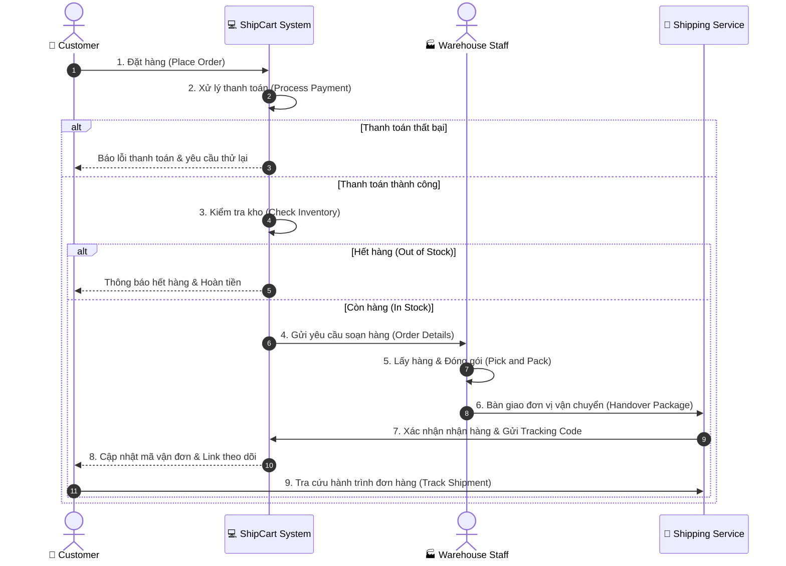
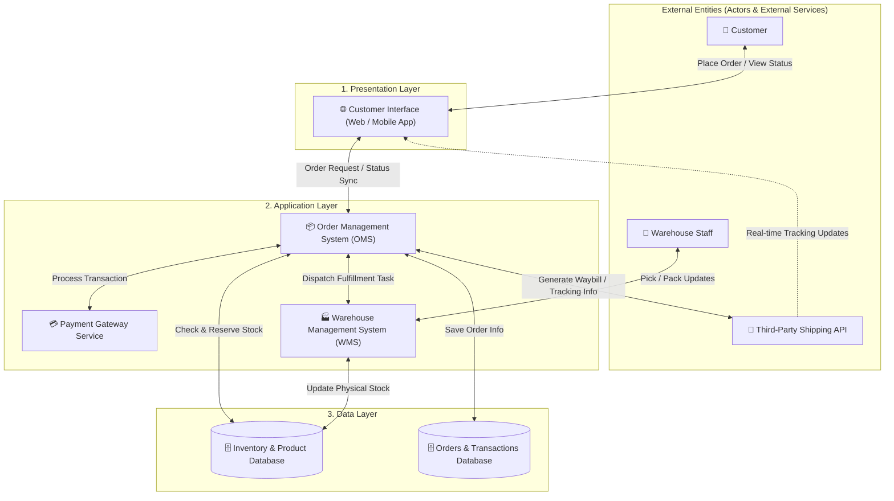

# Lab: System Documentation and Mapping (ShipCart Case Study)

> **Nguồn:** IBM System Design – Module 2: IT Systems Analysis and Review  
> **Tác giả:** Parikshit Jain  
> **Ngày lưu:** 2026-08-14

---

## 🎯 Mục tiêu bài Lab

1. Xây dựng **Process Flow Diagram (Swimlane)** cho luồng xử lý đơn hàng e-commerce.
2. Xây dựng **System Architecture Diagram theo tầng (Layered Architecture Map)**.
3. Phân tích điểm nghẽn hiệu năng (**Performance Bottleneck**) và đề xuất giải pháp tái cấu trúc (**BPR Improvement**) có luận cứ rõ ràng.

---

## 🏢 Bối Cảnh (Scenario: ShipCart)

- **Doanh nghiệp:** ShipCart – Sàn thương mại điện tử Direct-to-Customer (D2C).
- **Vấn đề:** Trì trệ trong xử lý đơn hàng (fulfillment) và theo dõi vận chuyển (tracking) do các hệ thống bị phân mảnh, thiếu tầm nhìn vào quy trình backend.
- **5 quy trình cốt lõi:**
  1. Đặt hàng (Order Placement)
  2. Xử lý thanh toán (Payment Processing)
  3. Kiểm tra tồn kho (Inventory Check)
  4. Hoàn tất đơn hàng tại kho (Order Fulfillment - Pick & Pack)
  5. Theo dõi vận chuyển (Shipment Tracking)

---

## 🧩 Phần 1: Process Flow Diagram (Swimlane Workflow)

---

## 🏗️ Phần 2: System Architecture Diagram (Layered Architecture)

---

## 📊 Phần 3: Performance Analysis & Recommendation

| Hạng mục xem xét | Chi tiết phân tích & Đề xuất |
|---|---|
| **Điểm nghẽn xác định (Bottleneck Identified)** | **Kiểm tra và cập nhật tồn kho thủ công/bất đồng bộ:** Giữa Order Management System (OMS) và CSDL kho (Inventory Database). Dữ liệu kho không cập nhật real-time dẫn đến việc hệ thống nhận đơn hàng cho các sản phẩm đã hết hàng (overselling) → Đơn hàng bị hủy, khách hàng thất vọng và tăng tải công việc xử lý thủ công cho nhân viên kho. |
| **Đề xuất cải tiến (Suggested Improvement)** | **Tích hợp đồng bộ tồn kho thời gian thực (Real-time Inventory Sync):** Triển khai phần mềm quét mã vạch/RFID tự động cập nhật số lượng tồn kho tức thời ngay khi sản phẩm được Pick/Pack hoặc nhập kho; kết nối trực tiếp cơ chế Event-driven giữa WMS và OMS. |
| **Luận cứ & Lợi ích kỳ vọng (Justification & Expected Benefits)** | 1. **Giảm độ trễ xử lý:** Loại bỏ độ trễ cập nhật tồn kho. 2. **Giảm thiểu hủy đơn:** Tránh bán vượt số lượng thực tế. 3. **Tăng Throughput:** Đẩy nhanh tốc độ xử lý đơn hàng từ khâu đặt đến đóng gói. 4. **Nâng cao trải nghiệm khách hàng:** Minh bạch tình trạng hàng hóa và thời gian giao nhận. 5. **Tối ưu chi phí vận hành:** Giảm áp lực tra soát thủ công cho nhân sự kho bãi. |

---

## 📝 Tổng Kết Bài Lab

- **Quy trình tổng thể:** Bắt đầu từ việc vẽ Swimlane Workflow để hiểu trách nhiệm từng role $\rightarrow$ Ánh xạ sang Kiến trúc phân tầng (Presentation, Application, Data, External API) để tìm điểm đứt gãy $\rightarrow$ Nhận diện Bottleneck và đưa ra giải pháp BPR.
- **Kỹ năng cốt lõi:** Trực quan hóa hệ thống thực tế (Visual Modeling) là chìa khóa để phân tích nguyên nhân gốc rễ và đề xuất giải pháp kỹ thuật có giá trị kinh doanh thực tiễn.
