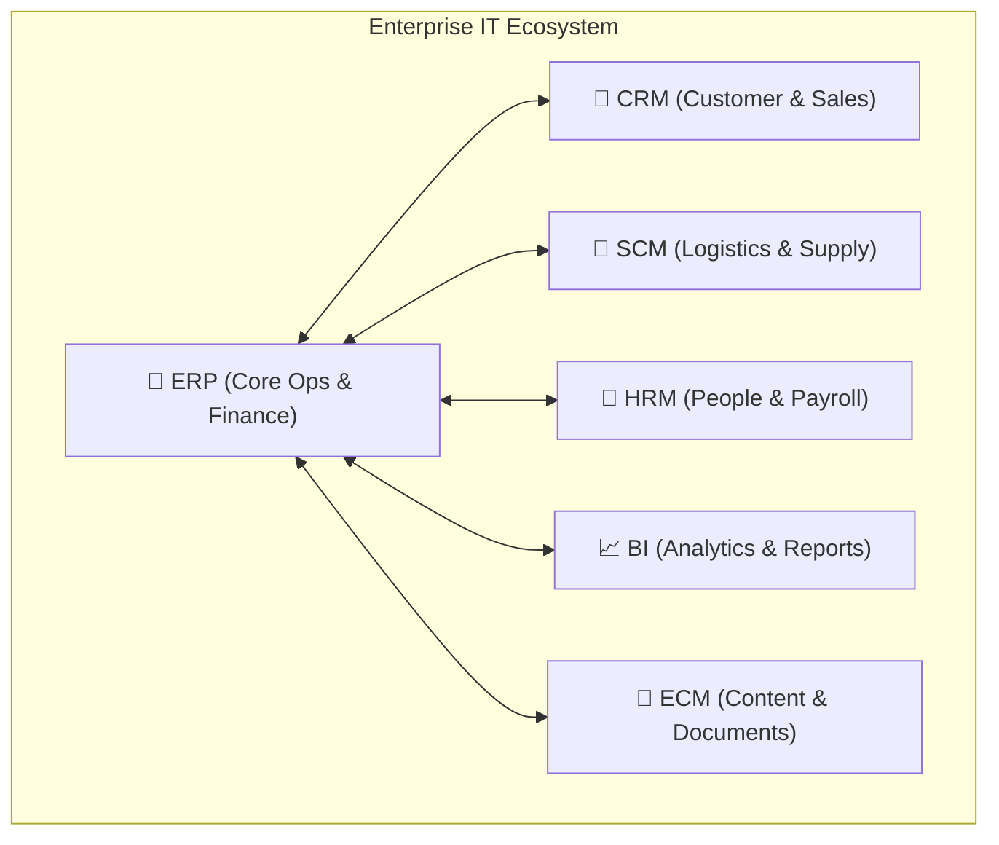

# Overview of ERP, CRM, and Other Enterprise Systems

> **Nguồn:** IBM System Design – Module 2: IT Systems Analysis and Review  
> **Ngày lưu:** 2026-08-14

---

## 🎯 Mục tiêu học tập

- Giải thích mục đích và các thành phần cốt lõi của hệ thống CNTT doanh nghiệp (**Enterprise IT Systems**).
- Mô tả chi tiết vai trò, kiến trúc của **ERP**, **CRM**, **SCM**, **HRM**, **BI**, **ECM**.
- Nhận diện các lợi ích kinh doanh, ứng dụng thực tế theo ngành.
- Nắm vững thách thức triển khai và các **Best Practices** thành công.

---

## 📊 Bối Cảnh Thực Tế

- **95%** doanh nghiệp triển khai ERP ghi nhận sự cải thiện vượt bậc trong hoạt động vận hành.
- Gần **50%** tổ chức vẫn đang hoạt động với các hệ thống rời rạc (*disconnected systems*) và bảng tính excel thủ công $\rightarrow$ Cho thấy tầm quan trọng của việc hợp nhất hệ thống doanh nghiệp.

---

## 1. Tổng Quan Về Enterprise IT Systems

**Enterprise IT Systems** là các nền tảng phần mềm nâng cao giúp **hợp nhất và tối ưu hóa các quy trình nghiệp vụ cốt lõi** của một tổ chức:
- **Mục đích:** Tự động hóa quy trình, tập trung hóa dữ liệu, thúc đẩy cộng tác liên phòng ban.
- **Giá trị:** Tăng năng suất, giảm chi phí vận hành, gắn kết hoạt động hàng ngày với mục tiêu chiến lược.

---

## 2. Chi Tiết Các Hệ Thống Doanh Nghiệp Trọng Yếu

### 2.1 Enterprise Resource Planning (ERP)
- **Mục đích:** Tích hợp mọi chức năng nghiệp vụ cốt lõi nội bộ (Tài chính, Nhân sự, Kho, Thu mua) vào một hệ thống duy nhất với cơ sở dữ liệu tập trung.
- **Thành phần cốt lõi:**
  - *Functional Modules:* Kế toán, Quản lý kho, Chuỗi cung ứng, Thu mua.
  - *Centralized Database:* Xóa bỏ các "ốc đảo dữ liệu" (data silos).
  - *Automation:* Tự động hóa báo cáo, lập lịch sản xuất, re-order hàng.
- **Giải pháp phổ biến:** SAP, Oracle NetSuite, Microsoft Dynamics 365.

### 2.2 Customer Relationship Management (CRM)
- **Mục đích:** Quản lý tương tác với khách hàng, khách hàng tiềm năng (leads) và đối tác; cung cấp **góc nhìn 360 độ (360-degree view)** về khách hàng.
- **Thành phần cốt lõi:**
  - *Contact Management:* Lưu trữ lịch sử giao dịch, thông tin liên hệ.
  - *Sales Automation:* Theo dõi leads, quản lý cơ hội, dự báo doanh số.
  - *Customer Service Tools:* Ticket support, case management, self-service portal.
  - *Analytics:* Phân tích hành vi khách hàng, hiệu quả chiến dịch marketing.
- **Giải pháp phổ biến:** Salesforce, HubSpot, Zoho CRM.

### 2.3 Các Hệ Thống Chuyên Biệt Khác

| Hệ thống | Tên đầy đủ | Chức năng chính | Nền tảng tiêu biểu |
|---|---|---|---|
| **SCM** | *Supply Chain Management* | Quản lý luồng hàng hóa, dịch vụ và thông tin từ nhà cung cấp đến khách hàng; tối ưu logistics. | SAP SCM, Oracle SCM |
| **HRM** | *Human Resource Management* | Quản lý tuyển dụng, bảng lương (payroll), chấm công, đánh giá hiệu suất, tuân thủ pháp lý. | Workday, BambooHR |
| **BI** | *Business Intelligence* | Phân tích dữ liệu lớn, trực quan hóa Dashboard, theo dõi KPIs doanh thu và hiệu quả vận hành. | Tableau, Microsoft Power BI |
| **ECM** | *Enterprise Content Management* | Quản lý, lưu trữ bảo mật và truy xuất tài liệu số, hồ sơ pháp lý, tài sản số của tổ chức. | DocuWare, OpenText |

---

## 3. Lợi Ích Của Enterprise IT Systems

1. **Integration & Efficiency:** Xóa bỏ dữ liệu rời rạc, chuẩn hóa quy trình liên phòng ban.
2. **Scalability:** Hỗ trợ doanh nghiệp mở rộng quy mô mà không làm gãy đổ hệ thống.
3. **Data-Driven Decision Making:** Cung cấp báo cáo real-time cho ban lãnh đạo ra quyết định chính xác.
4. **Enhanced Customer Experience:** Rút ngắn thời gian phản hồi, cá nhân hóa trải nghiệm khách hàng.
5. **Cost Reduction:** Cắt giảm chi phí vận hành thủ công, tránh trùng lặp tài nguyên.
6. **Compliance & Security:** Quản lý quyền truy cập tập trung, đáp ứng các tiêu chuẩn bảo mật/pháp lý.

---

## 4. Ứng Dụng Thực Tế & Công Cụ Thiết Kế

- **Sản xuất (Manufacturing):** ERP tích hợp sản xuất + thu mua + tài chính; SCM tối ưu luồng nguyên vật liệu.
- **Bán lẻ (Retail):** CRM thúc đẩy chăm sóc khách hàng; BI phân tích xu hướng mua sắm.
- **Công cụ thiết kế hệ thống:**
  - **DFD:** Sơ đồ hóa luồng quy trình nghiệp vụ.
  - **ERD:** Thiết kế cấu trúc CSDL tập trung.
  - **UML:** Trực quan hóa kiến trúc hệ thống và tích hợp API.
- **Kết nối công nghệ mới:** Cloud Computing, Trí tuệ nhân tạo (AI), IoT.

---

## 5. Thách Thức & Best Practices Triển Khai

| Thách thức | Best Practices giải quyết |
|---|---|
| **Chi phí đầu tư ban đầu cao** (High upfront costs) | Lựa chọn các giải pháp **Cloud-based (SaaS)** để giảm chi phí hạ tầng ban đầu và dễ scale. |
| **Thời gian triển khai kéo dài** (Long deployment timelines) | Chia nhỏ giai đoạn (*phased rollout*), ưu tiên các module cốt lõi trước. |
| **Kháng cự thay đổi từ nhân sự** (Resistance to change) | Gắn kết các bên liên quan từ sớm (*stakeholder buy-in*); đầu tư mạnh vào đào tạo người dùng (*user training*). |
| **Lệch mục tiêu kinh doanh** (Misalignment with goals) | Luôn bám sát mục tiêu chiến lược (cắt giảm chi phí, nâng cao dịch vụ) và theo dõi KPIs (uptime, user adoption). |

---

## 📝 Tóm Tắt Nhanh

- **Enterprise IT Systems** = Nền tảng hợp nhất toàn diện tổ chức.
- **ERP** quản lý vận hành nội bộ (Back-office) $\leftrightarrow$ **CRM** quản lý khách hàng và bán hàng (Front-office).
- **Hệ sinh thái bổ trợ:** SCM (chuỗi cung ứng), HRM (nhân sự), BI (phân tích thông minh), ECM (quản lý tài liệu).
- **Yếu tố thành công khi triển khai:** Cam kết từ lãnh đạo, giải pháp Cloud, đào tạo người dùng và theo dõi KPIs liên tục.
