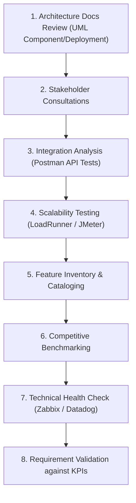

# Reviewing System Architecture and Assessing Features and Functionality

> **Nguồn:** IBM System Design – Module 2: IT Systems Analysis and Review  
> **Ngày lưu:** 2026-08-14

---

## 🎯 Mục tiêu học tập

- Mô tả tầm quan trọng của việc rà soát kiến trúc hệ thống (**System Architecture**) và đánh giá tính năng (**Features & Functionality**) trong thiết kế hệ thống CNTT.
- Nhận diện các thuộc tính cốt lõi của kiến trúc: **Tính Module (Modularity)**, **Khả năng mở rộng (Scalability)** và **Khả năng bảo trì (Maintainability)**.
- Đánh giá tính năng hệ thống đối chiếu với yêu cầu kinh doanh và mục tiêu chiến lược.
- Áp dụng các kỹ thuật: kiểm thử tải/scale, phân tích tích hợp API và kiểm tra sức khỏe kỹ thuật (**Technical Health Checks**).

---

## 💡 Ý Nghĩa Của Hoạt Động Rà Soát & Đánh Giá

| Thành phần | Vai trò quyết định | Ví dụ rủi ro khi thiếu rà soát |
|---|---|---|
| **System Architecture** *(Kiến trúc hệ thống)* | Định hình khung cấu trúc, quyết định tính mở rộng (Scalability), độ tin cậy (Reliability) và khả năng tích hợp (Integration). | Hệ thống ngân hàng nguyên khối cứng nhắc, không thể kết nối các API thanh toán mới. |
| **Features & Functionality** *(Tính năng & Nghiệp vụ)* | Quyết định mức độ đáp ứng nhu cầu thực tế của người dùng và doanh nghiệp. | Thiếu tính năng phát hiện gian lận thời gian thực (Real-time fraud detection) làm mất niềm tin khách hàng. |

> **Mục đích:** Giữ cho hệ thống luôn linh hoạt (*Agile*), vận hành trơn tru và tạo ra giá trị kinh tế bền vững trong các đợt nâng cấp, tái cấu trúc hoặc chuyển đổi số.

---

## 🧭 8 Chiến Lược Rà Soát Kiến Trúc & Đánh Giá Tính Năng



1. **Architecture Documentation Review:** Đọc lại các bản vẽ thiết kế (UML Component, Deployment Diagrams) để phát hiện cấu hình server hoặc module lỗi thời.
2. **Stakeholder Consultations:** Phỏng vấn Tech Leads, Quản lý kho, CSKH để nắm bắt các hạn chế thực tế (VD: CSDL kho chưa hỗ trợ đa chi nhánh).
3. **Integration Analysis:** Kiểm thử kết nối API bằng công cụ như **Postman** (VD: Phát hiện lỗi đồng bộ giữa CRM và ERP).
4. **Scalability Testing:** Giả lập tải đỉnh bằng **LoadRunner / JMeter** để đo năng lực chịu tải giao dịch thanh toán.
5. **Feature Inventory:** Lập danh mục tính năng hiện có và đối chiếu với yêu cầu kinh doanh (VD: Kiểm tra tính năng A/B testing trong Marketing tool).
6. **Competitive Benchmarking:** So sánh tính năng với các đối thủ trong ngành (VD: Kiểm tra phân tích dự báo Predictive Analytics trong SCM).
7. **Technical Health Check:** Dùng **Zabbix / Datadog** kiểm tra độ ổn định, memory leaks và tài nguyên CPU/RAM.
8. **Requirement Validation:** Ánh xạ tính năng với các chỉ số đo lường hiệu quả kinh doanh (**KPIs** như tốc độ xử lý đơn hàng).

---

## 🔍 2 Trọng Tâm Đánh Giá Cốt Lõi (Key Areas of Focus)

### 1. Kiến Trúc Hệ Thống (System Architecture)
- **Modularity & Maintainability:** Hệ thống có được module hóa không? Kiến trúc Microservices hay Monolithic?
- **Modern Patterns:** Có áp dụng Event-driven architecture, Message Queues (Kafka, RabbitMQ) và Cloud-ready không?

### 2. Tính Năng & Chức Năng (Features & Functionality)
- **Nghiệp vụ cốt lõi:** Các tính năng có đáp ứng đúng nhu cầu vận hành không (VD: Báo cáo tài chính thời gian thực)?
- **Future-proof:** Tính năng có dễ nâng cấp và thân thiện với người dùng không?

---

## 🏆 Lợi Ích Của Quá Trình Đánh Giá

- **Optimized Performance:** Tối ưu schema CSDL, giải quyết triệt để nút thắt cổ chai hiệu năng.
- **Strategic Alignment:** Gắn kết tính năng với mục tiêu kinh doanh (VD: Cá nhân hóa CRM để giữ chân khách hàng).
- **Cost Efficiency:** Loại bỏ module thừa thãi, giảm chi phí bảo trì hệ thống cũ.
- **Adaptability:** Kiến trúc mở giúp dễ dàng tích hợp công nghệ mới (AI, Cloud, Microservices).
- **User Productivity:** Tinh giản quy trình giúp tăng năng suất nhân viên và trải nghiệm khách hàng.
- **Risk Mitigation:** Phát hiện sớm lỗ hổng bảo mật và nguy cơ sập hệ thống.

---

## 🛡️ Thách Thức & Best Practices

```
[Challenges]
├── Tài liệu kiến trúc bị lỗi thời (Outdated documentation)
├── Lệch pha mục tiêu giữa IT và Kinh doanh (Stakeholder misalignment)
└── Phụ thuộc chéo quá phức tạp giữa các service (Complex dependencies)

[Best Practices]
├── Broad Stakeholder Engagement  (Gắn kết đa chiều từ IT đến Lãnh đạo)
├── Standardized Visualizations   (Chuẩn hóa bản vẽ bằng UML, BPMN)
├── Focus on Critical Components  (Ưu tiên phân hệ trọng yếu như xử lý thanh toán)
├── Continuous Monitoring         (Giám sát tự động qua Zabbix, Datadog)
└── Periodic Reassessment         (Đánh giá định kỳ theo từng chu kỳ phát triển)
```

---

## 📝 Tóm Tắt Nhanh

- **Kiến trúc hệ thống** định hình *năng lực kỹ thuật* (Scale, Tích hợp, Bảo trì); **Tính năng** quyết định *giá trị nghiệp vụ*.
- **Quy trình chuẩn:** Đọc bản vẽ UML $\rightarrow$ Phỏng vấn $\rightarrow$ Test API (Postman) $\rightarrow$ Test tải (LoadRunner) $\rightarrow$ Kiểm tra sức khỏe (Zabbix) $\rightarrow$ Đo đạc với KPIs.
- **Đánh giá hệ thống là quy trình lặp liên tục (Iterative):** Cần liên tục tái đánh giá khi mục tiêu kinh doanh và công nghệ thay đổi.
