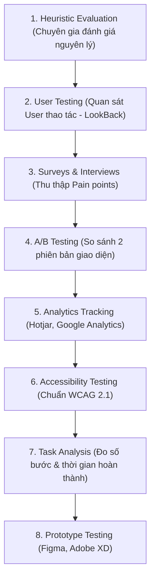

# UI/UX Evaluation for User-Friendly Systems

> **Nguồn:** IBM System Design – Module 2: IT Systems Analysis and Review  
> **Ngày lưu:** 2026-08-14

---

## 🎯 Mục tiêu học tập

- Nhận diện tầm quan trọng của việc đánh giá UI/UX trong thiết kế hệ thống CNTT.
- Mô tả 8 phương pháp đánh giá UI/UX hiệu quả (Heuristic, A/B testing, Analytics, Accessibility,...).
- Giải thích 6 yếu tố cốt lõi định hình trải nghiệm người dùng và các lợi ích kinh doanh mang lại.
- Nắm vững thách thức và các **Best Practices** khi thực hiện đánh giá UI/UX.

---

## 💡 Phân Biệt UI và UX

| Khái niệm | Định nghĩa | Trọng tâm |
|---|---|---|
| **User Interface (UI)** | Giao diện người dùng | Các yếu tố trực quan và tương tác: màu sắc, typography, nút bấm, bố cục layout. |
| **User Experience (UX)** | Trải nghiệm người dùng | Cảm nhận tổng thể về sự tiện lợi, tốc độ, độ dễ dùng và sự hài lòng khi hoàn thành tác vụ. |

> **Ý nghĩa:** Đánh giá UI/UX giúp hệ thống không chỉ "chạy đúng về mặt kỹ thuật" mà còn trực quan, mượt mà, giúp tăng tỷ lệ tiếp nhận (adoption) và gắn kết với mục tiêu kinh doanh.

---

## 🧭 8 Phương Pháp Đánh Giá UI/UX (Evaluation Methodologies)



1. **Heuristic Evaluation:** Chuyên gia rà soát giao diện dựa trên bộ nguyên lý Usability (VD: Đảm bảo thanh điều hướng nhất quán trong app ngân hàng).
2. **User Testing:** Quan sát người dùng thật thực hiện tác vụ và ghi nhận khó khăn bằng công cụ như **LookBack**.
3. **Surveys & Interviews:** Khảo sát và phỏng vấn trực tiếp để tìm điểm nghẽn (VD: Khó dùng bộ lọc báo cáo trên CRM).
4. **A/B Testing:** So sánh 2 phiên bản giao diện để đo lường tỷ lệ chuyển đổi hoặc thời gian hoàn thành tác vụ.
5. **Analytics Tracking:** Dùng **Hotjar (Heatmaps)** hoặc **Google Analytics** để phát hiện điểm rơi rớt người dùng (Drop-off points).
6. **Accessibility Testing (a11y):** Kiểm tra khả năng tiếp cận cho người khuyết tật theo chuẩn **WCAG 2.1** (độ tương phản, hỗ trợ Screen Reader).
7. **Task Analysis:** Đo lường chính xác số lượt click chuột và số giây cần thiết để hoàn tất một tác vụ (VD: Lưu form thông tin).
8. **Prototype Testing:** Thử nghiệm sớm trên bản mẫu (**Figma, Adobe XD**) trước khi đội Dev viết mã hoàn chỉnh.

---

## 🔑 6 Yếu Tố Cốt Lõi Định Hình UI/UX (Key Factors)

| Yếu tố | Ý nghĩa | Tiêu chuẩn đánh giá |
|---|---|---|
| **1. Intuitiveness (Tính trực quan)** | Dễ hiểu ngay từ lần đầu | Nhãn rõ ràng, luồng đi tự nhiên, rút ngắn thời gian học cách dùng (Learning curve). |
| **2. Efficiency (Tính hiệu quả)** | Tối ưu hóa thời gian thao tác | Giảm thiểu tối đa số bước/click chuột để hoàn thành form. |
| **3. Consistency (Tính nhất quán)** | Đồng nhất trong toàn bộ hệ thống | Màu sắc, font chữ, kích thước nút bấm đồng bộ trên mọi trang. |
| **4. Accessibility (Khả năng tiếp cận)** | Phục vụ mọi đối tượng người dùng | Độ tương phản màu sắc cao, hỗ trợ điều hướng hoàn toàn bằng bàn phím. |
| **5. Aesthetics (Tính thẩm mỹ)** | Giao diện hiện đại, sạch sẽ | Bố cục gọn gàng, tạo cảm giác tin cậy và hứng thú khi sử dụng. |
| **6. Feedback Mechanisms (Phản hồi tương tác)** | Xác nhận hành động của người dùng | Hiển thị thông báo Toast/Alert rõ ràng khi lưu dữ liệu thành công hoặc báo lỗi. |

---

## 🏆 6 Lợi Ích Kinh Doanh Của Đánh Giá UI/UX

1. **Tăng tỷ lệ tiếp nhận (Increased User Adoption):** Giao diện thân thiện khiến người dùng muốn gắn bó lâu dài.
2. **Nâng cao năng suất (Enhanced Productivity):** Tinh gọn form nhập liệu giúp nhân viên tiết kiệm hàng ngàn giờ thao tác.
3. **Cải thiện sự hài lòng (Improved Satisfaction):** Trải nghiệm mượt mà giúp giữ chân khách hàng (Customer Retention).
4. **Giảm thiểu sai sót (Reduced Errors):** Bố cục rõ ràng và cảnh báo thông minh giúp ngăn ngừa lỗi thao tác dữ liệu.
5. **Tiết kiệm chi phí sửa lỗi (Cost Savings):** Phát hiện lỗi trải nghiệm ở giai đoạn Prototype rẻ hơn gấp 10-100 lần so với sửa trên Production.
6. **Lợi thế cạnh tranh vượt trội (Competitive Edge):** Giúp sản phẩm nổi bật hoàn toàn trong các lĩnh vực E-commerce hay Fintech.

---

## 🛡️ Thách Thức & Best Practices

```
[Challenges]
├── Ý kiến chủ quan đa dạng của người dùng (Subjective preferences)
├── Ngân sách kiểm thử hạn hẹp (Limited testing budget)
└── Khó cân bằng giữa Tính thẩm mỹ (Aesthetics) và Tính năng (Functionality)

[Best Practices]
├── Involve Real Users Early   (Test với người dùng thật, không phỏng đoán)
├── Test Prototypes in Figma   (Đánh giá bản mẫu Prototype trước khi viết code)
├── Leverage Behavioral Data   (Ưu tiên sửa lỗi dựa trên số liệu Hotjar/GA)
├── Enforce WCAG 2.1 Standards (Kiểm thử tiếp cận để phục vụ đa dạng người dùng)
└── Balance Beauty & Usability (Thẩm mỹ phải phục vụ tính dễ dùng, không làm rối)
```

---

## 📝 Tóm Tắt Nhanh

- **UI/UX Evaluation** đảm bảo hệ thống không chỉ "hoạt động được" mà còn **dễ dùng, trực quan và hiệu quả**.
- **8 Phương pháp chủ chốt:** Heuristic, User Testing, Surveys, A/B Testing, Analytics (Hotjar), Accessibility (WCAG 2.1), Task Analysis, Figma Prototype.
- **6 Yếu tố vàng:** Trực quan (Intuitiveness), Hiệu quả (Efficiency), Nhất quán (Consistency), Tiếp cận (Accessibility), Thẩm mỹ (Aesthetics), Phản hồi (Feedback).
- **Nguyên tắc cốt lõi:** Thử nghiệm sớm trên Prototype, dựa vào dữ liệu hành vi thực tế và cân bằng giữa thẩm mỹ và tính năng.
