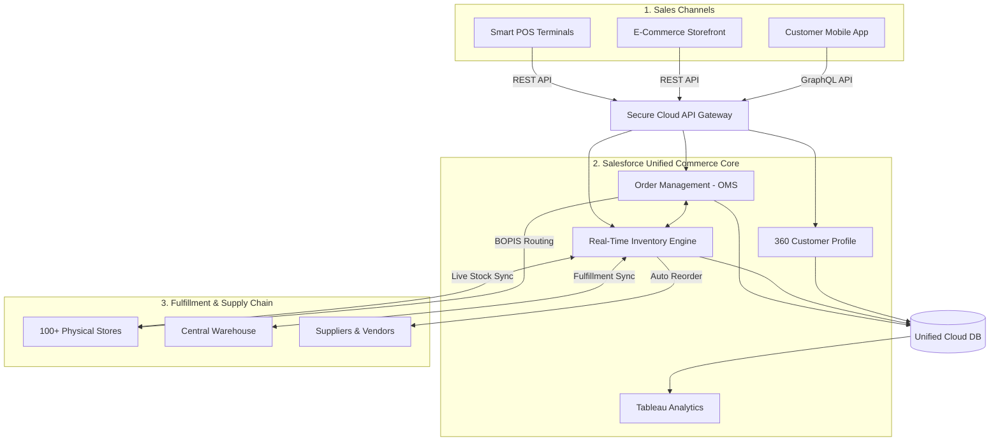
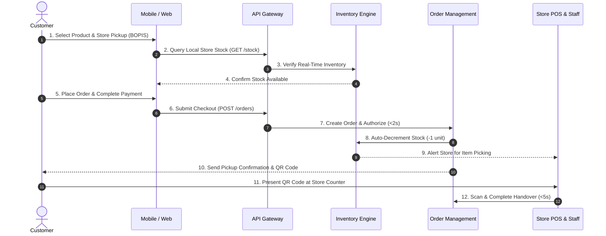

# Final Project Submission: Digital Transformation Strategy for a Midsized Retailer

**Course:** Design and Analysis of IT Systems (IBM / Coursera)  
**Author:** Systems Analyst  
**Format:** Final Project Report  

---

## Step 1: Assess Current Systems (9 Points)

### 1.1 Summary of Current System Architecture
The retailer currently operates an outdated, fragmented on-premises and early-generation e-commerce infrastructure across approximately 50 physical stores:
- **Point-of-Sale (POS) Systems:** In-store terminals run on legacy **Windows CE** operating systems utilizing outdated card reader drivers from 2009. The transaction checkout latency regularly exceeds **5 seconds**.
- **E-Commerce Platform:** Built on **Magento 1.9** backed by an independent, isolated MySQL database. The web experience is severely degraded with a Cumulative Layout Shift (**CLS > 0.25**) and initial page load times exceeding **2 seconds on 4G networks**.
- **Data Storage & Architecture:** Each individual store hosts its own **on-premise SQL database**. Store transactions are synchronized to Headquarters (HQ) via **nightly batch ETL jobs**, creating severe data silos and out-of-sync customer profiles.
- **Inventory Management:** Relies entirely on **manual data entry via Microsoft Excel/CSV spreadsheets**, causing extreme stock visibility latency, inventory inaccuracy, and delayed reordering.

### 1.2 Pain-Point Matrix (Issues, Impacts, and Root Causes)

| Operational Area | Specific Pain Point / Issue | Business & Customer Impact | Technical Root Cause |
| :--- | :--- | :--- | :--- |
| **Checkout (In-store & Online)** | High latency (>5s POS checkout, >2s 4G web load, CLS > 0.25). | Cart abandonment, reduced conversion rates, long queues, and customer churn. | Obsolete Windows CE hardware, 2009 peripheral drivers, and unoptimized monolithic Magento 1.9 architecture. |
| **Restocking & Inventory** | Frequent stockouts, overstocks, and supplier reorder delays. | Lost sales revenue, inability to fulfill orders, and tied-up working capital. | Disconnected manual Excel spreadsheets and lack of automated real-time inventory decrement across channels. |
| **Marketing & CRM** | Split customer lists and disconnected purchasing history. | Inability to run personalized omni-channel campaigns or loyalty programs. | Siloed store-level SQL databases updating only via nightly batch jobs to HQ with no centralized Customer Master Data. |

### 1.3 Key Inefficiencies Restricting Scaling & Agility
1. **Manual CSV Imports & Duplicate Data Entry:** Operations rely on manual spreadsheet reconciliation, creating high operational overhead and error risks.
2. **Inconsistent Customer Data across Channels:** Lack of a Single Customer View (SCV) prevents omnichannel personalization and accurate CRM segmentation.
3. **Sluggish POS and Web Interfaces:** Suboptimal user experience directly diminishes brand trust and lowers transaction throughput.
4. **Lack of Real-Time Inventory Visibility:** Prevents modern omnichannel capabilities such as Buy Online, Pickup In-Store (**BOPIS**) and Buy Online, Return In-Store (**BORIS**), blocking the planned expansion to 100+ stores.

---

## Step 2: Define Stakeholder Requirements (10 Points)

### 2.1 Stakeholders and Their Interests
1. **Customers:** Seek fast, frictionless purchasing experiences, sub-2-second responsive page loads, unified shopping carts across devices, and 100% accurate real-time inventory visibility.
2. **Store Staff:** Require an intuitive, modern POS terminal with rapid barcode scanning and sub-5-second checkout times, alongside multi-store inventory lookups to assist walk-in customers.
3. **Management (Executive & Operations):** Demand centralized data intelligence, a Single Customer View (360° profile), automated reporting, real-time margin/profit analytics, and seamless scaling to 100+ stores.
4. **IT Team:** Prioritize low maintenance overhead, modern API-first/cloud-native architecture, robust cybersecurity, and strict regulatory compliance (PCI-DSS for payment security, GDPR/CCPA for customer data protection).

### 2.2 Functional Requirements (FR) & Justifications

| Requirement ID | Functional Requirement Specification | Detailed Justification & Business Pain Point Addressed |
| :--- | :--- | :--- |
| **FR-01** | Process in-store sales transactions at POS within $\le$ **5 seconds** (including payment gateway authorization). | Eliminates in-store queue congestion and directly resolves the legacy Windows CE hardware/driver bottleneck. |
| **FR-02** | Automatic **real-time inventory decrement** across all sales channels (Online, POS, Warehouse) upon transaction commit. | Prevents double-selling, eliminates manual Excel stock adjustments, and resolves chronic stockouts. |
| **FR-03** | Provide a **360° Customer Profile API** aggregating in-store and online purchasing history, loyalty points, and preferences. | Eliminates data silos caused by nightly batch syncs; empowers marketing to deliver personalized omni-channel campaigns. |
| **FR-04** | Support **Buy Online, Pickup In-Store (BOPIS)** and cross-channel inventory reservation workflows. | Directly meets modern customer expectations and unlocks true unified omnichannel commerce capabilities. |

### 2.3 Non-Functional Requirements (NFR) & Justifications

| Requirement ID | Non-Functional Requirement Specification | Detailed Justification & Business Pain Point Addressed |
| :--- | :--- | :--- |
| **NFR-01** | **System Availability:** High Availability $\ge$ **99.9% uptime** ($24\times7\times365$) with cloud redundancy and automated failover. | Ensures zero sales disruption during peak trading hours and guarantees mission-critical retail continuity. |
| **NFR-02** | **Performance / Latency:** E-commerce page load times under **2 seconds on 4G mobile networks** with Cumulative Layout Shift (CLS) $\le$ 0.1. | Prevents online shopper bounce rate, improves mobile conversion rates, and maximizes search engine ranking (SEO). |
| **NFR-03** | **Scalability & Elasticity:** Ability to scale horizontally to support **3x holiday peak traffic** and seamlessly support growth to **100+ physical stores**. | Future-proofs the technical architecture to support corporate growth targets without requiring infrastructure re-architecting. |

---

## Step 3: Evaluate Alternative Solutions (7 Points)

### 3.1 Comparative Analysis Table

| Evaluation Criteria | Weight | Option A: Salesforce Commerce Cloud + POS (Tableau Retail) | Option B: Shopify Plus + Square POS | Option C: Custom Microservices (React + Node.js + Spree) |
| :--- | :---: | :---: | :---: | :---: |
| **Functional Fit** | **40%** | **9 / 10** (Score: 3.6) | **8 / 10** (Score: 3.2) | **9 / 10** (Score: 3.6) |
| **Scalability** | **20%** | **10 / 10** (Score: 2.0) | **7 / 10** (Score: 1.4) | **10 / 10** (Score: 2.0) |
| **Total Cost of Ownership (Year 1)** | **20%** | **7 / 10** ($150,000) (Score: 1.4) | **9 / 10** ($50,000) (Score: 1.8) | **4 / 10** ($300,000) (Score: 0.8) |
| **Implementation Risk** | **10%** | **7 / 10** (Risk: 15 / 6 mos) (Score: 0.7) | **9 / 10** (Risk: 10 / 3 mos) (Score: 0.9) | **3 / 10** (Risk: 25 / 12 mos) (Score: 0.3) |
| **Vendor Viability** | **10%** | **10 / 10** (Market Leader) (Score: 1.0) | **9 / 10** (Public SaaS) (Score: 0.9) | **5 / 10** (Self-maintained) (Score: 0.5) |
| **Weighted Total Score** | **100%** | **8.7 / 10 (Recommended)** | **8.2 / 10** | **7.2 / 10** |

### 3.2 Recommendation and Rationale
**Recommended Solution: Option A - Salesforce Commerce Cloud + POS (Tableau Retail)**

**Rationale:**
1. **Perfect Strategic Alignment for 100+ Store Expansion:** Salesforce Commerce Cloud offers enterprise-grade scalability (10/10) and comprehensive native omnichannel capabilities (order management, unified customer data, and Tableau analytics).
2. **Timeline Feasibility:** With a deployment time-to-value of **6 months**, Option A fits comfortably within management's strict **9-month deadline** prior to the holiday season.
3. **Rejection of Alternatives:**
   - *Shopify Plus (Option B)* has lower upfront cost and 3-month deployment, but its multi-store POS management and ERP integration encounter significant scalability limitations when scaling beyond 100 enterprise stores.
   - *Custom Microservices (Option C)* takes **12 months** (violating the 9-month deadline), costs **$300,000** (2x Salesforce), and carries an unacceptable implementation risk score of 25.

### 3.3 Trade-Offs for the Recommended Solution
- **Cost vs. Long-Term Scalability:** Year 1 cost ($150,000) is higher than Shopify Plus ($50,000), but delivers higher enterprise stability, avoiding a costly platform migration when expanding to 100+ stores.
- **Customization vs. Speed-to-Market:** Salesforce provides standard enterprise workflows that slightly constrain bespoke UI tweaks compared to Custom Microservices, but drastically reduces delivery risks and maintenance burden.

---

## Step 4: Feasibility and Risk Analysis (8 Points)

### 4.1 Technical, Economic, and Operational Feasibility
- **Technical Feasibility:** Fully feasible. Salesforce Commerce Cloud is an enterprise SaaS platform offering standardized RESTful APIs and certified connectors for POS terminals, eliminating local on-premise store servers and supporting automated cloud-based updates.
- **Economic Feasibility:** Strong positive Net Present Value (**NPV**) over a 5-year period. The $150k initial TCO is rapidly offset by eliminating in-store server hardware maintenance, slashing stockout losses, and driving a projected 15-20% revenue lift from omnichannel sales.
- **Operational Feasibility:** Highly feasible. The system features intuitive web/tablet interfaces for store associates. Comprehensive staff training requires only **8 weeks**, which fits smoothly within operational capacity without disrupting ongoing store sales.

### 4.2 Risk Register & Mitigation Strategies

| Risk ID | Risk Description | Probability (1-5) | Impact (1-5) | Risk Score ($P \times I$) | Mitigation Strategy |
| :--- | :--- | :---: | :---: | :---: | :--- |
| **R1** | **Data Migration Loss or Corruption:** Inconsistencies when migrating legacy store SQL databases and Magento customer tables to the cloud. | 3 | 4 | **12** | Execute **two complete dry runs** in staging; perform automated **Checksum validations** and data schema mapping reconciliations prior to production cutover. |
| **R2** | **Vendor Outage / Cloud Connectivity Loss:** Cloud service disruption or ISP internet outage at individual retail stores during operational hours. | 2 | 5 | **10** | Enforce contractually binding **99.9% vendor SLA**; deploy modern smart POS terminals equipped with **Offline Mode capability** (local caching of transactions with automated background sync upon reconnection). |

### 4.3 Ensuring Project Success within the 9-Month Timeline
The identified mitigations directly protect the 9-month critical path:
- Staging dry-runs prevent emergency post-launch rollbacks and unplanned data fixes.
- Offline-enabled POS deployment allows pilot rollouts at retail stores in parallel with cloud configuration, ensuring zero downtime and on-time completion before the peak holiday shopping season.

---

## Step 5: Visualize and Communicate Recommendations (6 Points)

### 5.1 Architecture & Omnichannel Process Flow (Visual Artifact)

#### A. Target Unified Cloud Commerce Architecture


#### B. End-to-End Omnichannel Checkout & BOPIS Process Flow


---

### 5.2 Addressing Root Pain Points
- **Elimination of POS & Web Delays:** Cloud-native architecture delivers sub-2-second web loading and sub-5-second POS transactions via modern payment APIs and Edge CDN caching.
- **Resolution of Stockouts:** Real-Time Inventory Engine synchronizes stock counts across all 50+ stores and warehouses instantaneously, triggering automated supplier purchase orders when inventory reaches safety thresholds.
- **Unified Omnichannel Marketing:** 360° Customer Profile consolidates all purchase histories into a single repository, enabling personalized marketing campaigns, unified cart recovery, and full BOPIS/BORIS support.

---

### 5.3 9-Month Implementation Roadmap

```mermaid
flowchart TD
    subgraph P1 [Phase 1: Month 1-2 | Foundation]
        T1["• Solution Architecture Finalization<br>• Salesforce Cloud Tenant Setup<br>• Legacy Data Audit & Cleansing"]
    end

    subgraph P2 [Phase 2: Month 3-5 | Integration & Testing]
        T2["• Cloud Platform & REST API Development<br>• POS & OMS Integration<br>• 2x Data Migration Dry Runs with Checksums"]
    end

    subgraph P3 [Phase 3: Month 6-7 | Pilot & Training]
        T3["• Pilot Deployment in 5 Flagship Stores<br>• BOPIS Workflow Real-World Validation<br>• 8-Week Staff Enablement & Training Program"]
    end

    subgraph P4 [Phase 4: Month 8-9 | Cutover & Expansion]
        T4["• Full 50-Store Rollout & Production Cutover<br>• Decommission Legacy Windows CE & Magento<br>• Performance Optimization for 100+ Stores"]
    end

    P1 --> P2 --> P3 --> P4
```

| Milestone | Timeframe | Key Deliverables & Objective |
| :--- | :---: | :--- |
| **Milestone 1: Discovery & Planning** | **Month 1 – 2** | Finalize solution architecture, configure Salesforce cloud tenant, conduct source data audit, and clean legacy databases. |
| **Milestone 2: Core Platform & Integration** | **Month 3 – 5** | Develop REST API integrations between POS, Web, and Inventory Engine; execute 2 Data Migration Dry Runs with Checksum validation. |
| **Milestone 3: Pilot & Staff Enablement** | **Month 6 – 7** | Roll out Pilot to 5 flagship stores; conduct 8-week staff training on new POS; validate BOPIS workflows in real-world retail conditions. |
| **Milestone 4: Full Cutover & Optimization** | **Month 8 – 9** | Complete full rollout across all 50 stores; deprecate legacy Windows CE/Magento 1.9; optimize performance for holiday season and 100+ store expansion. |
