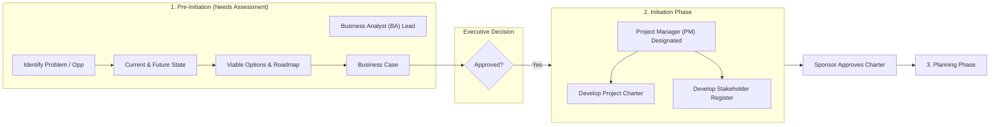

# The Initiating Process Group: Your Involvement

## 1. Tổng quan về Khởi tạo dự án (Project Initiation)
- **Ý nghĩa:** Khởi tạo dự án giống như việc chuẩn bị bản đồ trước khi căng buồm ra khơi. Nắm vững quy trình khởi tạo là bước đầu tiên quyết định sự thành công của dự án.
- **Sản phẩm cốt lõi:** 
  - **Project Charter (Hiến chương dự án)**
  - **Stakeholder Register (Sổ đăng ký bên liên quan)**
- **Ủy quyền chính thức:** Nhận phê duyệt chính thức từ **Executive Sponsor** (Nhà tài trợ điều hành) để dự án được cấp phép triển khai.

---

## 2. Giai đoạn Tiền khởi tạo: Đánh giá nhu cầu (Pre-Initiation / Needs Assessment Phase)
*Vai trò chủ trì: **Business Analyst (BA)** phối hợp chặt chẽ cùng các Stakeholders.*

Quy trình 5 bước thực hiện:
1. **Xác định vấn đề hoặc cơ hội (*Identify the problem or opportunity*):**
   - BA làm việc với các bên liên quan để nhận diện nhu cầu kinh doanh.
   - Soạn thảo **Situation Statement (Tuyên bố tình huống)**: nêu rõ vấn đề/cơ hội, tác động lên tổ chức và giá trị mang lại nếu được giải quyết.
2. **Đánh giá hiện trạng (*Current state assessment*):**
   - Đánh giá điểm mạnh và các điểm thiếu hiệu quả của quy trình hiện tại.
   - Xác định hành động cho từng quy trình: **Keep** (Giữ), **Change** (Thay đổi), **Start** (Bắt đầu mới), **Stop** (Dừng lại).
3. **Xác định trạng thái tương lai (*Determine the future state*):**
   - Định nghĩa mục tiêu kinh doanh (*business goals & objectives*) cần đạt.
   - Liệt kê danh sách các tính năng/chức năng hiện tại và đề xuất mới (*current & proposed features/functionality*).
4. **Xác định các phương án khả thi & Lộ trình (*Determine viable options & High-level Roadmap*):**
   - Đưa ra các giải pháp tiềm năng và thực hiện nghiên cứu tính khả thi (*feasibility study*).
   - Đánh giá và ưu tiên giải pháp theo: *Feasibility (Tính khả thi), Cost (Chi phí), Strategic Alignment (Căn chỉnh chiến lược), Impact (Mức độ tác động)*.
   - Xây dựng **High-level Product Roadmap** phác thảo tính năng và trình tự bàn giao.
5. **Tổng hợp Hồ sơ kinh doanh (*Assembling the Business Case*):**
   - Tổng hợp vấn đề/cơ hội, dữ liệu hỗ trợ, giải pháp đề xuất và đánh giá tác động.
   - Trình Ban lãnh đạo (*Executive Leadership*) để đưa ra quyết định: **Phê duyệt (Approval)**, **Hoãn lại (Deferment)**, hoặc **Bác bỏ (Rejection)**.

---

## 3. Giai đoạn Khởi tạo (Initiation / Pre-baseline Approval Phase)
*Vai trò chủ trì: **Project Manager (PM)** được chỉ định sau khi Business Case được phê duyệt.*

Gồm 2 bước then chốt:

### Bước 1: Lập Project Charter (Hiến chương dự án)
- **Người chủ trì:** PM dẫn dắt với sự hỗ trợ chuyên môn từ BA, SME (Subject Matter Experts) và key stakeholders.
- **Nội dung chính:** Chính thức hóa Mục đích (*Purpose*), Phạm vi (*Scope*), Mục tiêu (*Objectives*) và Quyền hạn (*Authority*) của dự án.
- **Phê duyệt:** Trình **Executive Sponsor** phê duyệt để chính thức bước vào giai đoạn tiền cơ sở (*pre-baseline phase*), tạo tiền đề cho lập kế hoạch (*Planning*).

### Bước 2: Xây dựng Stakeholder Register (Sổ đăng ký bên liên quan)
- **Hợp tác:** PM và BA phối hợp hợp nhất danh sách bên liên quan từ giai đoạn Needs Assessment cùng các bên mới phát hiện trong giai đoạn Initiation.
- **Nội dung:** Ghi nhận vai trò, trách nhiệm và mức độ ảnh hưởng của các bên (*Functional Managers, SMEs, Customers, End-users, Operations Managers,...*).
- **Vai trò:** Là tài liệu nguồn xuyên suốt vòng đời dự án từ Lập kế hoạch (*Planning*) đến Kết thúc (*Closure*).

---

## 4. Tóm tắt Phân định vai trò BA & PM

- **Business Analyst (BA):** Chủ trì giai đoạn Đánh giá nhu cầu (*Pre-initiation*), phát triển Business Case, và tiếp tục đồng hành như một SME hỗ trợ PM xuyên suốt các giai đoạn Planning, Execution, Closure nhằm đảm bảo dự án tạo ra đúng kết quả kinh doanh mong đợi.
- **Project Manager (PM):** Tiếp nhận khi Business Case được duyệt, chủ trì xây dựng Project Charter và Stakeholder Register, dẫn dắt dự án từ Initiation đến kết thúc.
