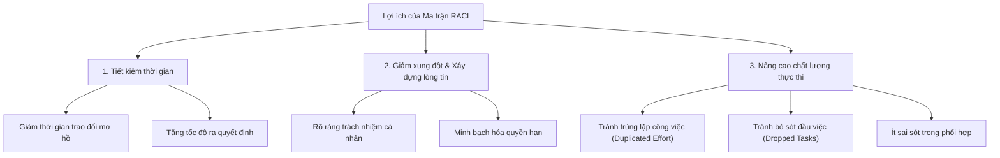

# Demo: Stakeholder Identification: RACI

## 1. Khái niệm Ma trận RACI (RACI Matrix)
- **Định nghĩa:** **RACI** là một **Responsibility Assignment Matrix (Ma trận phân công trách nhiệm)** dùng để làm rõ *ai làm việc gì (who does what)* trong dự án, quy trình hoặc đội ngũ.
- **Ý nghĩa 4 thành tố:**
  - **R - Responsible (Người thực hiện):** Người trực tiếp triển khai, làm việc để hoàn thành nhiệm vụ.
  - **A - Accountable (Người chịu trách nhiệm giải trình):** Người sở hữu kết quả cuối cùng (*owns the outcome*), có quyền phê duyệt và chịu trách nhiệm toàn diện.
  - **C - Consulted (Người được tham vấn):** Chuyên gia cung cấp ý kiến chuyên môn, dữ liệu đầu vào (*input & expertise*) trước và trong khi thực hiện.
  - **I - Informed (Người được thông báo):** Những người cần được cập nhật tiến độ và kết quả công việc (*updates & awareness*).

---

## 2. Đối tượng & Phạm vi áp dụng (Tính phổ quát)
RACI không chỉ dành cho Project Manager (PM) hay Business Analyst (BA) mà là công cụ quản trị phổ quát (*universal management tool*):
- **Quản lý vận hành (Operations Manager):** Làm rõ trách nhiệm về an toàn (*safety*), lịch trình (*scheduling*) và báo cáo (*reporting*).
- **Đội ngũ Kỹ thuật Dữ liệu (Data Engineering Team):** Phân định ai xây dựng pipeline, ai phê duyệt mô hình (*approve models*), ai tham vấn về tuân thủ (*compliance*).
- **Phòng ban chức năng (Marketing, Customer Service):** Đảm bảo mọi thành viên hiểu rõ vai trò, không phải phỏng đoán nhiệm vụ.
- **Quy mô áp dụng:** Dự án chính thức, quy trình liên phòng ban, vận hành định kỳ hoặc sáng kiến ngắn hạn.

---

## 3. Cấu trúc Biểu mẫu RACI (RACI Template)

| Cột thông tin | Mục đích & Quy tắc sử dụng |
| :--- | :--- |
| **Role** | Chức danh hoặc vai trò chuyên môn (VD: Project Manager, Operations Manager, Developer, Finance). |
| **Name** | Họ tên cá nhân phụ trách. Nếu chưa xác định, để trống hoặc ghi **TBD (To Be Determined)**. |
| **R / A / C / I** | Đánh dấu vai trò tương ứng với từng tác vụ/sản phẩm bàn giao. |
| **Key Tasks** | Liệt kê nhiệm vụ/trách nhiệm cụ thể gắn với vai trò đó để hướng tới hành động thực tế. |

> [!IMPORTANT]
> **Quy tắc vàng của RACI:** Mỗi nhiệm vụ/đầu việc **phải có DUY NHẤT 1 chữ "A" (Single Point of Accountability)**. Nếu có nhiều hơn một người chịu trách nhiệm cuối cùng, tính giải trình sẽ bị phân tán dẫn đến xung đột hoặc đùn đẩy trách nhiệm.

---

## 4. Ví dụ thực tế: Tự động hóa điều vận vận tải (Automating Transportation Dispatch)
- **Các vai trò liên quan:** PM, Operations Manager, Dispatch Coordinator, Drivers, IT, Customer Service, Finance.
- **Các chuỗi công việc:** Lập kế hoạch (*Planning*), Lên lịch (*Scheduling*), Điều vận (*Dispatching*), Giám sát (*Monitoring*), Xuất hóa đơn (*Billing*).
- **Hiệu quả:** Xóa bỏ sự mơ hồ (*removes ambiguity*), đảm bảo mọi mắt xích trong chuỗi vận hành nắm rõ nhiệm vụ của mình.

---

## 5. Lợi ích cốt lõi của RACI Matrix

- **Tiết kiệm thời gian & Tăng tốc độ:** Loại bỏ sự chồng chéo và do dự trong triển khai.
- **Giảm thiểu xung đột & Xây dựng lòng tin:** Khi vai trò minh bạch, các bộ phận phối hợp mượt mà hơn.
- **Tránh rủi ro vận hành:** Ngăn chặn tình trạng **trùng lặp công sức (*duplicated effort*)** hoặc **bỏ sót đầu việc (*dropped tasks*)**.
