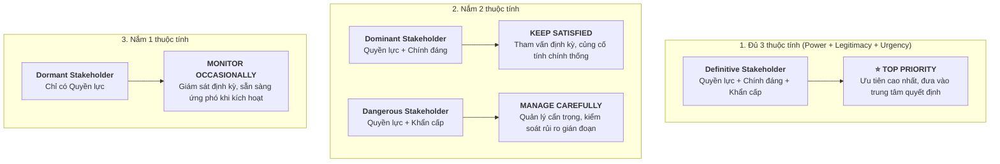

# Stakeholder Classification (Phân loại Bên liên quan)

## 1. Tầm quan trọng của việc phân loại Bên liên quan
- **Nguyên lý:** Mỗi bên liên quan có mức độ ảnh hưởng và mức độ quan tâm khác nhau. Phương pháp tiếp cận "cào bằng" (*one-size-fits-all*) hiếm khi mang lại thành công.
- **Mục tiêu:** Định hướng chiến lược tương tác phù hợp, tập trung nguồn lực và sự chú ý vào đúng đối tượng có tác động lớn nhất.
- **Hai mô hình chuẩn theo PMI:** 
  1. **Power & Interest Model (Mô hình Quyền lực & Mối quan tâm)**
  2. **Salience Model (Mô hình Nổi bật)**

---

## 2. Mô hình Quyền lực & Mối quan tâm (Power and Interest Model)

Mô hình phân loại bên liên quan vào 4 góc phần tư dựa trên 2 trục:
- **Power (Quyền lực):** Khả năng tác động đến dự án (tích cực hoặc tiêu cực).
- **Interest (Mối quan tâm):** Mức độ dự án ảnh hưởng đến họ hoặc sự quan tâm/lo ngại của họ đối với dự án.

```
       ▲  [ High Power, Low Interest ]      [ High Power, High Interest ]
       │  Chiến lược: KEEP SATISFIED        Chiến lược: MANAGE CLOSELY
       │  (Giữ cho họ hài lòng)             (Quản lý chặt chẽ - Key Players)
 POWER │  Ví dụ: Regulatory Authority       Ví dụ: Executive Sponsor
       │  ──────────────────────────────────────────────────────────────
       │  [ Low Power, Low Interest ]       [ Low Power, High Interest ]
       │  Chiến lược: MONITOR               Chiến lược: KEEP INFORMED
       │  (Giám sát nỗ lực tối thiểu)       (Luôn cập nhật thông tin)
       │  Ví dụ: Distant Department         Ví dụ: End Users / Customers
       └────────────────────────────────────────────────────────────────►
                                  INTEREST
```

### Chi tiết 4 nhóm và chiến lược quản lý:
1. **High Power, High Interest (Quyền lực cao, Quan tâm cao) — Key Players:**
   - *Chiến lược:* **Manage Closely (Quản lý chặt chẽ)**.
   - *Hành động:* Tham vấn trong các quyết định then chốt, cung cấp báo cáo cập nhật thường xuyên.
   - *Ví dụ:* **Executive Sponsor** (kiểm soát ngân sách, nguồn lực và gắn chặt với thành bại của dự án).
2. **High Power, Low Interest (Quyền lực cao, Quan tâm thấp):**
   - *Chiến lược:* **Keep Satisfied (Giữ cho họ hài lòng)**.
   - *Hành động:* Gửi các báo cáo tuân thủ súc tích, chỉ leo thang vấn đề (*escalate*) khi thực sự cần thiết; tránh làm phiền bởi các chi tiết vận hành vụn vặt.
   - *Ví dụ:* **Regulatory Authority (Cơ quan quản lý/pháp lý)** (có quyền đình chỉ/dừng dự án nhưng không theo dõi công việc hàng ngày).
3. **Low Power, High Interest (Quyền lực thấp, Quan tâm cao):**
   - *Chiến lược:* **Keep Informed (Luôn cập nhật thông tin)**.
   - *Hành động:* Giao tiếp hiệu quả qua khảo sát, bản tin, chương trình chạy thử (*pilots*), truyền thông rõ ràng về lợi ích dự án mang lại.
   - *Ví dụ:* **End Users / Customers (Người dùng cuối / Khách hàng)** (không quyết định ngân sách nhưng sự đón nhận của họ quyết định thành bại của sản phẩm).
4. **Low Power, Low Interest (Quyền lực thấp, Quan tâm thấp):**
   - *Chiến lược:* **Monitor (Giám sát với nỗ lực tối thiểu)**.
   - *Hành động:* Chỉ cung cấp thông tin cốt lõi, theo dõi định kỳ để kịp thời điều chỉnh nếu trạng thái của họ thay đổi trong tương lai.
   - *Ví dụ:* **Distant Department (Phòng ban gián tiếp / ít liên quan)**.

---

## 3. Mô hình Nổi bật (Salience Model)

Mô hình Salience đào sâu hơn bằng cách đánh giá **3 thuộc tính cốt lõi**:
- **Power (Quyền lực):** Khả năng chi phối hoặc ép buộc ý chí lên dự án.
- **Legitimacy (Tính chính đáng / Hợp pháp):** Tính đúng đắn, phù hợp và được thừa nhận của sự tham gia.
- **Urgency (Tính khẩn cấp):** Mức độ cấp bách về mặt thời gian hoặc mức độ nhạy cảm của các yêu cầu.



### 4 nhóm phân loại điển hình:

| Nhóm Stakeholder | Thuộc tính nắm giữ | Mức độ ưu tiên & Chiến lược ứng xử |
| :--- | :--- | :--- |
| **Definitive Stakeholders** *(Bên liên quan tuyệt đối / dứt khoát)* | **Power + Legitimacy + Urgency** (Đủ cả 3 thuộc tính) | **Ưu tiên cao nhất (Top Priority):** Phải đưa vào trung tâm của các quyết định, cập nhật liên tục và giải quyết mọi khúc mắc/lo ngại ngay lập tức. |
| **Dominant Stakeholders** *(Bên liên quan vượt trội / chi phối)* | **Power + Legitimacy** (Thiếu Urgency) | **Giữ hài lòng (Keep Satisfied):** Tham vấn định kỳ, gửi báo cáo tiến độ nhất quán nhằm củng cố tính chính thống và uy tín cho dự án. |
| **Dangerous Stakeholders** *(Bên liên quan nguy hiểm)* | **Power + Urgency** (Thiếu Legitimacy) | **Quản lý hết sức cẩn trọng (Manage Carefully):** Khả năng gây xáo trộn/phá vỡ dự án rất lớn; cần giảm thiểu rủi ro bằng cách đáp ứng các đòi hỏi cấp bách hợp lý và duy trì tính minh bạch tối đa. |
| **Dormant Stakeholders** *(Bên liên quan ngủ đông / tiềm ẩn)* | **Power** (Chỉ có 1 thuộc tính, thiếu Legitimacy & Urgency) | **Giám sát định kỳ (Monitor Occasionally):** Nhận biết vị thế của họ để sẵn sàng phản ứng nếu có sự kiện làm kích hoạt quyền lực của họ. |

---

## 4. Tóm tắt so sánh 2 mô hình

| Tiêu chí | Power & Interest Model | Salience Model |
| :--- | :--- | :--- |
| **Số trục đánh giá** | 2 trục (*Power*, *Interest*) | 3 thuộc tính (*Power*, *Legitimacy*, *Urgency*) |
| **Đặc điểm chính** | Trực quan, dễ phân loại vào ma trận $2 \times 2$ góc phần tư. | Phân tích sâu động thái quyền lực, mức độ cấp bách và rủi ro gián đoạn dự án. |
| **Ứng dụng chính** | Lập kế hoạch truyền thông và tương tác định kỳ. | Xếp thứ tự ưu tiên xử lý phản hồi và quản trị rủi ro xung đột phức tạp. |
