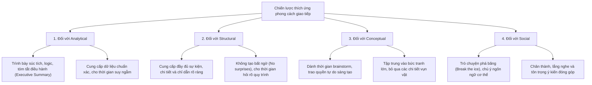

# Reading: Defining Communication Styles (Định hình Phong cách Giao tiếp)

## 1. Tổng quan về Đánh giá Phong cách Giao tiếp
- **Khuyến nghị từ PMI:** PMI khuyến khích sử dụng các bài đánh giá để xác định phong cách giao tiếp cá nhân, phong cách làm việc và động lực nội tại (*như Myers-Briggs, Insights, I-Speak, Emergenetics*).
- **Mô hình Emergenetics:** Phân loại hành vi giao tiếp của con người thành **4 phong cách cốt lõi**:
  1. **Analytical** *(Phân tích)*
  2. **Structural** *(Cấu trúc)*
  3. **Conceptual** *(Ý niệm / Tổng quan)*
  4. **Social** *(Xã hội / Con người)*
- **Tỷ lệ phân bổ thực tế:**
  - $6\%$ người có $1$ phong cách duy nhất.
  - $58\%$ người kết hợp $2$ phong cách.
  - $36\%$ người kết hợp $3$ phong cách.
  - $< 1\%$ người sở hữu cả $4$ phong cách.
  - *Mỗi cá nhân có thể pha trộn nhiều phong cách nhưng luôn có **một phong cách chủ đạo (*dominant style*)** nổi trội nhất.*

---

## 2. Chi tiết 4 Phong cách Giao tiếp Cốt lõi

| Phong cách | Trọng tâm | Đặc điểm & Sở thích giao tiếp | Câu hỏi then chốt thường trực (*Burning Questions*) |
| :--- | :---: | :--- | :--- |
| **Analytical** *(Phân tích)* | **WHY** *(Tại sao)* | - Cần dữ liệu thực tế và số liệu kiểm chứng. - Giao tiếp trực diện, đi thẳng vào vấn đề. - Cần thời gian tư duy, phân tích độc lập. - Tập trung vào kết quả và giải quyết triệt để vấn đề. | - *Tôi đã có đủ dữ liệu xác thực chưa?* - *Phương án nào tạo ra nhiều giá trị nhất?* - *Giải pháp này có giải quyết dứt điểm vấn đề không?* |
| **Structural** *(Cấu trúc / Quy trình)* | **HOW** *(Làm thế nào)* | - Luôn hỏi: Cái gì, Khi nào, Ở đâu, Như thế nào (*What, When, Where, How*). - Nói năng gãy gọn, câu cú mạch lạc, cẩn trọng. - Tỉ mỉ, chi tiết và có phương pháp rõ ràng. | - *Làm thế nào để hoàn thành việc này?* - *Quy trình thực hiện và mốc thời gian ra sao?* - *Tôi có nắm quyền kiểm soát tiến trình không?* |
| **Conceptual** *(Ý niệm / Bức tranh lớn)* | **WHAT** *(Cái gì / Toàn cảnh)* | - Hỏi những câu hỏi mở dẫn dắt sang ý tưởng khác. - Thường nói ngắn gọn/ngắt câu vì nghĩ người khác đã hiểu ý. - Thích dùng hình ảnh ẩn dụ (*metaphors*), tư duy trừu tượng. | - *Đã khám phá hết mọi tiềm năng chưa?* - *Bức tranh tổng thể là gì?* - *Làm thế nào để nâng tầm việc này lên nấc mới?* |
| **Social** *(Xã hội / Cảm xúc)* | **WHO** *(Ai / Con người)* | - Dùng câu chuyện và trải nghiệm thực tế để minh họa. - Ưu tiên giao tiếp trực tiếp mặt-đối-mặt (*face-to-face*). - Giàu lòng trắc ẩn, đồng cảm và thấu hiểu cảm xúc. | - *Việc này sẽ tác động đến người khác ra sao?* - *Làm thế nào để chúng ta cùng làm với nhau?* - *Đã có đúng người phù hợp tham gia chưa?* |

---

## 3. Bí quyết Điều chỉnh Phong cách Giao tiếp (Tips for Adapting)

Phương pháp "cào bằng" (*one-size-fits-all*) trong giao tiếp không mang lại hiệu quả. Hãy tùy biến theo từng phong cách người nhận:

### Bảng tóm tắt hành động cụ thể:
1. **Khi làm việc với Analytical:**
   - Ngắn gọn, logic, cung cấp bản tóm tắt điều hành (*executive summary*).
   - Đưa ra số liệu tin cậy và cho họ thời gian để thẩm định, phân tích.
2. **Khi làm việc với Structural:**
   - Cung cấp đầy đủ chi tiết, lộ trình và chỉ dẫn cụ thể.
   - Tuyệt đối **không tạo bất ngờ đột ngột (*no surprises*)**; tạo không gian cho họ đặt câu hỏi làm rõ.
3. **Khi làm việc với Conceptual:**
   - Tạo không gian thảo luận tự do (*brainstorm*), tư duy đột phá (*out-of-the-box*).
   - Truyền tải tầm nhìn bức tranh lớn, tránh sa đà vào các chi tiết tác vụ nhỏ nhặt.
4. **Khi làm việc với Social:**
   - Khởi đầu bằng các câu chuyện đời thường để tạo sự kết nối thân tình (*break the ice*).
   - Chú ý cử chỉ phi ngôn ngữ, thể hiện sự chân thành và trân trọng tiếng nói của họ.
