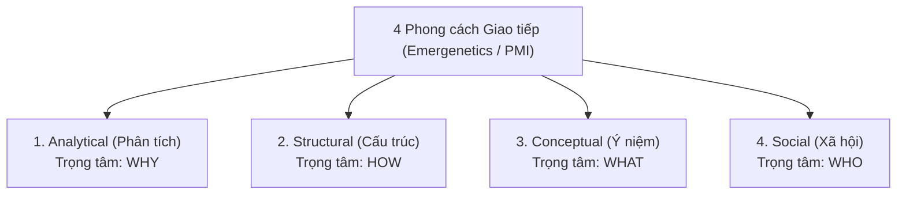

# Dialogue: Communication Planning and Different Communication Styles

## 1. Bản chất & Mục đích của Kế hoạch Truyền thông (Communication Planning)
- **Định nghĩa:** Lập kế hoạch truyền thông là việc xác định rõ:
  - **Thông tin gì (*What*):** Nội dung cần được truyền đạt.
  - **Tới ai (*Who / Target Audience*):** Đúng đối tượng có nhu cầu.
  - **Khi nào (*When / Frequency*):** Lịch trình và tần suất gửi tin.
  - **Bằng cách nào (*How / Medium*):** Kênh trao đổi (Email, Họp, Dashboard...).
  - **Bởi ai (*By whom / Owner*):** Người phụ trách biên soạn và phát hành.
- **Giá trị cốt lõi:**
  - Đảm bảo luồng thông tin minh bạch, kịp thời và đúng mục tiêu.
  - Duy trì sự đồng thuận (*alignment*) và xây dựng lòng tin giữa các bên.
  - Tránh tình trạng quá tải thông tin (*communication overload*) và hiểu lầm phạm vi.

---

## 2. Vai trò & Tầm quan trọng của Người Quản lý (Manager's Involvement)
Sự tham gia tích cực của người quản lý / Project Manager đóng vai trò then chốt đối với thành bại của truyền thông dự án:
- **Trách nhiệm giải trình (*Accountability*):** Quản lý chịu trách nhiệm cuối cùng về chất lượng, tính chính xác, kịp thời và độ tin cậy của thông tin dự án.
- **Căn chỉnh mục tiêu (*Alignment*):** Kết nối việc thực thi của đội ngũ với kỳ vọng của các bên liên quan cấp cao, loại bỏ rào cản và hiểu lầm.
- **Hóa giải điểm nghẽn & Xung đột (*Resolving Breakdowns*):** Kịp thời phát hiện và giải quyết đứt gãy luồng giao tiếp.
- **Duy trì động lực & Văn hóa tin cậy (*Fostering Trust & Engagement*):** Tạo dựng môi trường làm việc minh bạch, cởi mở và chủ động tương tác.

---

## 3. Khám phá 4 Phong cách Giao tiếp Cốt lõi (4 Communication Styles)

| Phong cách | Trọng tâm | Đặc điểm tư duy & Nhận diện |
| :--- | :---: | :--- |
| **Analytical** | **WHY** | Cần sự thật, số liệu xác thực, giao tiếp trực diện, logic, giải quyết triệt để vấn đề. |
| **Structural** | **HOW** | Tỉ mỉ, coi trọng quy trình từng bước, mạch lạc, kiểm soát lộ trình, không thích rủi ro bất ngờ. |
| **Conceptual** | **WHAT** | Tập trung vào bức tranh toàn cảnh (*big picture*), tư duy mở, ý tưởng đột phá, hình ảnh ẩn dụ. |
| **Social** | **WHO** | Coi trọng mối quan hệ, thấu cảm, thích trao đổi trực tiếp (*face-to-face*), minh họa bằng câu chuyện thực tế. |

---

## 4. Chiến lược Thích ứng Giao tiếp theo từng Phong cách (Adapting Approaches)

### 1. Đối với Phong cách Analytical (Phân tích)
- **Hành động:** Trình bày súc tích, logic; sử dụng bản tóm tắt điều hành (*Executive Summary*).
- **Cung cấp:** Số liệu, dữ kiện và chứng cứ đáng tin cậy.
- **Nguyên tắc:** Tập trung vào lý do (*Why*) và cách giải quyết dứt điểm vấn đề; dành đủ thời gian độc lập để họ phân tích và thẩm định trước khi ra quyết định.

### 2. Đối với Phong cách Structural (Cấu trúc / Quy trình)
- **Hành động:** Trình bày có phương pháp, rõ ràng từng bước theo quy trình và lộ trình thời gian.
- **Cung cấp:** Chi tiết cụ thể, chỉ dẫn rõ ràng.
- **Nguyên tắc:** Tuyệt đối **không tạo bất ngờ đột ngột (*no surprises*)**; dành thời gian cho họ đặt câu hỏi làm rõ quy trình và trao quyền kiểm soát tiến độ.

### 3. Đối với Phong cách Conceptual (Ý niệm / Bức tranh lớn)
- **Hành động:** Tập trung vào tầm nhìn, định hướng chiến lược và các tiềm năng lớn (*What*).
- **Cung cấp:** Khung tổng quan (*high-level framework*), hình ảnh/ẩn dụ trực quan; lược bỏ chi tiết tác vụ vụn vặt.
- **Nguyên tắc:** Dành thời gian cùng brainstorm tự do, tư duy đột phá (*out-of-the-box*) và trao quyền tự do sáng tạo cách thức đạt mục tiêu.

### 4. Đối với Phong cách Social (Xã hội / Cảm xúc con người)
- **Hành động:** Ưu tiên giao tiếp trực tiếp (*face-to-face*) hoặc video call; khởi đầu bằng các câu chuyện phá băng thân tình (*break the ice*).
- **Cung cấp:** Bối cảnh gắn liền với con người và sự hợp tác của đội ngũ.
- **Nguyên tắc:** Thể hiện sự chân thành, lắng nghe thấu cảm (*empathy*), chú ý ngôn ngữ cơ thể và chủ động ghi nhận, trân trọng đóng góp cá nhân của họ.
