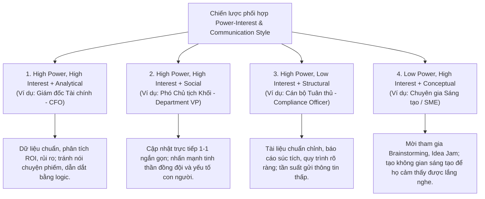

# Stakeholder Motivational Techniques and Application

## 1. Bản chất của Gắn kết Bên liên quan (Stakeholder Engagement)
- **Vượt trên giao tiếp thông thường:** Quản lý stakeholder không chỉ dừng lại ở việc gửi thông tin (*Communication*), mà là nghệ thuật duy trì sự tham gia (*Involvement*) và truyền động lực (*Motivation*).
- **Công thức cốt lõi:**
  > **Engagement Plan** = **Mô hình Power & Interest** + **Phong cách Giao tiếp (Communication Styles)**
- **Triết lý:** *"Gặp gỡ đối phương tại nơi họ đang đứng, chứ không phải bắt họ đứng ở nơi của ta"* (*Meet them where they are, not where I am*).

---

## 2. 3 Bước Nhận diện Phong cách Giao tiếp của Stakeholder
Không đoán mò (*no guessing*), hãy áp dụng phương pháp thực tế:
1. **Quan sát (*Observe*):** Theo dõi hành vi trong các cuộc họp: Họ yêu cầu số liệu, báo cáo cấu trúc, hay họ hào hứng nói về con người, tầm nhìn lớn?
2. **Hỏi trực tiếp (*Ask Questions*):** Tìm hiểu thói quen làm việc của họ (VD: *Họ thích báo cáo chi tiết hay chỉ cần tóm tắt điểm sáng? Thích văn bản hay trao đổi nhanh 1-1?*).
3. **Thử nghiệm & Thích ứng (*Test and Adjust*):** Thử nghiệm một phương thức tiếp cận và quan sát phản ứng; điều chỉnh linh hoạt phong cách (*flex your style*) cho đến khi đạt hiệu quả kết nối cao nhất.

---

## 3. Ma trận Kịch bản Thực tế: Kết hợp Power-Interest & Communication Style

### Bảng chi tiết chiến lược tương tác:

| Vị trí trên Power-Interest | Phong cách giao tiếp | Ví dụ điển hình | Chiến lược & Hành động tương tác then chốt |
| :--- | :--- | :--- | :--- |
| **High Power, High Interest** *(Manage Closely)* | **Analytical** | **CFO / Giám đốc Tài chính** | - Trình bày chính xác, dựa trên dữ liệu (*data-driven*), tập trung vào giải pháp. - Báo cáo phân tích ROI, rủi ro và các chỉ số KPI then chốt. - Tránh nói chuyện phiếm (*avoid small talk*), dẫn dắt bằng logic. |
| **High Power, High Interest** *(Manage Closely)* | **Social** | **Department VP** | - Lên lịch các buổi cập nhật trực tiếp mặt-đối-mặt (*face-to-face*) ngắn gọn. - Nhấn mạnh tinh thần đồng đội, sự hợp tác và yếu tố con người trong thành quả. |
| **High Power, Low Interest** *(Keep Satisfied)* | **Structural** | **Compliance Officer** | - Giao tiếp có tổ chức, tài liệu hóa đầy đủ, chuẩn chỉnh theo mẫu. - Tần suất gửi thông tin thấp (*low-frequency*), súc tích, không làm phiền bởi việc vụn vặt. |
| **Low Power, High Interest** *(Keep Informed)* | **Conceptual** | **Creative Lead / SME** | - Mời tham gia các buổi brainstorming, idea jams, thảo luận tầm nhìn tương lai. - Giữ động lực bằng cách mở ra các tiềm năng mới và ghi nhận tiếng nói của họ. |

---

## 4. Tổng kết: Chuyển hóa từ Giao tiếp sang Kết nối

Để xây dựng một **Kế hoạch Gắn kết Bên liên quan (Stakeholder Engagement Plan)** hiệu quả, hãy hợp nhất 4 mảnh ghép:
- **Stakeholder Register** (Nhận diện ai là ai)
- **RACI Roles** (Phân định rõ trách nhiệm)
- **Power & Interest Grid** (Xác định mức độ ưu tiên)
- **Communication Style Preferences** (Cách thức tiếp cận phù hợp)

> [!TIP]
> **Đích đến của quản trị Stakeholder:**
> - Chuyển từ **Giao tiếp** (*Communication*) $\rightarrow$ **Kết nối sâu sắc** (*Connection*).
> - Chuyển từ **Nhận thức** (*Awareness*) $\rightarrow$ **Đồng thuận hành động** (*Alignment*).
