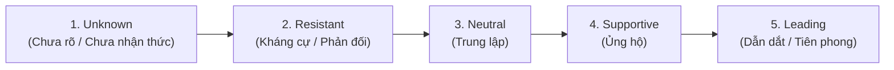

# Stakeholder Engagement Plan (Kế hoạch Gắn kết Bên liên quan)

## 1. Bản chất & Mục đích của Kế hoạch Gắn kết Stakeholder
- **Định nghĩa:** **Stakeholder Engagement Plan** là tài liệu quản trị nội bộ (*internal management document*) giúp đội ngũ dự án định hình cách thức tương tác với từng bên liên quan trọng yếu nhằm xây dựng và duy trì mức độ cam kết, ủng hộ bền vững xuyên suốt dự án.
- **Tính chất bảo mật nội bộ:**
  > [!IMPORTANT]
  > **Đây KHÔNG PHẢI là tài liệu chia sẻ công khai (*Not a shared plan / Not a stakeholder deliverable*)**. Tài liệu này được lưu hành nội bộ trong nhóm quản lý dự án để làm kim chỉ nam phân tích và định hướng chiến lược tương tác.
- **Điểm hợp nhất:** Kết hợp toàn bộ các kết quả từ **Stakeholder Register** (RACI, vai trò), **Power & Interest Model** và **Communication Styles**.

---

## 2. Cấu trúc Biểu mẫu Kế hoạch Gắn kết (Layout of the Plan)

Biểu mẫu chuẩn gồm các trường thông tin theo từng hàng (tương ứng với mỗi bên liên quan):

| Cột thông tin | Mô tả & Hướng dẫn phân tích |
| :--- | :--- |
| **Stakeholder / Group** | Tên cá nhân hoặc nhóm bên liên quan cụ thể. |
| **Power & Interest** | Đánh giá mức độ Quyền lực và Mối quan tâm (*High/Low Power, High/Low Interest*). |
| **Preferred Style** | Phong cách giao tiếp ưu tiên (*Analytical, Structural, Conceptual, Social*). |
| **Current Commitment** | **Mức độ cam kết hiện tại** theo thang chuẩn 5 bậc của PMI. |
| **Desired Commitment** | **Mức độ cam kết mong muốn** cần đạt được qua các hành động tương tác. |
| **Engagement Strategies** | **Chiến lược & hành động then chốt** nhằm dịch chuyển stakeholder từ trạng thái hiện tại sang trạng thái mong muốn. |

---

## 3. Thang đo 5 Bậc Cam kết của Stakeholder (PMI Standard Scale)

1. **Unknown (Chưa rõ):** Chưa nhận thức hoặc chưa nắm được thông tin về dự án và các tác động tiềm tàng.
2. **Resistant (Kháng cự / Phản đối):** Nhận thức được dự án nhưng không đồng tình, lo ngại thay đổi hoặc phản đối triển khai.
3. **Neutral (Trung lập):** Biết về dự án nhưng không ủng hộ cũng không phản đối.
4. **Supportive (Ủng hộ):** Nhận thức rõ dự án và tích cực ủng hộ các mục tiêu, sản phẩm bàn giao.
5. **Leading (Dẫn dắt / Tiên phong):** Nhận thức sâu sắc, chủ động đồng hành, hỗ trợ tháo gỡ khó khăn và dẫn dắt người khác cùng ủng hộ dự án.

---

## 4. Kịch bản Thực tế: Chuyển dịch Mức độ Cam kết

### Kịch bản 1: Nâng tầm người ủng hộ thành người dẫn dắt (Supportive $\rightarrow$ Leading)
- **Đối tượng:** *Sonny James (HR Training Manager)*.
- **Hiện trạng:** Đang ở mức `Supportive`, có phong cách kết hợp `Social` & `Structural`.
- **Mục tiêu:** Dịch chuyển lên mức `Leading`.
- **Chiến lược tương tác:**
  - Tổ chức các buổi trao đổi trực tiếp 1-1 (*in-person meetings*).
  - Căn chỉnh kế hoạch đào tạo khớp với các mốc tiến độ chính của dự án (*milestones*).
  - Nhấn mạnh vào giá trị và tác động tích cực đến sự phát triển của đội ngũ nhân sự.

### Kịch bản 2: Hóa giải sự phản đối thành sự ủng hộ (Resistant $\rightarrow$ Supportive)
- **Đối tượng:** *Warehouse Staff Representatives (Đại diện nhân viên bộ phận kho)*.
- **Hiện trạng:** Đang ở mức `Resistant` do tâm lý e ngại xáo trộn quy trình cũ, có phong cách `Social` (chuộng đối thoại).
- **Mục tiêu:** Dịch chuyển lên mức `Supportive`.
- **Chiến lược tương tác:**
  - Tổ chức các buổi họp toàn thể ngắn gọn (*Town Hall sessions*).
  - Sử dụng hình ảnh và sơ đồ trực quan minh họa rõ dự án sẽ giúp công việc của họ dễ dàng, an toàn hơn ra sao.
  - Lắng nghe và khuyến khích đóng góp ý kiến từ thực tế hiện trường $\rightarrow$ **Biến nỗi lo lắng thành tinh thần cùng làm chủ (*transform concern into ownership*)**.

---

## 5. Tính chất Tài liệu Sống & 3 Điểm đúc kết cốt lõi

> [!TIP]
> **Một tài liệu sống động (Living Document):** Mức độ cam kết của Stakeholder không bao giờ cố định. Một người đang ủng hộ có thể trở nên trung lập nếu rủi ro phát sinh; một người phản đối có thể chuyển sang ủng hộ mạnh mẽ nếu được giải tỏa lo ngại.

### 3 Câu hỏi rà soát định kỳ:
1. *Mức độ ảnh hưởng (Power) hoặc mối quan tâm (Interest) của bên liên quan nào đã thay đổi?*
2. *Phương thức truyền thông hiện tại còn mang lại hiệu quả hay không?*
3. *Có bên liên quan nào từng tích cực ủng hộ nay lại trở nên thờ ơ, mất gắn kết không?*

### 3 Điểm cốt lõi cần nhớ:
1. **Là công cụ lập kế hoạch nội bộ của nhóm dự án**, không phải tài liệu gửi cho các bên liên quan.
2. **Tùy biến hành động dựa trên dữ liệu tổng hợp** (RACI + Power-Interest + Communication Style).
3. **Biến truyền thông (*Communication*) $\rightarrow$ Gắn kết (*Engagement*) $\rightarrow$ Cam kết bền vững (*Sustained Commitment*)**.
