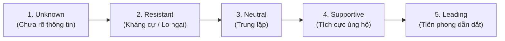

# Reading: Stakeholder Engagement Plan

## 1. Bản chất & Mục đích của Kế hoạch Gắn kết Stakeholder
- **Định nghĩa:** **Stakeholder Engagement Plan** là tài liệu quản trị nội bộ quan trọng giúp đội ngũ dự án xác định rõ chiến lược tương tác với từng bên liên quan nhằm đảm bảo sự đồng thuận, tham gia và duy trì cam kết bền vững xuyên suốt vòng đời dự án.
- **Tính chất bảo mật nội bộ:**
  > [!IMPORTANT]
  > **Đây KHÔNG PHẢI là tài liệu bàn giao chia sẻ cho các bên liên quan (*Not a shared plan / Not a stakeholder deliverable*)**. Đây là công cụ lập kế hoạch nội bộ của nhóm dự án.
- **Sức mạnh hợp nhất:** Kết hợp toàn diện dữ liệu từ **Stakeholder Register** (vai trò, RACI), **Power/Interest Model** và **Phong cách Giao tiếp (Communication Styles)**.

---

## 2. Cấu trúc Biểu mẫu Kế hoạch Gắn kết (Layout of the Plan)

Biểu mẫu được tổ chức theo từng hàng tương ứng với mỗi bên liên quan hoặc nhóm bên liên quan:

| Trường thông tin | Ý nghĩa & Hướng dẫn điền |
| :--- | :--- |
| **Stakeholder / Group** | Tên cá nhân hoặc nhóm đối tượng cụ thể. |
| **Power & Interest** | Đánh giá mức độ Quyền lực và Quan tâm (*High/Low Power, High/Low Interest*). |
| **Preferred Style** | Phong cách giao tiếp ưu tiên (*Analytical, Structural, Conceptual, Social*). |
| **Current Commitment** | **Mức độ cam kết hiện tại** theo thang chuẩn 5 cấp độ của PMI. |
| **Desired Commitment** | **Mức độ cam kết mục tiêu** cần đạt được. |
| **Engagement Strategies** | **Chiến lược & Hành động cụ thể** để dịch chuyển stakeholder từ trạng thái hiện tại sang trạng thái mong muốn. |

---

## 3. Thang đo 5 Cấp độ Cam kết theo Chuẩn PMI (5 Levels of Commitment)

- **1. Unknown (Chưa rõ):** Chưa nắm được thông tin hoặc chưa nhận thức được dự án.
- **2. Resistant (Kháng cự / Phản đối):** Nhận thức được dự án nhưng có tâm lý phản đối, lo ngại rủi ro/thay đổi.
- **3. Neutral (Trung lập):** Biết về dự án nhưng đứng ngoài quan sát, không ủng hộ cũng không phản đối.
- **4. Supportive (Ủng hộ):** Hiểu rõ và tích cực đồng thuận với các mục tiêu dự án.
- **5. Leading (Tiên phong / Dẫn dắt):** Nhận thức sâu sắc, chủ động gỡ khó và dẫn dắt các bên khác cùng ủng hộ.

---

## 4. Các Ví dụ Chuyển hóa Thực tế (Practical Examples)

### Ví dụ 1: Nâng tầm từ Ủng hộ lên Dẫn dắt (Supportive $\rightarrow$ Leading)
- **Stakeholder:** *Sonny James (HR Training Manager)*.
- **Đặc điểm:** Hiện đang `Supportive`, có phong cách `Social` + `Structural`.
- **Hành động:**
  - Tổ chức các buổi họp trao đổi trực tiếp 1-1 (*in-person meetings*).
  - Căn chỉnh lịch trình đào tạo khớp với các cột mốc dự án (*project milestones*).
  - Nhấn mạnh tác động tích cực đến con người và cơ hội phát triển năng lực nội bộ.

### Ví dụ 2: Hóa giải Kháng cự thành Ủng hộ (Resistant $\rightarrow$ Supportive)
- **Stakeholder:** *Warehouse Staff Representatives (Đại diện nhân viên bộ phận kho)*.
- **Đặc điểm:** Đang ở mức `Resistant` do tâm lý sợ xáo trộn công việc quen thuộc; có phong cách `Social` (thích đối thoại, kết nối).
- **Hành động:**
  - Tổ chức các buổi họp toàn thể ngắn gọn (*Town Hall sessions*).
  - Sử dụng hình ảnh trực quan minh họa cách hệ thống mới giúp công việc an toàn, nhẹ nhàng hơn.
  - Mời họ đóng góp ý kiến thực tế từ hiện trường $\rightarrow$ **Biến lo ngại thành tinh thần cùng làm chủ (*transform concern into ownership*)**.

---

## 5. Tính chất Tài liệu Sống & Công thức Thành công

> [!TIP]
> **Tài liệu sống động (Living Document):** Thái độ của Stakeholder luôn biến đổi. Người ủng hộ có thể trở thành trung lập nếu rủi ro phát sinh; người phản đối có thể chuyển sang ủng hộ nếu được giải tỏa lo ngại và nhìn thấy giá trị.

### 3 Câu hỏi rà soát định kỳ:
1. *Mức độ quyền lực (Power) hay mối quan tâm (Interest) của ai đã thay đổi?*
2. *Phương thức giao tiếp hiện tại còn hiệu quả không?*
3. *Có bên liên quan nào từng ủng hộ nay lại trở nên thờ ơ, mất gắn kết không?*

### Công thức Chuyển hóa Giá trị:
$$\text{Communication (Truyền thông)} \longrightarrow \text{Engagement (Gắn kết)} \longrightarrow \text{Sustained Commitment (Cam kết bền vững)}$$
