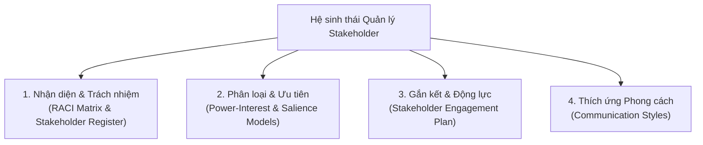

# Podcast - Recap: Stakeholder Management Essentials

## 1. Bản chất Cốt lõi của Quản lý Bên liên quan (The Heartbeat of Projects)
- **Tầm quan trọng:** Quản lý Stakeholder là "nhịp đập" (*heartbeat*) quyết định sự thành bại của mọi dự án. Dù có một kế hoạch hay tiến độ hoàn hảo, dự án vẫn sẽ đình trệ nếu thiếu sự đồng thuận và ủng hộ từ con người.
- **Quy trình 3 bước xuyên suốt:**
  1. **Identify (Nhận diện):** Xác định toàn bộ những người có tầm ảnh hưởng (*influence*), mối quan tâm (*interest*) hoặc chịu tác động (*impact*).
  2. **Engage (Gắn kết):** Xây dựng lòng tin, tạo sự tham gia chủ động và truyền động lực.
  3. **Manage (Quản trị):** Theo dõi liên tục, linh hoạt điều chỉnh theo biến động thực tế của dự án.

---

## 2. Hệ thống Công cụ & Mô hình Quản trị Trọng tâm

| Nhóm công cụ | Tên công cụ / Mô hình | Vai trò & Giá trị mang lại |
| :--- | :--- | :--- |
| **Nhận diện & Trách nhiệm** | **RACI Matrix & Stakeholder Register** | Làm rõ vai trò (*Responsible, Accountable, Consulted, Informed*), thiết lập kỳ vọng từ sớm, xóa bỏ sự mơ hồ "ai làm việc gì". |
| **Phân loại chiến lược** | **Power & Interest / Salience Model** | Định hướng mức độ ưu tiên và năng lượng quản lý (VD: Quản lý chặt chẽ Sponsor có Quyền lực cao, Quan tâm cao; giữ hài lòng cơ quan quản lý). |
| **Kế hoạch hành động** | **Stakeholder Engagement Plan** | Lộ trình nội bộ giúp chuyển hóa mức độ cam kết từ *Resistant/Neutral $\rightarrow$ Supportive/Leading* đúng người, đúng thời điểm. |
| **Giao tiếp thích ứng** | **Communication Styles** *(Analytical, Structural, Conceptual, Social)* | Tùy biến thông điệp theo sở thích tiếp nhận, chuyển từ truyền đạt dữ liệu khô khan sang kết nối cảm xúc và tạo động lực. |

---

## 3. Chuyển hóa từ "Quản lý Tác vụ" sang "Dẫn dắt Con người"

- **Từ Thông tin $\rightarrow$ Kết nối $\rightarrow$ Đà tăng trưởng:**
  $$\text{Information (Thông tin)} \longrightarrow \text{Connection (Kết nối)} \longrightarrow \text{Momentum (Đà bứt phá)}$$
- **Khác biệt then chốt:**
  - *Quản lý tác vụ đơn thuần (Managing Tasks):* Chỉ gửi email, báo cáo tiến độ theo checklist.
  - *Dẫn dắt con người (Leading People):* Lắng nghe, thấu cảm, điều chỉnh phong cách để khơi dậy tinh thần làm chủ và cam kết bền vững.

---

## 4. 3 Câu hỏi Lớn Đúc kết Toàn bộ Module

1. **Bên liên quan của bạn là những ai?** (*Who are your stakeholders?*)
2. **Bạn thực sự cần sự ủng hộ then chốt từ ai?** (*Whose support do you really need?*)
3. **Bạn có thể tùy biến cách tiếp cận ra sao để chạm tới họ?** (*How can you adapt your approach to reach them?*)

---

## 5. Cầu nối sang Module tiếp theo
- **Chủ đề kế tiếp:** **Requirements Management and Generative AI Applications** (Quản lý Yêu cầu và Ứng dụng AI Tạo sinh trong Quản lý Dự án).
