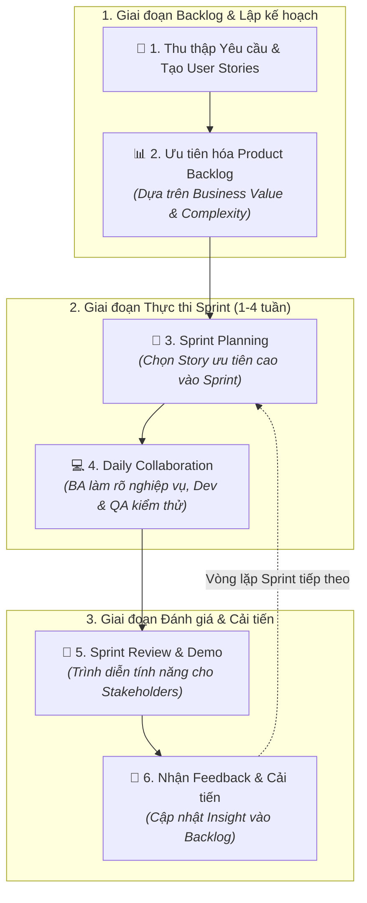

# What Is Agile Business Analysis?

## 1. Bối cảnh & Định nghĩa
- **Vấn đề của Traditional BA:** Quy trình dài dòng, kế hoạch cứng nhắc (rigid upfront planning), tài liệu đồ sộ (heavy documentation), khó thích ứng khi yêu cầu khách hàng thay đổi liên tục hoặc kỳ vọng của stakeholder bị lệch.
- **Khái niệm Agile BA:** Việc áp dụng các nguyên lý và kỹ thuật Phân tích Nghiệp vụ (Business Analysis) bên trong khung làm việc Agile (Agile Framework).
- **Mục tiêu cốt lõi:** Chuyển từ "quản lý thay đổi" sang "chủ động đón nhận thay đổi" (embrace change), tập trung vào phân phối giá trị khách hàng nhanh chóng, cộng tác liên tục và cải tiến không ngừng.

---

## 2. So sánh Traditional BA vs. Agile BA

| Tiêu chí | Traditional Business Analysis | Agile Business Analysis |
| :--- | :--- | :--- |
| **Kế hoạch & Phạm vi** | Lập kế hoạch chi tiết từ đầu (Upfront Planning), phạm vi cố định. | Linh hoạt, phạm vi tiến hóa qua từng Sprint / Iteration. |
| **Tài liệu** | Tài liệu đặc tả yêu cầu chi tiết, đồ sộ (BRD, SRS). | Gọn nhẹ, tập trung vào **User Stories** & **Acceptance Criteria**. |
| **Phản hồi (Feedback)** | Nhận phản hồi muộn (sau khi hoàn thành toàn bộ sản phẩm). | Vòng lặp phản hồi ngắn (sau mỗi 1–4 tuần qua Sprint Review). |
| **Chuyển giao (Delivery)** | Big-bang release (bàn giao toàn bộ ở cuối dự án). | **Incremental Delivery** (bàn giao từng phần giá trị nhỏ, dùng được ngay). |
| **Tương tác** | Giao tiếp chủ yếu qua văn bản/tài liệu được ký duyệt. | **Continuous Collaboration** (trao đổi hàng ngày, trực tiếp với team & stakeholder). |

---

## 3. Các Khái niệm & Trụ cột cốt lõi trong Agile BA

1. **User Stories:** Mô tả tính năng ngắn gọn dưới góc nhìn người dùng cuối:
   $$\text{As a } \langle\text{role}\rangle, \text{ I want } \langle\text{feature}\rangle \text{ so that } \langle\text{benefit}\rangle$$
   *Ví dụ:* *"As a customer, I want to receive email notifications when my order is shipped so that I can track my delivery."*
2. **Product Backlog:** Danh sách các tính năng/nhiệm vụ được ưu tiên hóa liên tục dựa trên giá trị kinh doanh (business value) và độ phức tạp (complexity).
3. **Sprint & Timeboxing:** Các chu kỳ ngắn (1–4 tuần). BA cùng team chọn story từ backlog để thực hiện và bàn giao trong sprint.
4. **Continuous Collaboration:** Cộng tác hàng ngày (Daily Stand-ups, refinement) giữa BA, Developers, Testers và Stakeholders.
5. **Flexibility & Adaptability:** Linh hoạt bổ sung/thay đổi story trong backlog cho sprint tiếp theo khi thị trường hoặc nhu cầu người dùng thay đổi.
6. **Incremental Delivery:** Phát hành sản phẩm theo từng phiên bản nhỏ (MVP / working software) để người dùng thử nghiệm sớm và giảm thiểu rủi ro.
7. **User-Centric Approach:** Đặt người dùng làm trung tâm thông qua khảo sát, phỏng vấn thực tế để hiểu rõ nhu cầu quan trọng nhất.

---

## 4. Công cụ & Kỹ thuật chính của Agile BA

- **User Story Mapping:** Sắp xếp trực quan các User Story theo luồng trải nghiệm người dùng (workflow) và mức độ ưu tiên, giúp team bao quát toàn bộ hành trình khách hàng.
- **Kanban Board:** Bảng trực quan hóa tiến độ công việc qua các cột trạng thái (*To Do -> In Progress -> Done*), giúp kiểm soát Work In Progress (WIP).
- **Sprint Retrospectives:** Buổi họp cuối mỗi sprint để nhìn lại: việc gì làm tốt, việc gì cần cải thiện và hành động điều chỉnh quy trình cho sprint tiếp theo.

---

## 5. Ví dụ Quy trình Thực tế của Agile BA (Implementation Flow)

1. **Thu thập & Viết Story:** BA thảo luận với stakeholder tạo story: *"As a customer, I want to filter products by price."*
2. **Ưu tiên Backlog:** Đưa story vào Product Backlog, sắp xếp thứ tự ưu tiên dựa trên giá trị kinh doanh.
3. **Sprint Execution:** Team chọn story lọc sản phẩm vào Sprint kéo dài 2 tuần. BA làm việc sát sao cùng Dev/QA để giải đáp chi tiết nghiệp vụ.
4. **Demo & Feedback:** Cuối sprint, demo tính năng cho stakeholder lấy ý kiến đóng góp.
5. **Lặp lại (Iterate):** Cập nhật các insight/thay đổi mới vào Backlog cho sprint tiếp theo.

---

## 6. Lợi ích của Agile Business Analysis
- **Phát hành nhanh hơn (Faster Time-to-Market):** Nhờ cơ chế phân phối gia tăng (incremental delivery).
- **Sản phẩm sát nhu cầu thực tế:** Nhờ vòng lặp phản hồi liên tục (continuous feedback loop).
- **Giảm thiểu rủi ro dự án:** Phát hiện sai sót, lệch hướng sớm ngay từ các sprint đầu, tránh chi phí sửa đổi đắt đỏ về sau.
