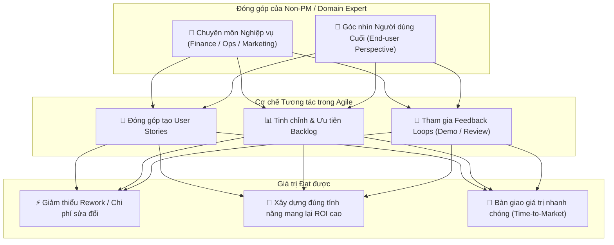

# Requirements Elicitation: Your Role (Khơi gợi Yêu cầu: Vai trò của bạn)

## 1. Trọng tâm: Vai trò của các vai trò "Non-PM / Non-BA"
- **Agile dựa trên Hợp tác Liên chức năng (Cross-Functional Collaboration):** Mọi vai trò (Finance Analyst, Marketing, Sales, Operations, Product Specialist, Tech team) đều có tiếng nói quyết định thành công của sản phẩm.
- **Giá trị của việc tham gia sớm:**
  - Cung cấp góc nhìn thực tế từ nghiệp vụ chuyên môn (domain expertise).
  - Làm rõ độ ưu tiên từ sớm $\rightarrow$ Giảm thiểu làm lại (rework).
  - Đảm bảo giải pháp kỹ thuật giải quyết đúng bài toán kinh doanh (*solve the right problem*).

---

## 2. Vì sao Non-PM cần hiểu về Agile Requirements Elicitation?

---

## 3. Cách các vai trò tham gia vào Quy trình Khơi gợi Yêu cầu

| Giai đoạn | Hành động cụ thể của bạn (Non-PM / Analyst) | Kết quả mang lại |
| :--- | :--- | :--- |
| **1. Khởi tạo Yêu cầu (Discovery)** | Đóng góp định dạng User Story: $$\text{As a } \langle\text{role}\rangle, \text{ I want } \langle\text{feature}\rangle \text{ so that } \langle\text{benefit}\rangle$$ | Định hình rõ đối tượng, mục tiêu và lý do cần tính năng. |
| **2. Quản lý Backlog (Refinement)** | Cung cấp dữ liệu nghiệp vụ để BA/PO đánh giá *Business Value* và *Complexity*. | Sắp xếp đúng thứ tự ưu tiên các tính năng cần làm trước. |
| **3. Trong Sprint (Execution)** | Tham gia Daily standups khi cần, sẵn sàng giải đáp thắc mắc về logic nghiệp vụ cho Dev/QA. | Giải quyết kịp thời khúc mắc, tránh dev hiểu sai nghiệp vụ. |
| **4. Cuối Sprint (Review & Demo)** | Trực tiếp trải nghiệm bản demo, đưa ra phản hồi thực tế. | Bổ sung insight mới, điều chỉnh hướng đi cho sprint kế tiếp. |

---

## 4. Các Công cụ & Kỹ thuật bổ trợ

- **User Story Mapping:** Sắp xếp trực quan các User Story theo hành trình trải nghiệm người dùng, giúp bạn nhìn thấy vị trí tính năng của mình trong tổng thể hệ thống.
- **Kanban Board:** Theo dõi trực quan trạng thái công việc (*To Do $\rightarrow$ In Progress $\rightarrow$ Done*).
- **Sprint Retrospectives:** Cùng đội ngũ đánh giá quy trình phối hợp, đề xuất cải tiến cách giao tiếp giữa các phòng ban.

---

## 5. Tóm lược Bài học (Key Takeaways)
1. **Bạn không cần là PM/BA để khơi gợi yêu cầu:** Mọi thành viên đều là nguồn dữ liệu nghiệp vụ quý giá.
2. **Tham gia sớm = Rủi ro thấp:** Đưa phản hồi ngay trong các vòng lặp ngắn (Sprints) giúp tiết kiệm nguồn lực tối đa.
3. **Lấy người dùng làm trung tâm (User-Centric):** Mọi yêu cầu đều phải trả lời được câu hỏi: *Mang lại giá trị gì cho người dùng và doanh nghiệp?*
