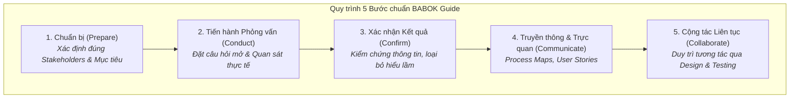

# Podcast: Eliciting Requirements Using Stakeholder Interviews

## 1. Tổng quan & Tầm quan trọng
- Khơi gợi yêu cầu đúng đắn ngay từ đầu (**Getting It Right from the Start**) là ranh giới giữa thành công bền vững và việc dự án gặp rắc rối, làm lại (rework) về sau.
- Không coi việc thu thập yêu cầu như một bản checklist vô hồn, mà là quá trình lắng nghe, thấu hiểu và cộng tác liên tục giữa Business Analysts và các cấp quản trị/vận hành.

---

## 2. Quy trình 5 bước Khơi gợi Yêu cầu chuẩn BABOK (5-Step Elicitation Approach)

---

## 3. Chi tiết từng bước trong Quy trình

| Bước | Mục tiêu | Kỹ thuật & Thực tiễn triển khai | Lưu ý cốt lõi |
| :--- | :--- | :--- | :--- |
| **Step 1: Prepare** *(Chuẩn bị)* | Xác định ai cần tham gia và thông tin nền tảng cần nắm trước buổi phỏng vấn. | Xác định các bên liên quan từ nhiều cấp bậc (đặc biệt là **Frontline Managers** - người trực tiếp vận hành). | Nếu bỏ sót đối tượng quan sát thực tế ở tuyến đầu, yêu cầu sẽ có những lỗ hổng lớn mà cấp lãnh đạo cấp cao không thấy được. |
| **Step 2: Conduct** *(Tiến hành)* | Thu thập các điểm nghẽn và nhu cầu thực sự của các bên. | - Đặt **câu hỏi mở (Open-ended questions)** để lắng nghe *pain points* sâu sắc. - Kết hợp **quan sát (Observation)** thao tác thực tế. | Nhiều khi người dùng không nhận ra thao tác nào đang làm chậm quy trình của họ cho đến khi BA trực tiếp quan sát. |
| **Step 3: Confirm** *(Xác nhận)* | Đối chiếu lại những gì BA ghi nhận với thực tế của Stakeholders. | Gửi lại bản tóm tắt, tổ chức buổi review ngắn để xác thực (*Check against reality*). | Bắt và sửa ngay những hiểu lầm (*misunderstandings*) trước khi chúng trở thành các sai sót lớn trong khâu thiết kế. |
| **Step 4: Communicate** *(Truyền thông)* | Truyền tải yêu cầu rõ ràng, nhất quán cho cả đội ngũ Technical và Non-technical. | Sử dụng công cụ trực quan: **Process Maps**, **User Stories**, sơ đồ luồng công việc. | Giúp toàn bộ các phòng ban thấy được bức tranh sắp xây dựng và lý do tại sao nó quan trọng (*why it matters*). |
| **Step 5: Collaborate** *(Cộng tác)* | Duy trì sự tham gia của Stakeholders trong suốt vòng đời dự án. | Thu thập phản hồi liên tục khi bước vào giai đoạn thiết kế giao diện (Design) và kiểm thử (Testing). | Đảm bảo sản phẩm đầu ra gắn liền với thực tế thực tiễn (*real-world needs*), không chỉ dừng lại ở lý thuyết suông. |

---

## 4. Lời khuyên then chốt (Key Takeaways)
> 💡 **"Keep asking, listening, and collaborating."**
> 
> Đừng bao giờ làm việc theo kiểu "nhận checklist rồi biến mất". Sự phối hợp nhịp nhàng giữa BA, nhà quản lý và nhân sự tuyến đầu sẽ tạo ra các giải pháp mang lại giá trị thực tế cao nhất cho doanh nghiệp.
