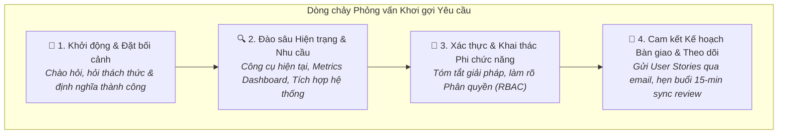

# Activity Summary: Eliciting Requirements from Stakeholder Interviews (Role Play)

## 1. Tổng quan Hoạt động
- **Mục tiêu:** Thực hành kỹ năng phỏng vấn khơi gợi yêu cầu (Requirements Elicitation) với Stakeholder chính (**Taylor Brooks - Department Head**) cho hệ thống mới.
- **Kịch bản:** Đóng vai Business Analyst (Tuyến) dẫn dắt buổi phỏng vấn từ khâu chào hỏi, đào sâu vấn đề, xác nhận yêu cầu (confirm) đến lên kế hoạch cộng tác tiếp theo.

---

## 2. Diễn biến Phỏng vấn & Yêu cầu Nghiệp vụ thu thập được

### Các Yêu cầu Hệ thống đã được xác nhận:
1. **Hiện trạng (As-Is):** Quy trình thủ công, dữ liệu phân mảnh (*fragmented*) qua Excel/Sheets, tài liệu rời rạc và email $\rightarrow$ Dễ sai sót và tốn thời gian.
2. **Dashboard thời gian thực (Real-time Metrics):**
   - Trạng thái dự án: *In progress*, *At risk*, *Completed*.
   - Tỷ lệ sử dụng nguồn lực (*Resource utilization rate*).
   - Danh sách hạn chót sắp tới (*Upcoming deadlines*).
3. **Yêu cầu Tích hợp (System Integrations):**
   - Hệ thống HR (lấy thông tin nhân sự).
   - Công cụ quản lý dự án hiện tại (lấy Project ID và Name).
4. **Bảo mật & Phân quyền (RBAC):**
   - **Management / Team Leads:** Xem đầy đủ chi phí phân bổ nguồn lực và dữ liệu HR nhạy cảm.
   - **Team Members:** Chỉ xem danh sách task và tiến độ của chính mình.

---

## 3. Đánh giá Phản hồi (Feedback & Assessment)

| Nhiệm vụ (Task) | Kết quả | Chi tiết Đánh giá |
| :--- | :---: | :--- |
| **Task 1: Establish context & prepare** | ✅ Đạt | Chào hỏi chuyên nghiệp, ghi nhận đúng vai trò của stakeholder, đặt câu hỏi định hướng mục tiêu (*What success looks like*). |
| **Task 2: Conduct elicitation** | ✅ Đạt | Sử dụng câu hỏi mở đào sâu vào công cụ thực tế, chỉ số dashboard và nhu cầu tích hợp; không dừng lại ở bề nổi. |
| **Task 3: Confirm elicitation results** | ✅ Đạt | Tóm tắt chính xác các điểm mấu chốt, chủ động đặt thêm câu hỏi về bảo mật/phân quyền để bao quát phạm vi. |
| **Task 4: Manage continued collaboration** | ⚠️ Cần cải thiện | Đã hẹn buổi sync 15 phút, **tuy nhiên cần đề xuất rõ ràng hơn về sự tham gia dài hạn của Stakeholder** (ví dụ: tham gia review prototype giao diện, kiểm thử nghiệm thu UAT, v.v.) và nhấn mạnh vai trò của họ giúp sản phẩm cuối cùng thành công. |

---

## 4. Bài học Rút ra cho các Buổi Phỏng vấn Tiếp theo
> 💡 **Kỹ thuật Chốt buổi Phỏng vấn (Closing Technique):**
> Ngoài việc hẹn mốc gửi tài liệu, hãy luôn thêm một câu chốt cam kết đồng hành dài hạn:
> *"We would love to keep you involved throughout our upcoming prototype reviews and sprint demos. Your ongoing feedback will ensure the final system precisely matches your department's day-to-day needs."*
