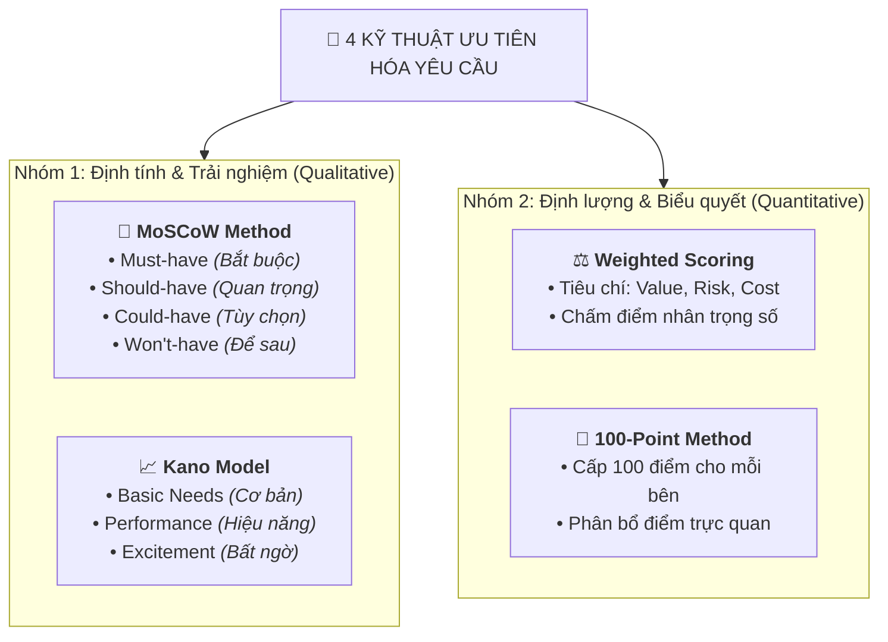

# Requirements Prioritization (Ưu tiên hóa Yêu cầu)

## 1. Định nghĩa & Tầm quan trọng
- **Khái niệm:** Requirements Prioritization là quá trình đánh giá mức độ quan trọng của các yêu cầu và xếp hạng chúng dựa trên các yếu tố: **Giá trị kinh doanh (Business Value)**, **Độ khẩn cấp (Urgency)**, và **Tính khả thi (Feasibility)**.
- **Mục tiêu:**
  - Tập trung nguồn lực, ngân sách và thời gian giới hạn vào những tính năng mang lại ROI cao nhất.
  - Xây dựng niềm tin với Stakeholders bằng cách giải quyết các nhu cầu thiết yếu trước.
  - Giảm thiểu rủi ro trễ hạn hoặc thất bại dự án.
- **Góc nhìn Non-PM / Analyst:** Giúp bạn có tiếng nói tác động trực tiếp vào các tính năng phục vụ người dùng thực tế và tối ưu vận hành.

---

## 2. Bốn Phương pháp Ưu tiên hóa Phổ biến (Prioritization Techniques)

### 1. Phương pháp **MoSCoW**
- **Must-have:** Bắt buộc phải có để dự án thành công (non-negotiable). *VD: Chức năng Đăng nhập, Chuyển tiền trong app ngân hàng.*
- **Should-have:** Quan trọng và có giá trị cao nhưng không chí mạng nếu hoãn lại ngắn hạn. *VD: Thanh toán hóa đơn, Thông báo biến động số dư.*
- **Could-have:** Tính năng hay ho (*nice-to-have*), chỉ làm nếu dư dả thời gian và nguồn lực. *VD: Giao diện tùy biến, Công cụ quản lý chi tiêu cá nhân.*
- **Won't-have (this time):** Không làm trong giai đoạn hiện tại (loại khỏi scope sprint này).

---

### 2. Mô hình **Kano (Kano Model)**
Phân loại tính năng dựa trên mức độ hài lòng của khách hàng (*Customer Satisfaction*):
- **Basic Needs (Nhu cầu cơ bản):** Tính năng mặc nhiên phải có. Nếu thiếu $\rightarrow$ Khách hàng cực kỳ thất vọng; nếu có $\rightarrow$ Coi là hiển nhiên. *VD: Khả năng xem nội dung trên mobile app.*
- **Performance Needs (Nhu cầu hiệu năng):** Càng làm tốt, khách hàng càng hài lòng (tỷ lệ thuận tuyến tính). *VD: Tốc độ tải app, thời gian phản hồi.*
- **Excitement Needs (Nhu cầu tạo bất ngờ/thích thú):** Tính năng vượt kỳ vọng giúp gây ấn tượng mạnh và làm khách hàng thích thú. *VD: Gamification, tính năng thưởng quà bất ngờ.*

---

### 3. Phương pháp **Weighted Scoring (Chấm điểm Trọng số)**
- Đánh giá từng yêu cầu theo bộ tiêu chí định lượng: *Business Value, Risk Reduction, Implementation Cost, Cost of Delay*.
- Nhân điểm từng tiêu chí với trọng số tương ứng để ra bảng xếp hạng tổng thể.
- *Nguyên tắc:* Tính năng có Business Value cao nhưng Cost quá lớn có thể xếp sau tính năng có Business Value vừa phải nhưng chi phí triển khai cực thấp.

---

### 4. Phương pháp **100-Point Method (100 Điểm)**
- Mỗi Stakeholder được phát 100 điểm để tự do phân bổ cho các tính năng theo nhận thức về tầm quan trọng của họ.
- *Ví dụ:* Cấp 60 điểm cho tính năng thanh toán cốt lõi, 40 điểm còn lại chia đều cho các tiện ích phụ. Tránh tranh cãi cảm tính.

---

## 3. Vai trò của Business Analyst trong Quá trình Ưu tiên hóa

| Trách nhiệm BA | Hành động cụ thể |
| :--- | :--- |
| **Facilitate Workshops** | Dẫn dắt các buổi workshop sử dụng MoSCoW, Kano hoặc 100-Point để đạt được sự đồng thuận (*buy-in*). |
| **Thu thập Dữ liệu** | Khảo sát, phỏng vấn và phân tích dữ liệu thị trường để làm căn cứ ra quyết định dựa trên dữ liệu (*data-driven*). |
| **Trực quan hóa ROI** | Sử dụng biểu đồ trọng số (*Weighted scoring charts*) để các bên thấy rõ bức tranh lợi ích/chi phí. |
| **Rà soát Định kỳ** | Liên tục rà soát lại thứ tự ưu tiên khi bối cảnh kinh doanh hoặc thị trường thay đổi. |
| **Truyền thông Minh bạch** | Trình bày rõ ràng lý do *Vì sao tính năng A được ưu tiên trước tính năng B* cho toàn bộ team & stakeholders. |

---

## 4. Ví dụ Thực tế: Triển khai Mobile Banking App

1. **Thu thập danh sách tính năng:** Tra cứu số dư, Chuyển tiền, Thanh toán hóa đơn, Push notification, Quản lý chi tiêu cá nhân (Budgeting tools).
2. **Áp dụng MoSCoW ban đầu:**
   - *Must-have:* Tra cứu số dư, Chuyển tiền.
   - *Should-have:* Thanh toán hóa đơn, Push notification.
   - *Could-have:* Quản lý chi tiêu (Budgeting tools).
3. **Phản hồi Stakeholder & Điều chỉnh:** Nhu cầu quản lý tài chính cá nhân tăng cao $\rightarrow$ Chuyển *Budgeting tools* từ *Could-have* lên *Should-have*.
4. **Bàn giao Kế hoạch:** BA tài liệu hóa danh sách ưu tiên cuối cùng và chuyển cho Tech team để xây dựng Product Roadmap.
