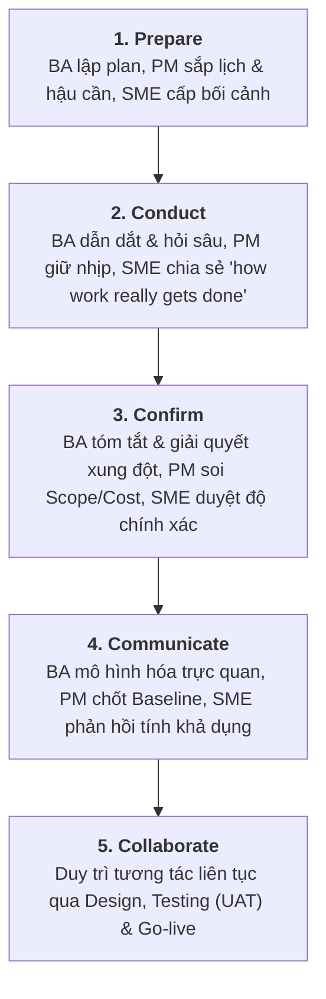

# Elicitation Cheat Sheet (Ma trận Khơi gợi Yêu cầu chuẩn BABOK)

## 1. Mục đích & Giá trị của Cheat Sheet
- Cung cấp khung tra cứu nhanh (**Quick Reference**) cho quy trình khơi gợi yêu cầu 5 bước chuẩn **BABOK® Guide**.
- Phân định rõ ràng trách nhiệm giữa 3 nhóm vai trò: **Business Analyst (BA)**, **Project Manager (PM)** và **Non-PM / Non-BA (SMEs, End-users, Managers)**.
- Đảm bảo yêu cầu được xác thực, giảm hiểu lầm và chuyển hóa các cuộc trao đổi thành kết quả hành động cụ thể (*actionable outcomes*).

---

## 2. Ma trận Trách nhiệm 5 Bước Khơi gợi Yêu cầu

| Bước (Step) & Mục tiêu | 🧠 Business Analyst (BA) | 📋 Project Manager (PM) | 👥 Non-PM / Non-BA (SMEs/Users) |
| :--- | :--- | :--- | :--- |
| **1. Prepare for Elicitation** *(Chuẩn bị)* • Xác định mục đích, phạm vi, phương pháp & đối tượng. | - Lập kế hoạch khơi gợi & chọn kỹ thuật phù hợp. - Xác định danh sách stakeholders. - Thống nhất thời gian & nguồn lực với PM. | - Tích hợp hoạt động khơi gợi vào lịch trình dự án tổng thể. - Đảm bảo phòng họp, hậu cần, nguồn lực và phê duyệt. - Kết nối đầu ra khơi gợi với mục tiêu dự án. | - Cung cấp bối cảnh vận hành & nỗi đau nghiệp vụ (*pain points*). - Gợi ý các chuyên gia nghiệp vụ (SMEs) cần tham gia. - Chia sẻ lịch trống & các ràng buộc thời gian. |
| **2. Conduct Elicitation** *(Tiến hành)* • Thu thập dữ liệu qua tương tác, quan sát & phân tích. | - Điều phối workshop, phỏng vấn, focus group. - Đặt câu hỏi mở & đào sâu (*probing questions*). - Ghi chép insight khách quan. | - Hỗ trợ quản lý thời gian (timekeeping) & mức độ gắn kết. - Quan sát đảm bảo nội dung bám sát mục tiêu dự án. | - Chia sẻ trải nghiệm thực tế, quy trình và thách thức. - Làm rõ *"công việc thực tế được xử lý như thế nào"*. - Đề xuất ý tưởng cải tiến & xác nhận tính khả thi. |
| **3. Confirm Results** *(Xác nhận)* • Kiểm chứng độ chính xác, đầy đủ & hiểu đúng. | - Tóm tắt phát hiện & đối chiếu với stakeholders. - Giải quyết xung đột quan điểm. - Tài liệu hóa giả định & ràng buộc. | - Đánh giá yêu cầu đã xác nhận với Scope baseline. - Nhận diện các thay đổi ảnh hưởng tới Schedule & Cost. | - Đọc lại tài liệu tóm tắt để xác thực độ chính xác. - Xác nhận yêu cầu phản ánh đúng nhu cầu thực. - Chỉ ra các điểm bị thiếu hoặc hiểu sai. |
| **4. Communicate Info** *(Truyền thông)* • Trực quan hóa & chia sẻ kết quả rõ ràng. | - Xây dựng sơ đồ trực quan (models), tóm tắt, spec. - Thuyết trình & giải đáp thắc mắc. - May đo tài liệu theo từng đối tượng tiếp nhận. | - Cập nhật Scope baseline & tài liệu lập kế hoạch. - Đảm bảo team dev & Project Sponsor hiểu tác động của yêu cầu. | - Đánh giá độ rõ ràng & tính đầy đủ của tài liệu. - Góp ý về tính khả dụng (usability). - Cảnh báo các thách thức triển khai thực tế. |
| **5. Manage Collaboration** *(Quản trị Cộng tác)* • Duy trì gắn kết & thúc đẩy đồng sở hữu. | - Điều phối trao đổi liên tục & thu thập feedback. - Theo dõi mức độ gắn kết của stakeholder. - Linh hoạt điều chỉnh cách tiếp cận. | - Củng cố qua governance, communication plans & reviews. - Leo thang (escalate) các khúc mắc chưa giải quyết. | - Tiếp tục tham gia review, kiểm thử (UAT) & change requests. - Đưa ra phản hồi và nêu nhu cầu mới khi phát sinh. - Hỗ trợ thúc đẩy chuyển đổi (adoption) hệ thống mới. |

---

## 3. Quy trình Dòng chảy Tổng quát (Flow Diagram)

---

## 4. Tóm tắt 4 Điểm cốt lõi (Key Takeaways)
1. **Chuẩn bị kỹ lưỡng:** Định nghĩa rõ mục đích, phạm vi và công cụ trước khi bắt đầu giúp tiết kiệm thời gian cho tất cả các bên.
2. **Khám phá chiều sâu:** BA đóng vai trò "người khai mở" (discovery), PM giữ vững ranh giới dự án, còn Non-PM/SME mang lại hơi thở thực tiễn vận hành.
3. **Xác nhận sớm để giảm rủi ro:** Xác thực và mô hình hóa trực quan giúp triệt tiêu hiểu lầm trước khi bước vào khâu lập trình/thiết kế tốn kém.
4. **Cộng tác là một chu kỳ liên tục:** Không dừng lại sau buổi phỏng vấn mà kéo dài xuyên suốt qua khâu Review, Prototype, Testing và Adoption.
