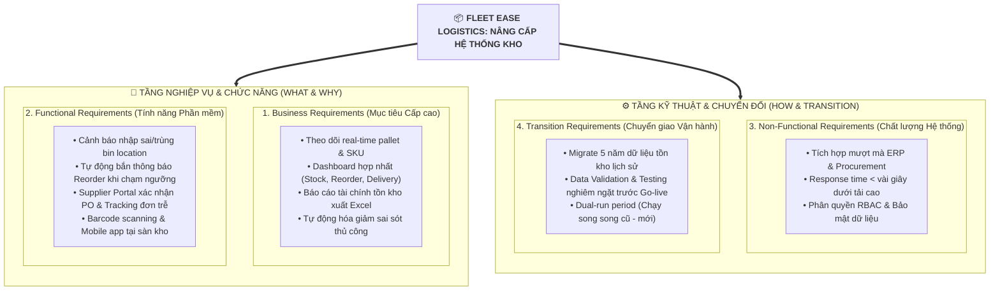

# Lab Solution & Summary: Affinity Charting (Phân loại & Gom nhóm Yêu cầu)

## 1. Mục tiêu bài Lab
- Phân tích và trích xuất yêu cầu từ các buổi phỏng vấn Stakeholder trong dự án Nâng cấp Hệ thống Quản trị Kho bãi (**Inventory Management System Upgrade Project** - *Fleet Ease Logistics*).
- Phân loại và gom nhóm yêu cầu (**Affinity Grouping**) thành 4 nhóm chuẩn:
  1. **Business Requirements** *(Yêu cầu kinh doanh / Mục tiêu cấp cao)*
  2. **Functional Requirements** *(Yêu cầu chức năng / Tính năng hệ thống)*
  3. **Non-Functional Requirements** *(Yêu cầu phi chức năng / Chất lượng & Hiệu năng)*
  4. **Transition Requirements** *(Yêu cầu chuyển đổi / Điều kiện tạm thời)*

---

## 2. Bối cảnh & Các Bên liên quan (Stakeholders)
- **Samantha Lee** (Warehouse Operations Manager): Gặp vấn đề cập nhật chậm, hàng để sai vị trí, cần dashboard tổng hợp.
- **Ravi Patel** (IT Systems Lead): Đòi hỏi tích hợp ERP, migrate 5 năm dữ liệu, thời gian phản hồi nhanh dưới vài giây.
- **Maria Gomez** (Procurement Manager): Cần cảnh báo tự động đặt hàng, cổng thông tin nhà cung cấp (Supplier portal), quét mã vạch barcode.
- **David Chen** (Finance Analyst): Cần báo cáo tài chính tồn kho xuất file Excel, chạy song song 2 hệ thống (dual-run) để giảm rủi ro.

---

## 3. Bảng Phân loại Chi tiết 14 Yêu cầu (Detailed Requirements Matrix)

| ID | Yêu cầu trích xuất (Requirement Statement) | Nhóm Phân loại (Category) | Stakeholder đề xuất | Mục đích & Ý nghĩa nghiệp vụ |
| :---: | :--- | :---: | :--- | :--- |
| **01** | Theo dõi thời gian thực (Real-time tracking) cho từng pallet và SKU | **Business** | Samantha Lee | Tăng tính minh bạch và tốc độ nắm bắt tồn kho toàn chuỗi cung ứng. |
| **02** | Dashboard tập trung hiển thị tồn kho, điểm đặt hàng lại (reorder points) và các đơn sắp giao | **Business** | Samantha Lee | Hỗ trợ ra quyết định điều hành nhanh mà không phải mở 3 báo cáo riêng lẻ. |
| **03** | Báo cáo tài chính định kỳ hàng tháng về vòng quay tồn kho (turnover) & giá trị kho xuất ra Excel | **Business** | David Chen | Phục vụ CFO đánh giá hiệu quả vốn lưu động và hàng tồn đọng lâu năm (aging). |
| **04** | Giảm thiểu sai sót do nhập liệu thủ công thông qua tự động hóa | **Business** | Maria Gomez | Tối ưu chi phí vận hành và tăng độ chính xác dữ liệu nhập kho. |
| **05** | Tự động cảnh báo khi người dùng lưu sai vị trí thùng hoặc trùng lặp mã vị trí (bin entries) | **Functional** | Samantha Lee | Ngăn chặn việc thất lạc hàng hóa ngay tại thời điểm xếp hàng vào kệ kho. |
| **06** | Tự động gửi thông báo đặt hàng lại khi mức tồn kho chạm ngưỡng tối thiểu (threshold) | **Functional** | Maria Gomez | Tránh tình trạng hết hàng đột ngột và tiết kiệm thời gian theo dõi thủ công. |
| **07** | Cổng thông tin Nhà cung cấp (Supplier Portal) để xác nhận đơn hàng & theo dõi tình trạng giao | **Functional** | Maria Gomez | Thay thế trao đổi qua email rời rạc, cảnh báo đơn hàng nhà cung cấp bị trễ. |
| **08** | Quét mã vạch (Barcode scanning) hoặc ứng dụng mobile thao tác trực tiếp tại kho | **Functional** | Maria Gomez | Cho phép nhân viên kho thao tác trực tiếp, cập nhật dữ liệu tức thì. |
| **09** | Tích hợp mượt mà với nền tảng ERP hiện hữu và hệ thống Mua sắm (Procurement) | **Non-Functional** | Ravi Patel | Đảm bảo tính liên thông dữ liệu và tính toàn vẹn hệ thống trong toàn doanh nghiệp. |
| **10** | Tốc độ phản hồi và cập nhật hệ thống trong vòng vài giây kể cả khi nhiều người dùng đồng thời | **Non-Functional** | Ravi Patel | Đảm bảo hiệu năng cao (Performance/Scalability), không gây gián đoạn vận hành kho. |
| **11** | Kiểm soát truy cập dựa trên vai trò (RBAC) và tuân thủ bảo mật dữ liệu | **Non-Functional** | *(Industry Best Practice)* | Bảo vệ dữ liệu nhạy cảm, phân định rõ quyền của Kho, Mua sắm, Kế toán. |
| **12** | Migration 5 năm dữ liệu tồn kho lịch sử sang hệ thống mới | **Transition** | Ravi Patel | Đảm bảo dữ liệu kinh doanh liên tục, không bị mất mát lịch sử giao dịch. |
| **13** | Kiểm thử xác thực độ chính xác dữ liệu (Data Validation & Testing) trước khi Go-live | **Transition** | Ravi Patel / David Chen | Đảm bảo hệ thống sạch lỗi và khớp số liệu tài chính trước khi chính thức vận hành. |
| **14** | Vận hành song song 2 hệ thống (Dual-run / Overlap period) giữa hệ thống cũ và mới | **Transition** | David Chen | Phòng ngừa rủi ro sự cố phát sinh ngoài dự kiến trong giai đoạn đầu chuyển đổi. |

---

## 4. Sơ đồ Cấu trúc Gom nhóm (Affinity Chart Diagram)

---

## 5. Kết luận & Đúc kết từ Bài Lab
1. **Phân loại rõ ràng:** Giúp đội ngũ dự án không bị lẫn lộn giữa *Mục tiêu kinh doanh (Business)*, *Tính năng cần code (Functional)*, *Tiêu chuẩn kỹ thuật (Non-Functional)* và *Các bước chuẩn bị tạm thời (Transition)*.
2. **Affinity Charting:** Kỹ thuật gom nhóm trực quan cực kỳ hữu ích khi xử lý một lượng lớn thông tin phỏng vấn rời rạc, chưa có cấu trúc.
3. **Chuyển giao êm đẹp:** Các yêu cầu Transition (như chạy song song dual-run, migrate dữ liệu 5 năm) là yếu tố sống còn để giảm thiểu rủi ro gián đoạn chuỗi cung ứng khi Go-live.
