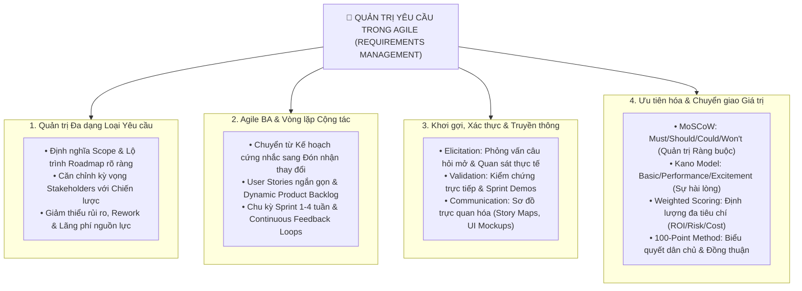

# Dialogue Summary: Requirements Management & Generative AI Applications

## 1. Tổng quan Hoạt động Dialogue
- **Chủ đề:** Khám phá toàn diện quy trình nhận diện, khơi gợi, ưu tiên hóa, xác thực và quản lý các loại yêu cầu trong môi trường Agile cộng tác.
- **Kết quả đánh giá:** Hoàn thành xuất sắc 4/4 chủ đề cốt lõi với sự kết hợp chặt chẽ giữa lý thuyết chuẩn mực và ứng dụng thực tiễn.

---

## 2. Bốn Trụ cột Kiến thức Cốt lõi (4 Core Pillars)

---

## 3. Chi tiết Tóm tắt từng Chủ đề Thảo luận

| Chủ đề | Trọng tâm Thảo luận | Giá trị Thực tiễn & Đúc kết |
| :--- | :--- | :--- |
| **1. Requirements Fundamentals** | Định nghĩa yêu cầu & tầm quan trọng của quản lý yêu cầu. | Yêu cầu là nền móng để xác định phạm vi, liên kết các bên liên quan và triệt tiêu nguy cơ trễ hạn/thất bại dự án. |
| **2. Agile BA vs. Traditional** | Sự linh hoạt, tinh gọn và cách thích ứng với thị trường. | Thay vì tài liệu BRD đồ sộ nhận phản hồi muộn, Agile BA dùng User Stories phân phối giá trị gia tăng (*incremental delivery*) theo từng Sprint ngắn. |
| **3. Elicitation, Validation & Comm.** | Kỹ thuật phỏng vấn, quan sát thực tế và mô hình hóa trực quan. | Phỏng vấn tìm *pain points*, quan sát tìm *"cách việc thực sự diễn ra"*, và dùng công cụ trực quan (*visual models*) làm cầu nối giữa Technical và Business. |
| **4. Prioritization Techniques** | Áp dụng MoSCoW, Kano, Weighted Scoring & 100-Point. | Giúp đội ngũ ra quyết định dựa trên dữ liệu (*data-driven*), cân bằng giữa Giá trị kinh doanh (Business Value), Sự hài lòng (Satisfaction) và Ràng buộc kỹ thuật/ngân sách (Constraints). |

---

## 4. Đánh giá Năng lực (Feedback Assessment)
- **Điểm mạnh (Strengths):**
  - Trả lời rõ ràng, súc tích, bao quát toàn bộ các khía cạnh nghiệp vụ.
  - Kết nối nhuần nhuyễn giữa khái niệm lý thuyết và bài toán vận hành Agile thực tế.
- **Định hướng phát triển (Actionable Improvement):**
  - Tiếp tục áp dụng các phương pháp khơi gợi (interviews/workshops) và chấm điểm ưu tiên (weighted scoring/MoSCoW) vào các tình huống thực chiến để tối ưu hóa năng lực điều phối dự án.
