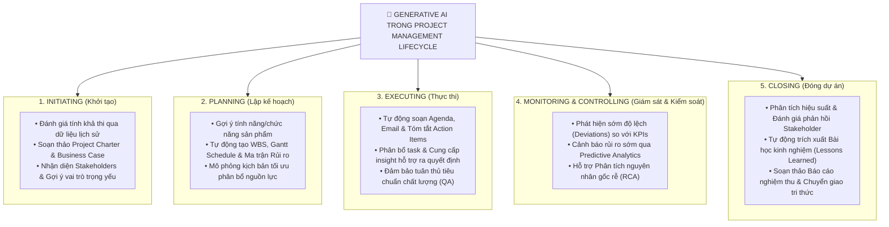

# Generative AI for Project Management (Ứng dụng GenAI trong Quản trị Dự án)

## 1. Bối cảnh & Vai trò của Project Manager (PM)
- **Trách nhiệm của PM:** Dẫn dắt và quản trị toàn bộ vòng đời dự án từ Khởi tạo (Initiation) đến Đóng dự án (Closure), đảm bảo bàn giao đúng hạn (*on time*), trong ngân sách (*within budget*), đáp ứng yêu cầu và mang lại giá trị kinh doanh (*deliver value*).
- **Thách thức thực tế:** Nghiên cứu từ **Standish Group** chỉ ra rằng chỉ có **31%** dự án hoàn thành đúng hạn & đúng ngân sách, tỷ lệ thành công chung chỉ đạt **36%** (nghĩa là có tới **64%** dự án gặp trục trặc hoặc thất bại).
- **Giải pháp:** Tích hợp **Generative AI** nhằm tự động hóa tác vụ hành chính, phân tích dự báo rủi ro, tối ưu hóa nguồn lực và giải phóng PM tập trung vào hoạch định chiến lược & giải quyết vấn đề.

---

## 2. Ma trận Ứng dụng Generative AI qua 5 Giai đoạn Vòng đời Dự án

---

## 3. Bảng Chi tiết Công việc Truyền thống vs. Sự hỗ trợ từ Generative AI

| Giai đoạn (Lifecycle Stage) | Công việc của PM | Ứng dụng Đột phá của Generative AI |
| :--- | :--- | :--- |
| **1. Initiating** *(Khởi tạo)* | Lập Business Case, Project Charter, xác định Stakeholders ban đầu. | - Khai phá cơ hội dự án và phân tích tính khả thi từ dữ liệu lịch sử. - Soạn thảo khung Project Charter và đề xuất phân bổ vai trò quan trọng. |
| **2. Planning** *(Lập kế hoạch)* | Định nghĩa Scope, Schedule, Budget, Resource Plan và Risk Register. | - Tạo cấu trúc phân rã công việc (**WBS**) và đề xuất tính năng. - Mô phỏng các kịch bản (*Scenario Simulation*) để tìm lịch trình tối ưu. - Dự báo các điểm phụ thuộc (*dependencies*) và xung đột nguồn lực. |
| **3. Executing** *(Thực thi)* | Điều phối cuộc họp, cập nhật trạng thái, quản lý thay đổi, đảm bảo QA. | - Tự động hóa soạn thảo Agenda họp, tóm tắt cuộc họp & Action Items. - Cung cấp insight thời gian thực giúp PM ra quyết định điều hành nhanh. |
| **4. Monitoring & Controlling** *(Giám sát)* | Kiểm tra Deliverables, theo dõi KPIs, phát hiện sai lệch, chạy RCA. | - Phân tích dữ liệu vận hành để phát hiện sớm các độ lệch tiến độ/ngân sách. - Đưa ra hệ thống cảnh báo sớm (*Early Warning System*) thông qua Predictive Analytics. |
| **5. Closing** *(Đóng dự án)* | Nghiệm thu bàn giao, đóng hợp đồng, tổng kết dự án. | - Phân tích dữ liệu hiệu suất và khảo sát mức độ hài lòng của stakeholder. - Tự động tổng hợp Báo cáo đóng dự án (**Project Closure Report**) và đúc kết **Lessons Learned** để chuyển giao tri thức (*Knowledge Transfer*). |

---

## 4. Tóm tắt Giá trị Cốt lõi (Key Takeaways)
1. **Tiết kiệm thời gian & Giảm tải hành chính:** Giúp PM thoát khỏi các tác vụ thủ công (viết mail, làm biên bản họp, soạn báo cáo định kỳ).
2. **Ra quyết định dựa trên dữ liệu (Data-Driven Decisions):** Dự báo trước các điểm nghẽn và rủi ro nhờ khả năng tổng hợp dữ liệu lịch sử.
3. **Nâng cao tỷ lệ thành công:** Giảm thiểu khoảng cách giữa kế hoạch và thực tế, giúp đưa tỷ lệ thành công của dự án vượt qua mức trung bình 36% của ngành.
