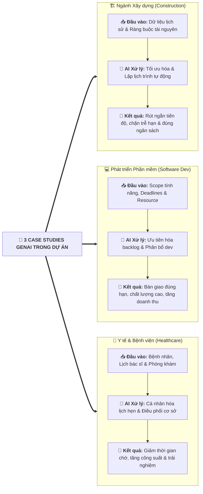

# Leveraging the Power of GenAI in Project Management (Case Studies)

## 1. Tổng quan & Giá trị Thực tiễn
- **GenAI như giải pháp toàn diện (One-stop Solution):** Tự động hóa tác vụ, khai phá insight và định hướng ra quyết định cho cả **Project Managers** và **Non-PMs**.
- **Đơn giản hóa độ phức tạp:** Hỗ trợ điều phối tiến độ (*timelines*), bám sát deliverables và tối ưu giao tiếp với stakeholders.

---

## 2. Ba Case Studies Thực tế theo Ngành (Industry Case Studies)

---

## 3. Tổng hợp Giá trị Mang lại từ các Case Studies

| Khía cạnh Giá trị | Ngành Xây dựng (Construction) | Ngành Phần mềm (Software) | Ngành Y tế (Healthcare) |
| :--- | :--- | :--- | :--- |
| **1. Tối ưu Phân bổ Nguồn lực** *(Resource Allocation)* | Tối ưu tiến độ dựa trên giới hạn nguồn lực và sở thích stakeholder; rút ngắn thời gian lập kế hoạch. | Phân bổ lập trình viên và tài nguyên hợp lý qua nhiều dự án đồng thời; tăng hiệu quả sử dụng. | Điều phối bác sĩ, nhân viên y tế và phòng khám tối ưu; tránh tình trạng quá tải cục bộ. |
| **2. Nâng cao Ra Quyết định** *(Decision-Making)* | Tạo lịch trình tối ưu giúp hoàn thành dự án trước thời hạn trong ngân sách. | Lựa chọn tính năng ưu tiên mang lại ROI cao nhất; ra mắt sản phẩm đúng hạn. | Cá nhân hóa lịch hẹn bệnh nhân, nâng cao trải nghiệm khám chữa bệnh và giảm chi phí vận hành. |
| **3. Hiệu quả Lập Kế hoạch** *(Planning Efficiency)* | Tự động hóa tạo lịch trình dự án; giảm thiểu sai sót do con người, giải phóng đội ngũ. | Rút ngắn thời gian lên backlog & roadmap cho các sprint tiếp theo. | Tự động hóa quy trình đặt hẹn, giảm tải thủ tục hành chính cho nhân viên y tế. |
| **4. Quản trị Rủi ro & Dự báo** *(Risk & Data-Driven)* | Dự báo trước các điểm nghẽn (*bottlenecks*) và nguy cơ trễ hạn để xử lý chủ động. | Phân tích xu hướng và mẫu hình dữ liệu (*patterns*) để dự báo nhu cầu nguồn lực chính xác. | Dự đoán lưu lượng bệnh nhân theo khung giờ để chủ động sắp xếp trang thiết bị. |

---

## 4. Đúc kết Cốt lõi (Key Takeaways)
1. **Dữ liệu Lịch sử là Tài sản:** GenAI khai thác dữ liệu quá khứ để đưa ra các phương án lập lịch và phân bổ tối ưu hơn con người tự tính toán thủ công.
2. **Quản trị Chủ động (Proactive vs. Reactive):** Khả năng phân tích mẫu hình (pattern recognition) giúp phát hiện rủi ro trễ hạn từ trước khi nó xảy ra.
3. **Giá trị đa ngành:** GenAI mang lại lợi ích đo lường được từ quản lý công trường xây dựng, phân phối phần mềm Agile đến tối ưu hóa dịch vụ công trong y tế.
