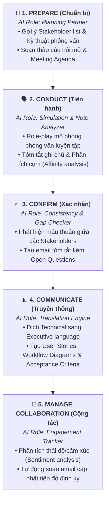

# AI in Requirements Elicitation (Ứng dụng AI trong Khơi gợi Yêu cầu chuẩn BABOK)

## 1. Bản chất & Nguyên tắc cốt lõi
- **Vai trò của GenAI:** GenAI **không thay thế** kỹ năng thấu cảm và thấu hiểu con người của BA/PM, mà đóng vai trò là một **Trợ lý thông minh (Intelligent Partner)**.
- **Giá trị mang lại:** Cắt giảm thời gian sao chép (*transcription*), định dạng (*formatting*) và hành chính để đội ngũ tập trung vào việc quan trọng nhất: **Xây dựng giải pháp giải quyết đúng nhu cầu thực tế của Stakeholders**.

---

## 2. Ứng dụng GenAI qua 5 Bước Khơi gợi Yêu cầu (BABOK® Guide)

---

## 3. Bảng Chi tiết Ứng dụng & Mẫu Prompts Thực tế

| Bước BABOK | Mục tiêu giai đoạn | Vai trò của GenAI | Ví dụ Prompt Thực chiến |
| :--- | :--- | :--- | :--- |
| **Step 1: Prepare** *(Chuẩn bị)* | Lập kế hoạch, xác định stakeholder, chọn kỹ thuật phỏng vấn. | Planning Partner: Lên danh sách stakeholder, soạn agenda, gợi ý câu hỏi mở sâu sắc. | *"Tạo 5 câu hỏi mở để khai thác các vấn đề về lập lịch giao hàng của khách hàng ngành logistics."* |
| **Step 2: Conduct** *(Tiến hành)* | Thu thập thông tin qua phỏng vấn, workshop, quan sát. | Simulation & Structuring: Role-play luyện phỏng vấn; gom nhóm feedback theo chủ đề (Affinity Analysis). | *"Đóng vai Quản lý kho đang bức xúc với phần mềm tồn kho hiện tại, tôi sẽ hỏi để tìm ra nhu cầu của bạn."* |
| **Step 3: Confirm** *(Xác thực)* | Xác nhận thông tin ghi nhận đúng ý định của Stakeholder. | Consistency Checker: Phát hiện điểm mâu thuẫn, tổng hợp email xác nhận, bảng đối chiếu đa chiều. | *"Lập bảng so sánh yêu cầu giữa phòng Kinh doanh và Kho, chỉ ra các điểm đang xung đột cần làm rõ."* |
| **Step 4: Communicate** *(Truyền thông)* | Trực quan hóa & trình bày yêu cầu cho cả Tech và Non-tech. | Translation Engine: Dịch thuật ngữ kỹ thuật sang ngôn ngữ kinh doanh; sinh User Stories & bảng đặc tả. | *"Chuyển các yêu cầu dạng text này thành bảng chuẩn gồm: ID, Description, Source, Acceptance Criteria."* |
| **Step 5: Manage Collaboration** *(Quản trị cộng tác)* | Duy trì sự tham gia, gắn kết và giải quyết xung đột dài hạn. | Engagement & Sentiment Tracker: Phân tích độ gắn kết, soạn email cập nhật tiến độ định kỳ. | *"Viết email cập nhật lịch sự gửi Stakeholders tóm tắt tiến độ tuần 3 và các bước tiếp theo trong khâu khơi gợi."* |

---

## 4. Tóm tắt Đúc kết (Key Takeaways)
1. **AI là Trợ lý, không phải Người thay thế:** AI cung cấp ý tưởng, cấu trúc dữ liệu và phát hiện mâu thuẫn; con người giữ vai trò phán đoán nghiệp vụ, xác thực và ra quyết định.
2. **Nâng cao năng lực phỏng vấn:** Kỹ thuật Role-play với AI trước buổi họp giúp BA tự tin và đào sâu vấn đề chuẩn xác hơn.
3. **Chuẩn hóa tài liệu trong vài giây:** Chuyển đổi linh hoạt từ văn bản thô sang User Story, bảng Acceptance Criteria hoặc Slide báo cáo Executive.
