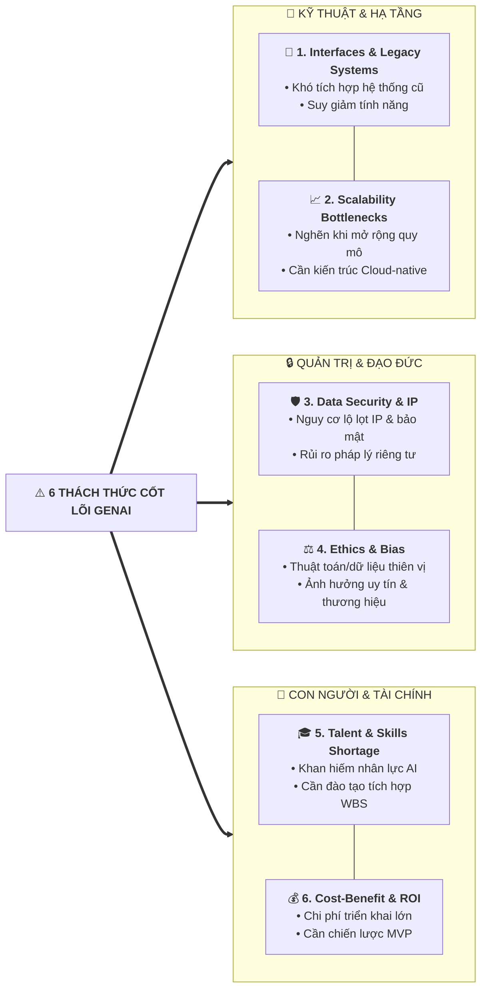

# Challenges of GenAI in Project Management (Thách thức & Thực tiễn Khắc phục)

## 1. Bối cảnh & Tổng quan
- **Cơ hội song hành cùng rủi ro:** Generative AI mang lại năng lực đột phá trong quản trị dự án, nhưng cũng đặt ra những rủi ro kỹ thuật, pháp lý, con người và đạo đức nghiêm trọng.
- **Vai trò của PM & Non-PM (Department Heads / Leads):** Phải chủ động nhận diện rào cản, lập kế hoạch phòng ngừa trong Risk Register và biến thách thức thành lợi thế cạnh tranh.

---

## 2. Sáu Thách thức Cốt lõi của GenAI (Key Challenges)

---

## 3. Ma trận Thách thức & Biện pháp Khắc phục (Best Practices Matrix)

| Thách thức | Bản chất rủi ro | Biện pháp Khắc phục Tốt nhất (Best Practices) |
| :--- | :--- | :--- |
| **1. Interfaces & Legacy Systems** | Hệ thống cũ không hỗ trợ AI API/giao thức hiện đại $\rightarrow$ Gãy đổ luồng dữ liệu. | - Xác định các điểm phụ thuộc (*dependencies*) từ giai đoạn khởi tạo. - Lên kế hoạch nâng cấp hạ tầng hoặc xây dựng tầng trung gian (*middleware/adapters*). |
| **2. Data Security & Governance** | AI truy cập dữ liệu nội bộ vô tình làm lộ tài sản trí tuệ (IP) hoặc vi phạm luật dữ liệu cá nhân. | - Ban hành chính sách chia sẻ dữ liệu (*Data Sharing Policy*). - Tham vấn chuyên gia Pháp chế & IP; đưa rủi ro vào *Risk Register*. - Thiết lập cơ chế kiểm soát rào chắn dữ liệu (*Data boundaries & anonymization*). |
| **3. Scalability (Khả năng mở rộng)** | Giải pháp AI chạy thử (PoC) tốt nhưng nghẽn khi mở rộng toàn doanh nghiệp. | - Thiết kế kiến trúc hỗ trợ mở rộng ngay từ đầu (*Scalability by design*). - Tận dụng hạ tầng điện toán đám mây (*Cloud-native solutions*). |
| **4. Cost-Benefit & ROI** | Chi phí GPU, API token và kỹ thuật vượt quá giá trị kinh doanh mang lại. | - Thực hiện định lượng giá trị sản phẩm trước khi làm. - Ưu tiên tính năng bám sát mục tiêu **MVP (Minimum Viable Product)** để tối đa hóa ROI. |
| **5. Team Composition & Skills** | Thiếu hụt nhân tài AI $\rightarrow$ Dự án trễ hạn hoặc phụ thuộc nhà thầu ngoài đắt đỏ. | - Đánh giá khoảng trống năng lực (*Skill gaps*) từ Stakeholder Register. - Đưa các gói đào tạo nội bộ (*Training work packages*) trực tiếp vào **WBS**. - Kế hoạch tuyển dụng/thuê ngoài cân đối chi phí. |
| **6. Ethics, Bias & Copyright** | AI đưa ra kết luận thiên vị gây tổn hại thương hiệu; vi phạm bản quyền nội dung. | - Định kỳ kiểm toán mô hình (*Audit AI models*) cùng stakeholders. - Thiết lập khung quy tắc đạo đức AI (*Ethical AI Guidelines*). - Áp dụng quy trình kiểm soát chất lượng (QA/QC) trước khi Go-live. |

---

## 4. Tóm tắt Đúc kết (Key Takeaways)
1. **Quản trị Rủi ro Chủ động:** Không bao giờ triển khai AI theo cảm tính; mọi rủi ro về bảo mật, đạo đức và pháp lý phải nằm trong *Risk Register* ngay từ đầu.
2. **Chiến lược MVP & ROI:** Bắt đầu bằng các Use Case nhỏ gọn, chứng minh giá trị kinh doanh rõ ràng trước khi nhân rộng quy mô lớn.
3. **Đào tạo con người là chìa khóa:** Xây dựng năng lực AI ngay trong đội ngũ qua các gói đào tạo tích hợp sẵn trong cấu trúc phân rã công việc (WBS).
