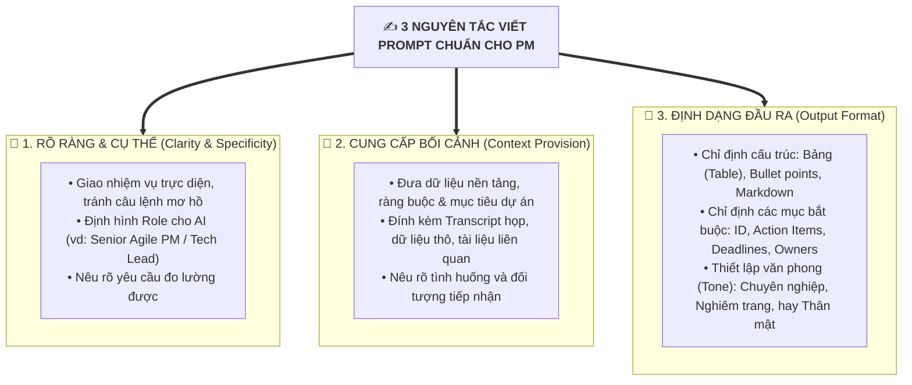
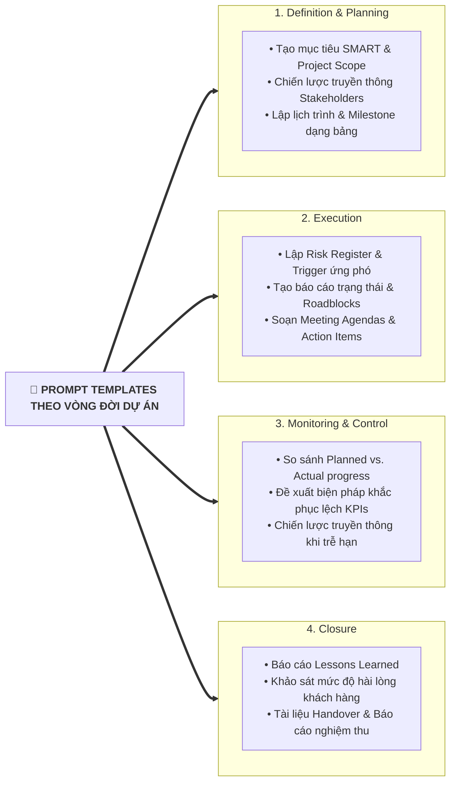

# Cheat Sheet for GenAI Prompts in Project Management

## 1. Ba Trụ Cột Viết Prompt Hiệu Quả (3 Core Elements)

---

## 2. Kỹ thuật Bổ trợ (Additional Pro-Tips)
- **Cung cấp mẫu (Few-shot / Examples):** Đưa kèm một đoạn format mẫu để AI bám sát cấu trúc mong muốn.
- **Lặp lại & Tinh chỉnh (Iterative Refinement):** Tiếp tục đưa phản hồi (*follow-up prompts*) để AI gọt giũa kết quả tối ưu nhất.
- **Yêu cầu đầu ra định lượng:** Đòi hỏi các con số, mốc thời gian và trách nhiệm rõ ràng thay vì câu trả lời chung chung.

---

## 3. Mẫu Prompts từ Cơ bản đến Nâng cao (Simple vs. Detailed)

| Mục đích sử dụng | Prompt Đơn giản (Simple) | Prompt Nâng cao có Bối cảnh (Detailed with Context) |
| :--- | :--- | :--- |
| **Tóm tắt cuộc họp** | *"Summarize today's meeting notes."* | *"Dựa trên transcript cuộc họp sau: [Dán Transcript], hãy trích xuất: (1) Các quyết định chính, (2) Danh sách Action Items kèm Owner và Deadline, (3) Các vấn đề còn tồn đọng cần giải quyết."* |
| **Email cập nhật Stakeholders** | *"Compose an email to the team specifying the project status update."* | *"Đóng vai Project Manager, viết email chuyên nghiệp gửi Ban lãnh đạo thông báo về dự án nâng cấp website. Nêu rõ: Giai đoạn Thiết kế đã hoàn thành, chuẩn bị bước vào Development, các milestones chính, 1 sự cố phát sinh kèm giải pháp xử lý và các bước tiếp theo."* |
| **Kế hoạch Quản trị Rủi ro** | *"Identify potential risks for the upcoming project phase."* | *"Xây dựng kế hoạch quản trị rủi ro cho dự án ERP. Xác định 5 rủi ro lớn nhất, đánh giá Xác suất & Mức độ ảnh hưởng (Ma trận Rủi ro), đề xuất phương án ứng phó và gán Risk Owner cho từng mục. Định dạng dạng bảng Markdown."* |
| **Phân rã Công việc (WBS)** | *"List the tasks in the Sprint Backlog to complete this week."* | *"Lập danh sách công việc chi tiết cho chiến dịch Product Launch gồm: Nghiên cứu thị trường, Quảng cáo và Đào tạo Sales. Ước tính thời gian hoàn thành, phân bổ nhân sự phụ trách và chỉ rõ các điểm phụ thuộc (dependencies)."* |

---

## 4. Bộ Prompt Mẫu theo 4 Giai đoạn Vòng đời Dự án (Lifecycle Prompts)

### Chi tiết Câu lệnh Gợi ý cho từng Phase:
- **Phase 1: Project Definition & Planning:**
  - *"Generate SMART goals and define the scope baseline for [Project Name]."*
  - *"Outline a project schedule with milestones, deliverables, and dependencies in tabular format."*
- **Phase 2: Project Execution:**
  - *"Generate a weekly project status report highlighting completed tasks, upcoming milestones, and immediate roadblocks."*
  - *"Draft a meeting agenda for our Sprint Planning, including timeboxes for story point estimation and capacity review."*
- **Phase 3: Project Monitoring & Control:**
  - *"Evaluate our project KPIs based on this data: [Insert Data]. Identify key deviations between planned vs. actual progress and propose corrective actions."*
  - *"Draft an impact analysis report explaining the cause of the delay in milestone X and outlining the mitigation strategy for sponsors."*
- **Phase 4: Project Closure:**
  - *"Create a comprehensive Lessons Learned document summarizing key achievements, operational challenges, technical root causes, and recommendations for future projects."*
  - *"Draft a formal Project Handover Checklist and final deliverables sign-off document."*
