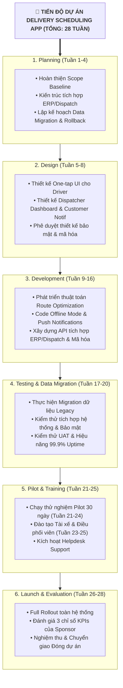

# Lab Solution & Summary: Elicit Requirements Using AI

## 1. Bối cảnh Dự án (The Situation)
- **Tổ chức:** Fleet Ease Logistics.
- **Dự án:** Ứng dụng Điều phối Giao hàng (*Delivery Scheduling App*).
- **Vai trò của bạn:** Tân Project Manager kế nhiệm (nhận bàn giao từ Nora - Outgoing PM).
- **Yêu cầu của Sponsor (Sam - VP of Operations):** Chuẩn bị 3 Deliverables chiến lược trước cuộc họp Ban điều hành:
  1. **Bảng phân loại Yêu cầu** (*Categorized Requirements Overview*): Business, Functional, Non-Functional, Transition.
  2. **Kế hoạch Tiến độ Hoạt động** (*Activity Timeline*): Trình tự công việc, thời lượng ước tính và các điểm phụ thuộc (*dependencies*).
  3. **Danh mục Quản trị Rủi ro** (*Risk Register*): Đánh giá Xác suất, Mức độ ảnh hưởng và Phương án ứng phó.

---

## 2. Deliverable 1: Bảng Phân loại Yêu cầu (Categorized Requirements)

| ID | Yêu cầu (Requirement Statement) | Phân loại (Category) | Nguồn đề xuất (Stakeholder) | Tiêu chí đo lường / Mục tiêu |
| :---: | :--- | :---: | :--- | :--- |
| **BR-01** | Giảm 20% tỷ lệ giao hàng trễ | **Business** | Sam (Sponsor) | Tăng tỷ lệ giao hàng đúng hẹn (*on-time delivery*). |
| **BR-02** | Nâng cao 15% chỉ số hài lòng khách hàng (CSAT) | **Business** | Sam (Sponsor) | Đo lường qua khảo sát sau giao hàng. |
| **BR-03** | Tăng 25% năng suất làm việc của điều phối viên | **Business** | Sam (Sponsor) | Tối ưu hóa số chuyến/thao tác trên mỗi điều phối viên. |
| **FR-01** | Tối ưu hóa lộ trình theo thời gian thực (Real-time route optimization) | **Functional** | Diego (Dispatch) | Tự động điều chỉnh lịch trình khi giao thông biến động. |
| **FR-02** | Gửi Push Notifications cho tài xế khi lộ trình thay đổi | **Functional** | Cal (Driver Rep) | Cảnh báo tức thì cho tài xế trên đường di chuyển. |
| **FR-03** | Chế độ Offline Mode cho phép app hoạt động khi mất sóng | **Functional** | Cal (Driver Rep) | Lưu trữ cục bộ dữ liệu hành trình khi kết nối yếu. |
| **FR-04** | Giao diện tài xế đơn giản: Xác nhận cập nhật với 1 chạm (One-tap) | **Functional** | Cal (Driver Rep) | Tối ưu thao tác lái xe, giảm phân tâm. |
| **FR-05** | Thông báo thời gian giao hàng dự kiến chính xác cho khách hàng | **Functional** | Lena (Customer Exp) | Tăng độ tin cậy và minh bạch thông tin cho khách hàng. |
| **FR-06** | Dashboard hiệu suất thời gian thực cho điều phối viên | **Functional** | Diego (Dispatch) | Giám sát toàn bộ đội xe và hiệu quả giao hàng real-time. |
| **NFR-01** | Tích hợp mượt mà với nền tảng ERP và Dispatch hiện hữu | **Non-Functional** | Priya (IT Lead) | Đồng bộ dữ liệu 2 chiều không gián đoạn. |
| **NFR-02** | Độ sẵn sàng hệ thống đạt 99.9% Uptime | **Non-Functional** | Priya (IT Lead) | Đảm bảo tính liên tục của vận hành chuỗi cung ứng. |
| **NFR-03** | Mã hóa toàn bộ dữ liệu ở mọi trạng thái (In-transit & At-rest) | **Non-Functional** | Priya (IT Lead) | Tuân thủ các tiêu chuẩn an ninh mạng nghiêm ngặt. |
| **TR-01** | Migration dữ liệu từ hệ thống Legacy cũ sang hệ thống mới | **Transition** | Priya (IT Lead) | Chuyển đổi toàn vẹn dữ liệu lịch sử giao hàng. |
| **TR-02** | Triển khai giai đoạn Pilot 30 ngày trước khi Rollout toàn bộ | **Transition** | Priya (IT Lead) | Đánh giá thực tế trên phạm vi hẹp để tinh chỉnh lỗi. |
| **TR-03** | Xây dựng kế hoạch Rollback khẩn cấp nếu gặp sự cố lớn | **Transition** | Priya (IT Lead) | Giảm thiểu rủi ro gián đoạn vận hành kinh doanh. |
| **TR-04** | Đào tạo sử dụng giao diện mới cho Tài xế và Điều phối viên | **Transition** | Lena (Customer Exp) | Nâng cao tỷ lệ tiếp nhận (*adoption rate*). |
| **TR-05** | Thiết lập đội ngũ Hỗ trợ Helpdesk trong suốt giai đoạn Rollout | **Transition** | Lena (Customer Exp) | Hỗ trợ xử lý sự cố người dùng tại chỗ 24/7. |

---

## 3. Deliverable 2: Kế hoạch Tiến độ Dự án (Project Activity Timeline)

| Giai đoạn (Phase) | Hoạt động chính (Major Activities) | Thời lượng | Phụ thuộc (Dependencies) |
| :--- | :--- | :---: | :--- |
| **Phase 1: Planning** | Hoàn thiện đặc tả yêu cầu, kiến trúc hệ thống, kế hoạch Data Migration & Rollback. | 4 tuần | Bắt đầu dự án |
| **Phase 2: UI/UX & Architecture Design** | Thiết kế giao diện One-tap cho Driver, Dashboard cho Dispatcher và luồng tích hợp ERP. | 4 tuần | Sau Phase 1 |
| **Phase 3: Development & Integration** | Lập trình tính năng (Route Optimization, Offline mode, Notifications) và tích hợp API ERP/Dispatch. | 8 tuần | Sau Phase 2 |
| **Phase 4: Testing & Migration** | Migration dữ liệu từ Legacy, kiểm thử UAT, kiểm tra bảo mật mã hóa và Uptime 99.9%. | 4 tuần | Sau Phase 3 |
| **Phase 5: Pilot & Training** | Triển khai Pilot 30 ngày (4 tuần), đào tạo Tài xế/Điều phối viên và kích hoạt Helpdesk. | 5 tuần | Sau Phase 4 |
| **Phase 6: Full Rollout & Closeout** | Triển khai chính thức toàn quốc, đo lường KPIs (giảm 20% trễ, tăng 15% CSAT, tăng 25% năng suất), đóng dự án. | 3 tuần | Sau Phase 5 |

---

## 4. Deliverable 3: Bảng Đánh giá & Quản trị Rủi ro (Risk Register)

| Mã Rủi ro | Mô tả Rủi ro (Risk Description) | Xác suất (Prob.) | Mức ảnh hưởng (Impact) | Phương án Ứng phó (Recommended Response) |
| :---: | :--- | :---: | :---: | :--- |
| **RSK-01** | Thuật toán tối ưu tuyến đường tính toán sai khi dữ liệu giao thông thay đổi đột ngột | Medium | High | Tích hợp nhiều nguồn dữ liệu bản đồ dự phòng và cho phép điều phối viên ghi đè thủ công (*manual override*). |
| **RSK-02** | Xung đột hoặc mất mát dữ liệu trong quá trình chuyển đổi (Migration) từ hệ thống Legacy | High | High | Thực hiện chạy thử nghiệm migration trên môi trường Staging nhiều lần và chuẩn bị sẵn script Rollback tức thì. |
| **RSK-03** | Sự cố nghẽn mạng hoặc lỗi kết nối API giữa hệ thống mới với ERP và Dispatch cũ | Medium | High | Thiết kế cơ chế Retry tự động, xây dựng hàng đợi tin nhắn (Message Queue) và giám sát API liên tục. |
| **RSK-04** | Tài xế gặp khó khăn trong việc thích nghi giao diện mới dẫn đến chậm trễ giao hàng | High | Medium | Thiết kế giao diện tối giản 1 chạm (One-tap) và tổ chức các buổi đào tạo thực hành trực quan ngắn. |
| **RSK-05** | Chế độ Offline Mode hoạt động không đồng bộ dẫn đến mất dữ liệu khi vào vùng mất sóng | Low | High | Áp dụng cơ chế lưu trữ đệm cục bộ (Local caching) và tự động đồng bộ ngầm ngay khi có mạng trở lại. |
| **RSK-06** | Không đạt chỉ tiêu Uptime 99.9% do hạ tầng máy chủ quá tải trong giờ cao điểm | Low | High | Triển khai kiến trúc Cloud Auto-scaling và cơ chế cân bằng tải dự phòng đa vùng (Multi-AZ). |
| **RSK-07** | Lỗ hổng bảo mật làm rò rỉ dữ liệu khách hàng hoặc thông tin vận chuyển nhạy cảm | Low | High | Mã hóa đầu cuối (End-to-End Encryption) cả lúc truyền tải lẫn lưu trữ, tiến hành kiểm toán bảo mật độc lập trước Go-live. |
| **RSK-08** | Kết quả Pilot 30 ngày không đạt được kỳ vọng giảm 20% giao trễ như cam kết với Sponsor | Medium | High | Rà soát chỉ số hàng tuần trong thời gian Pilot, tinh chỉnh tham số thuật toán ngay lập tức trước khi Rollout đại trà. |

---

## 5. Đúc kết & Bài học Thực hành (Key Takeaways)
1. **GenAI là Trợ thủ Đắc lực:** Giúp chuyển đổi nhanh chóng văn bản phỏng vấn phi cấu trúc thành 3 deliverables chuyên nghiệp (Requirements, Timeline, Risk Register) chỉ trong thời gian ngắn.
2. **Vai trò của PM là Phán đoán & Kiểm chứng:** AI tạo khung sườn và gợi ý, nhưng PM phải rà soát tính khả thi kỹ thuật và thống nhất cam kết với các bên liên quan (Sam, Priya, Diego, Lena, Cal).
3. **Căn chỉnh liên tục:** Đảm bảo toàn bộ hoạt động kỹ thuật và chuyển đổi đều hướng trực tiếp tới việc hiện thực hóa 3 chỉ số KPIs kinh doanh mà Sponsor đặt ra.
