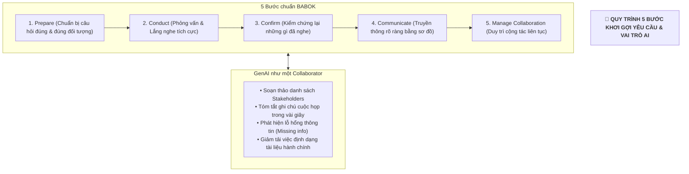

# Podcast Recap: Requirements Management & Generative AI Applications

## 1. Tổng quan & Bản chất của Quản trị Yêu cầu
- **Tầm quan trọng sống còn:** Yêu cầu (Requirements) là yếu tố quyết định thành bại (*make or break*) của toàn bộ dự án. Nếu không làm rõ ngay từ đầu, kế hoạch dù hoàn hảo đến đâu cũng sẽ đổ vỡ.
- **Bản chất thực sự:** Hiểu sâu sắc **người dùng thực sự cần gì** (*what people actually need*) chứ không chỉ dừng lại ở **những gì họ nói họ muốn** (*what they say they want*).
- **Không phải là Checklist:** Đây là quá trình giao tiếp, làm rõ và tạo sự đồng thuận tuyệt đối giữa các bên trước khi bắt tay vào lập trình/xây dựng.

---

## 2. Quy trình 5 Bước Khơi gợi Yêu cầu chuẩn & Elicitation Cheat Sheet

- **Elicitation Cheat Sheet:** Công cụ thực chiến giúp BA/PM lên kế hoạch phỏng vấn, ghi chú khoa học và nhắc nhở việc **xác nhận (Confirm)** thông tin trước khi chuyển giao.

---

## 3. Vai trò của Generative AI: Người Cộng tác (Collaborator) thay vì Người Thay thế (Replacement)

| Khía cạnh | Khả năng của GenAI | Yếu tố Bắt buộc của Con người (Human Oversight) |
| :--- | :--- | :--- |
| **Soạn thảo & Cấu trúc** | Tự động lập danh sách stakeholder, tóm tắt transcript, phân loại yêu cầu, sinh bảng rủi ro. | Phán đoán bối cảnh thực tế (*contextual judgment*), xác minh tính khả thi kỹ thuật. |
| **Phát hiện Thiếu sót** | Tìm các điểm mâu thuẫn giữa các bên, nhận diện lỗ hổng thông tin nhanh chóng. | Ra quyết định chiến lược, cân bằng lợi ích các bên và giải quyết xung đột. |
| **Quản trị & Bảo mật (Governance)** | Xử lý dữ liệu định lượng, chuyển đổi định dạng tài liệu. | **Không thể thương lượng (Non-negotiable):** Đảm bảo an toàn dữ liệu nhạy cảm, bảo vệ quyền riêng tư và phát hiện thiên vị (Bias). |

---

## 4. Ba Thông điệp Đúc kết Cốt lõi (Key Takeaways)

> 💡 **1. AI Amplifies, Doesn't Replace:**  
> GenAI không lấy đi công việc của PM/BA mà là đòn bẩy khuếch đại năng lực quản trị.
> 
> 💡 **2. Shift from Formatting to Leading:**  
> Giảm thiểu thời gian gõ phím, định dạng văn bản để dành thời gian cho việc quan trọng nhất: **Lãnh đạo, tương tác con người và giải quyết vấn đề**.
> 
> 💡 **3. Human in the Loop:**  
> Luôn giữ sự giám sát của con người để kiểm soát rủi ro bảo mật dữ liệu và thiên vị của mô hình AI.
