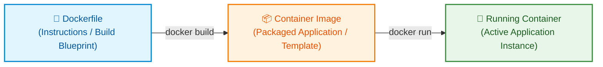

# Xây dựng và Chạy Container Images (Building and Running Container Images)

Tài liệu này tóm tắt nội dung bài học **Building and Running Container Images** trong **Module 3: Containers and Containerization** thuộc khóa học **Cloud Native, Microservices, Containers, DevOps, and Agile** do IBM cung cấp.

---

## 1. Quy trình phát triển Container (Container Lifecycle Workflow)

Quy trình từ mã nguồn đến một container đang chạy bao gồm 3 bước tuần tự cơ bản:



1. **Tạo Dockerfile**: Viết file kịch bản khai báo môi trường và chỉ thị đóng gói.
2. **Build Container Image**: Sử dụng Dockerfile để đóng gói thành một Image hoàn chỉnh.
3. **Run Container**: Sử dụng Container Image để tạo và chạy các phiên bản Container độc lập.

---

## 2. Cấu trúc cơ bản của một Dockerfile (Sample Dockerfile)

Dockerfile là một tệp văn bản chứa các chỉ thị từng bước để xây dựng nên Image.

Ví dụ cơ bản:
```dockerfile
# 1. Khai báo base image nền tảng
FROM alpine:latest

# 2. Định nghĩa câu lệnh thực thi mặc định khi khởi chạy container
CMD ["echo", "hello world"]
```

* **`FROM`**: Chỉ định base image gốc để kế thừa (hệ điều hành tối giản, runtime ngôn ngữ,...).
* **`CMD`**: Khai báo lệnh thực thi mặc định khi container được khởi chạy.

---

## 3. Các bước thực thi & Lệnh Docker CLI cốt lõi

### Bước 1: Xây dựng Image (`docker build`)
Để build một image từ Dockerfile trong thư mục hiện tại:
```bash
docker build -t my-app:v1 .
```
* **`build`**: Lệnh yêu cầu Docker Engine bắt đầu tiến trình build.
* **`-t` (Tag)**: Gắn tên định danh cho Image bao gồm:
  * **Repository / Image Name**: `my-app`
  * **Version / Tag**: `v1`
* **`.` (Current Directory / Build Context)**: Chỉ định ngữ cảnh gửi tới Docker Daemon (thư mục hiện tại chứa Dockerfile và source code).

**Thông báo đầu ra điển hình khi build:**
* `Sending build context to Docker daemon ...`
* `Step 1/2 : FROM ...`
* `Step 2/2 : CMD ...`
* `Successfully built <image_id>`: Xác nhận image đã được build thành công với ID tương ứng.
* `Successfully tagged my-app:v1`: Xác nhận đã gắn tag thành công.

---

### Bước 2: Kiểm tra danh sách Image (`docker images`)
Để xem các Docker Image đang lưu trữ trên máy local:
```bash
docker images
```
* **Output hiển thị:**
  * `REPOSITORY`: Tên ứng dụng/kho lưu trữ (`my-app`).
  * `TAG`: Phiên bản image (`v1`).
  * `IMAGE ID`: Mã băm duy nhất đại diện cho image.
  * `CREATED`: Thời điểm khởi tạo image.
  * `SIZE`: Dung lượng của image.

---

### Bước 3: Khởi chạy Container (`docker run`)
Tạo và thực thi container từ image đã build:
```bash
docker run my-app:v1
```
* Khi chạy, container sẽ thực thi lệnh được định nghĩa trong chỉ thị `CMD` và in ra kết quả trên màn hình:
  ```text
  hello world
  ```

---

### Bước 4: Kiểm tra trạng thái Container (`docker ps -a`)
Hiển thị danh sách và chi tiết các container:
```bash
docker ps -a
```
* Tham số `-a` (*all*): Hiển thị toàn bộ container (bao gồm cả container đang chạy và container đã kết thúc/dừng).

---

### Bước 5: Chia sẻ & Phân phối Image (`docker push` / `docker pull`)

* **`docker push`**: Đẩy (upload) một image đã build lên **Container Registry** (ví dụ: *Docker Hub, IBM Cloud Container Registry, AWS ECR, GCP GCR*).
  ```bash
  docker push <registry_url>/my-app:v1
  ```
* **`docker pull`**: Tải (download) một image có sẵn từ **Container Registry** về môi trường cục bộ để sử dụng.
  ```bash
  docker pull <registry_url>/my-app:v1
  ```

---

## 4. Bảng tổng hợp các lệnh Docker quan trọng (Docker Commands Cheat Sheet)

| Lệnh Docker | Mục đích sử dụng |
| :--- | :--- |
| `docker build -t <name>:<tag> <context>` | Đóng gói tạo Container Image từ một Dockerfile |
| `docker images` | Liệt kê toàn bộ các images, repository, tag, ID và dung lượng trên máy |
| `docker run <name>:<tag>` | Khởi tạo và chạy một container từ Image tương ứng |
| `docker ps -a` | Xem danh sách và trạng thái chi tiết của tất cả container (running & exited) |
| `docker push <image>` | Đẩy image lên kho lưu trữ cấu hình sẵn (*Configured Registry*) |
| `docker pull <image>` | Kéo image từ kho lưu trữ cấu hình sẵn về máy local |

---

## 5. Tổng kết ghi nhớ nhanh (Key Takeaways)

1. **Dockerfile** $\rightarrow$ **Image** $\rightarrow$ **Container**: Dockerfile chứa chỉ thị đóng gói, Image là khuôn mẫu bất biến, Container là phiên bản thực thi đang chạy.
2. Dùng lệnh **`docker build`** kết hợp với Dockerfile để tạo Container Image.
3. Dùng lệnh **`docker run`** kết hợp với Image name/tag để khởi tạo và chạy Container.
4. Quản lý và phân phối Image trên Registry thông qua cặp lệnh **`docker push`** và **`docker pull`**.
