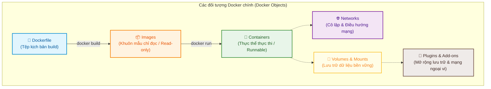
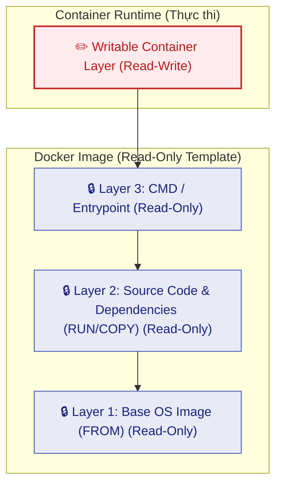

# Đối tượng trong Docker (Docker Objects)

Tài liệu này tóm tắt nội dung bài học **Docker Objects** trong **Module 3: Containers and Containerization** thuộc khóa học **Cloud Native, Microservices, Containers, DevOps, and Agile** do IBM cung cấp.

---

## 1. Tổng quan về các đối tượng Docker (Docker Objects Overview)

Hệ sinh thái Docker được cấu thành từ nhiều đối tượng cốt lõi quản lý từ mã nguồn, khuôn mẫu, tiến trình thực thi đến tài nguyên mạng và lưu trữ:



---

## 2. Dockerfile & Các chỉ thị cốt lõi (Essential Instructions)

**Dockerfile** là một tệp văn bản thuần chứa các chỉ thị từng bước để tự động hóa quá trình đóng gói Image.

### Ba chỉ thị bắt buộc và phổ biến nhất:
1. **`FROM`**:
   * Chỉ thị **bắt buộc phải đứng đầu** trong mọi Dockerfile.
   * Khai báo base image nền tảng (ví dụ: hệ điều hành như `ubuntu`, `alpine` hoặc môi trường ngôn ngữ như `golang`, `node`).
2. **`RUN`**:
   * Thực thi các lệnh shell trong quá trình build để cài đặt thư viện, cấu hình hệ thống hoặc biên dịch mã nguồn.
   * Mỗi lệnh `RUN` tạo ra một layer chỉ đọc mới.
3. **`CMD`**:
   * Định nghĩa câu lệnh mặc định sẽ chạy khi container được khởi động.
   * **Lưu ý quan trọng**: Trong một Dockerfile **chỉ nên có duy nhất 1 chỉ thị `CMD`**. Nếu khai báo nhiều `CMD`, **chỉ có `CMD` cuối cùng được áp dụng**.

---

## 3. Docker Images & Kiến trúc phân lớp (Layered Architecture)

**Docker Image** là một khuôn mẫu chỉ đọc (*read-only template*) bất biến chứa ứng dụng và toàn bộ môi trường phụ thuộc.



### Cơ chế phân lớp (Layering) & Tối ưu hóa:
* Mỗi chỉ thị trong Dockerfile sẽ sinh ra một **Layer** tương ứng.
* **Cơ chế Caching & Tái sử dụng**: Khi Dockerfile thay đổi và build lại, Docker Engine **chỉ build lại các layer bị thay đổi**.
* Các Image khác nhau có thể **chia sẻ chung các Layer** cơ sở $\rightarrow$ Giúp tiết kiệm tối đa dung lượng ổ cứng (*disk space*) và băng thông mạng (*network bandwidth*) khi tải/đẩy image.
* **Writable Layer (Lớp ghi)**: Khi khởi chạy container, một lớp mỏng cho phép đọc-ghi (*read-write*) được đặt lên trên cùng của các layer chỉ đọc. Nhờ đó container có thể sửa đổi dữ liệu khi chạy mà không làm biến đổi image gốc.

---

## 4. Quy chuẩn đặt tên Image (Container Image Naming Convention)

Tên định danh đầy đủ của một Docker Image bao gồm **3 thành phần chính**:

$$\mathbf{\text{<hostname>}} \mathbf{/} \mathbf{\text{<repository>}} \mathbf{:} \mathbf{\text{<tag>}}$$

Ví dụ cụ thể: `docker.io/ubuntu:18.04`

```
 docker.io    /    ubuntu    :    18.04
└──────────┘      └─────────┘    └───────┘
  Hostname        Repository        Tag
 (Registry)        (App/OS)      (Version)
```

| Thành phần | Ý nghĩa | Ví dụ |
| :--- | :--- | :--- |
| **Hostname** | Địa chỉ máy chủ lưu trữ Image Registry | `docker.io` (Docker Hub), `icr.io` (IBM Cloud Registry). Khi dùng Docker CLI, nếu không ghi thì mặc định hiểu là `docker.io`. |
| **Repository** | Tên kho / nhóm image liên quan | `ubuntu`, `nginx`, `my-app` |
| **Tag** | Phiên bản cụ thể hoặc biến thể của image | `18.04`, `latest`, `v1.2` |

---

## 5. Docker Containers (Thực thể thực thi)

* **Khái niệm**: Là một thực thể thực thi (*runnable instance*) được tạo ra từ Docker Image.
* **Quản trị vòng đời**: Sử dụng **Docker CLI** hoặc **Docker API** để:
  * Khởi tạo (`create`), chạy (`start`), dừng (`stop`), xóa (`rm`).
* **Tính năng**:
  * Có thể kết nối vào nhiều mạng khác nhau.
  * Gắn kết các ổ lưu trữ dữ liệu ngoài.
  * Tạo một image mới dựa trên trạng thái hiện thời của container (`docker commit`).
  * Duy trì mức độ cô lập bảo mật cao giữa các container với nhau và với máy chủ host.

---

## 6. Mạng, Lưu trữ & Plugin (Networks, Storage & Plugins)

### 1. Docker Networks (Mạng)
* Đảm bảo cách ly và định tuyến liên lạc an toàn giữa các container.
* Cho phép các container trong cùng mạng có thể phân giải tên miền (*DNS resolution*) và giao tiếp với nhau mà không làm lộ cổng ra ngoài máy host.

### 2. Storage & Quản lý dữ liệu bền vững (Persistence)
* **Vấn đề**: Mặc định, dữ liệu nằm trên Writable Layer của container là tạm thời (*ephemeral*), sẽ bị mất hoàn toàn khi container bị xóa.
* **Giải pháp**: Docker sử dụng **Volumes** và **Bind Mounts**:
  * **Volumes**: Không gian lưu trữ do Docker quản lý trên host, an toàn và dễ backup.
  * **Bind Mounts**: Gắn trực tiếp thư mục/file cụ thể từ host vào container.
  * Dữ liệu được lưu trữ độc lập với vòng đời container, không bị mất khi container dừng hoặc xóa.

### 3. Plugins & Add-ons
* Mở rộng tính năng cho Docker Engine.
* Ví dụ: **Storage Plugins** giúp Docker kết nối trực tiếp với các hệ thống lưu trữ phân tán, SAN, NAS hoặc Cloud Object Storage của bên thứ ba.

---

## 7. Tổng kết ghi nhớ nhanh (Key Takeaways)

1. **Bộ đối tượng cốt lõi**: Dockerfile, Images, Containers, Networks, Volumes, Plugins.
2. **Dockerfile**: `FROM` (chỉ định base image, bắt buộc ở đầu), `RUN` (chạy lệnh tạo layer build), `CMD` (lệnh mặc định khi chạy, chỉ `CMD` cuối cùng có hiệu lực).
3. **Image Layers**: Image là *read-only* gồm nhiều layer chia sẻ được; Container thêm một *writable layer* lên trên cùng.
4. **Cấu trúc tên Image**: `hostname/repository:tag` (Registry / Tên kho / Phiên bản).
5. **Dữ liệu bền vững**: Sử dụng **Volumes** hoặc **Bind Mounts** để chống mất dữ liệu khi container bị hủy.
