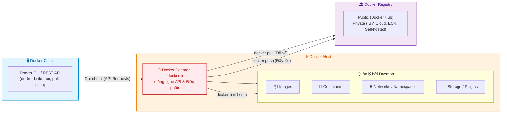
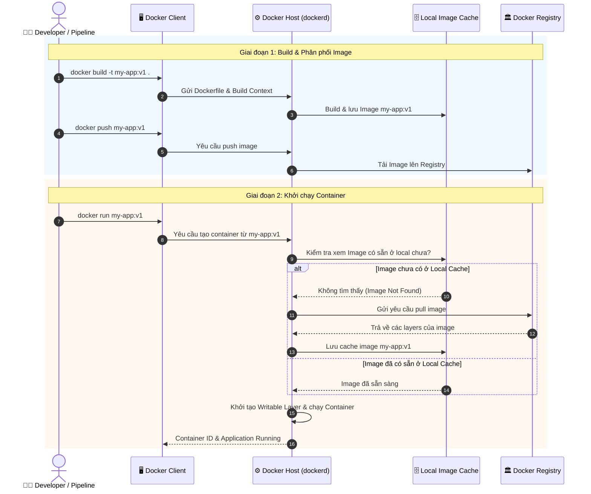

# Kiến trúc Docker (Docker Architecture)

Tài liệu này tóm tắt nội dung bài học **Docker Architecture** trong **Module 3: Containers and Containerization** thuộc khóa học **Cloud Native, Microservices, Containers, DevOps, and Agile** do IBM cung cấp.

---

## 1. Tổng quan Kiến trúc Client - Server của Docker

Docker hoạt động theo mô hình **Client - Server (Khách - Chủ)** hoàn chỉnh, bao gồm 3 khối thành phần cốt lõi:

---

## 2. Chi tiết 3 Thành phần Kiến trúc Cốt lõi

### 1. Docker Client
* **Vai trò**: Là điểm giao tiếp trực tiếp giữa lập trình viên/quản trị viên với hệ thống Docker.
* **Giao thức**: Sử dụng **Docker CLI** hoặc **REST APIs** để gửi các yêu cầu chỉ thị đến Docker Host.
* **Mô hình kết nối**:
  * Client có thể chạy trên cùng một máy với Docker Host (*Local*).
  * Client có thể kết nối điều khiển Docker Daemon từ xa (*Remote Docker Daemon* qua mạng).

### 2. Docker Host
* **Thành phần trung tâm - `dockerd` (Docker Daemon)**:
  * Là tiến trình chạy ngầm (*background process*) liên tục lắng nghe các yêu cầu Docker API.
  * Thực hiện toàn bộ các tác vụ xử lý nặng (*heavy lifting*): xây dựng (*build*), khởi chạy (*run*), và phân phối (*distribute*) containers.
* **Quản trị tài nguyên nội bộ**:
  * Trực tiếp quản lý các đối tượng: **Images**, **Containers**, **Namespaces**, **Networks**, **Storage**, **Plugins** và **Add-ons**.
  * Các Docker Daemon có thể giao tiếp với nhau để quản lý các cụm dịch vụ Docker (Docker Swarm/Services).

### 3. Docker Registry (Kho lưu trữ Image)
* **Vai trò**: Là nơi tập trung để lưu trữ, quản lý phiên bản và phân phối các Container Images.
* **Phân loại**:
  * **Public Registry**: Nổi tiếng nhất là **Docker Hub** (mặc định), mở cho toàn bộ cộng đồng chia sẻ.
  * **Private Registry**: Dành riêng cho doanh nghiệp cần bảo mật tuyệt đối mã nguồn nội bộ.
* **Hình thức lưu trữ/triển khai**:
  * Dịch vụ Cloud được quản lý bởi bên thứ ba (ví dụ: *IBM Cloud Container Registry, AWS ECR, Google Artifact Registry, Azure ACR*).
  * *Self-hosted*: Doanh nghiệp tự cài đặt và vận hành trong Private Data Center hoặc On-Premises.

---

## 3. Quy trình Container hóa chi tiết (Containerization Workflow)

Quá trình từ khi lập trình đến khi container khởi chạy diễn ra theo các bước logic sau:

### Các bước thực hiện:
1. **Build Image**: Sử dụng base image hoặc `Dockerfile`, chạy lệnh `docker build` để tạo Container Image.
2. **Push lên Registry**: Dùng lệnh `docker push` (thường thông qua CI/CD Build Pipeline tự động) để lưu trữ image lên Registry.
3. **Chạy Container (`docker run`)**:
   * Docker Host kiểm tra trước trong **Local Cache**:
     * Nếu **đã có sẵn** $\rightarrow$ Daemon tiến hành khởi chạy container ngay lập tức.
     * Nếu **chưa có** $\rightarrow$ Docker Daemon tự động kết nối đến Registry, thực hiện **`pull`** Image về máy host, sau đó mới khởi chạy Container.

---

## 4. Bảng tóm tắt chức năng các thành phần

| Thành phần | Đại diện | Chức năng chính |
| :--- | :--- | :--- |
| **Docker Client** | `docker` CLI / REST API | Nhận lệnh từ người dùng và gửi request đến Daemon. |
| **Docker Host** | Server / VM chứa `dockerd` | Lắng nghe request, thực hiện build/run/quản lý images, containers, networks, storage. |
| **Docker Daemon** | `dockerd` | "Trái tim" của host, đảm nhiệm toàn bộ tác vụ tính toán nặng và quản lý vòng đời container. |
| **Docker Registry** | Docker Hub, IBM Cloud CR,... | Lưu trữ, bảo mật và phân phối các images giữa các môi trường Dev, Staging, Prod. |

---

## 5. Tổng kết ghi nhớ nhanh (Key Takeaways)

1. Docker vận hành theo kiến trúc **Client - Server**: gồm **Client**, **Host (Daemon `dockerd`)**, và **Registry**.
2. **Docker Daemon (`dockerd`)** là trung tâm thực thi tất cả các tác vụ nặng: build, run, pull, push và quản lý tài nguyên.
3. Client và Host có thể nằm **chung một máy** hoặc **kết nối từ xa qua mạng**.
4. Khi chạy `docker run`, nếu image chưa có ở máy host, Docker Daemon sẽ **tự động pull từ Registry** về trước khi chạy container.
