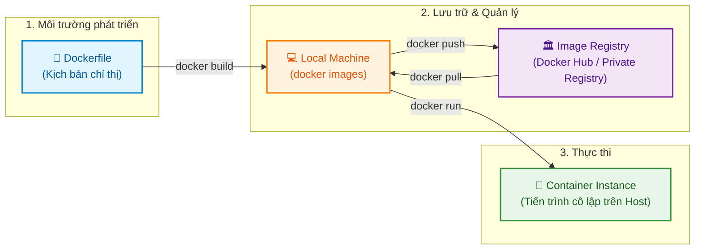

# Ôn tập Khái niệm Docker & Phân tích Chi tiết Dockerfile (Review of Docker Concepts and Understanding a Dockerfile)

Tài liệu này tóm tắt nội dung bài đọc **Review of Docker Concepts and Understanding a Dockerfile** trong **Module 3: Containers and Containerization** thuộc khóa học **Cloud Native, Microservices, Containers, DevOps, and Agile** do IBM cung cấp.

---

## 1. Ôn tập các khái niệm Docker cốt lõi (Docker Concepts Overview)

Docker đơn giản hóa toàn bộ quá trình đóng gói, triển khai và quản lý ứng dụng thông qua kiến trúc Container chuẩn hóa.



* **Dockerfile**: Tệp văn bản chứa toàn bộ hướng dẫn xây dựng một Docker Image (khai báo base image, thư mục làm việc, sao chép code, mở port, cấu hình lệnh chạy và kiểm tra sức khỏe).
* **Container**: Một thực thể (*instance*) đang chạy của Docker Image dưới dạng tiến trình độc lập, siêu nhẹ và cô lập trên máy chủ host.
* **Nơi lưu trữ Docker Images (Storage Locations)**:
  * **Local Machine**: Lưu trữ cục bộ trên máy sau khi build (tra cứu bằng lệnh `docker images`).
  * **Registry**: Kho lưu trữ tập trung trên mạng (Public như Docker Hub hoặc Private của doanh nghiệp) giúp truy cập và triển khai từ bất kỳ đâu.

---

## 2. Phân tích chi tiết một Dockerfile mẫu (Java Web Application)

Dưới đây là một Dockerfile hoàn chỉnh chuẩn sản xuất cho ứng dụng Java Web Spring Boot / OpenJDK 21:

```dockerfile
# 1. Khai báo base image chính thức OpenJDK 21 (bản rút gọn slim)
FROM openjdk:21-jdk-slim

# 2. Thiết lập thư mục làm việc bên trong container
WORKDIR /app

# 3. Gắn metadata thông tin tác giả, phiên bản và mô tả
LABEL maintainer="Your Name <your.email@example.com>"
LABEL version="1.0"
LABEL description="A Java web application running in Docker"

# 4. Sao chép tệp JAR đã biên dịch từ máy host vào container
COPY target/myapp.jar /app/myapp.jar

# 5. Khai báo cổng mạng container sẽ lắng nghe
EXPOSE 8080

# 6. Định nghĩa câu lệnh thực thi mặc định khi khởi động container
CMD ["java", "-jar", "/app/myapp.jar"]

# 7. Cấu hình kiểm tra sức khỏe ứng dụng định kỳ (Healthcheck)
HEALTHCHECK --interval=30s --timeout=10s --start-period=10s --retries=3 \
  CMD curl --fail http://localhost:8080/health || exit 1
```

---

## 3. Giải thích chuyên sâu từng chỉ thị (Step-by-Step Directives)

| STT | Chỉ thị (Instruction) | Giải thích chức năng & Ý nghĩa thực tế |
| :---: | :--- | :--- |
| **1** | **`FROM openjdk:21-jdk-slim`** | **Base Image**: Chỉ định image gốc chứa môi trường chạy Java 21. Hậu tố `-slim` giúp loại bỏ các gói không cần thiết, tối ưu hóa kích thước image. |
| **2** | **`WORKDIR /app`** | **Working Directory**: Thiết lập thư mục làm việc hiện hành bên trong container. Mọi lệnh `COPY`, `RUN`, `CMD` tiếp theo sẽ được thực thi tại thư mục `/app` này. Nếu thư mục chưa tồn tại, Docker sẽ tự tạo. |
| **3** | **`LABEL ...`** | **Metadata**: Gắn nhãn thông tin tác giả (`maintainer`), phiên bản (`version`), và mô tả (`description`) phục vụ việc tra cứu và quản lý. |
| **4** | **`COPY target/myapp.jar /app/myapp.jar`** | **Copy mã nguồn/File thực thi**: Sao chép file `.jar` đã build sẵn từ thư mục máy host (`target/`) vào đường dẫn `/app/myapp.jar` bên trong container. |
| **5** | **`EXPOSE 8080`** | **Khai báo cổng (Port Exposure)**: Tài liệu hóa rằng ứng dụng bên trong container sẽ lắng nghe ở cổng `8080` (lưu ý: chỉ mang tính khai báo, cần dùng cờ `-p` khi `docker run` để map cổng ra ngoài host). |
| **6** | **`CMD ["java", "-jar", "/app/myapp.jar"]`** | **Lệnh khởi chạy (Default Command)**: Sử dụng cú pháp mảng JSON (*Exec form*) để thực thi máy ảo Java chạy ứng dụng web. |
| **7** | **`HEALTHCHECK`** | **Kiểm tra trạng thái sức khỏe (Health Monitoring)**: Kiểm tra định kỳ xem ứng dụng có đang phản hồi tốt tại endpoint `/health` hay không. |

### Chi tiết các tham số trong `HEALTHCHECK`:
* **`--interval=30s`**: Thực hiện kiểm tra định kỳ mỗi 30 giây một lần.
* **`--timeout=10s`**: Hết 10 giây nếu endpoint không phản hồi thì tính là một lần thất bại.
* **`--start-period=10s`**: Thời gian chờ 10 giây khi container mới bật để ứng dụng kịp khởi động trước khi bắt đầu kiểm tra sức khỏe.
* **`--retries=3`**: Thử lại tối đa 3 lần liên tiếp. Nếu cả 3 lần đều fail, Docker sẽ chuyển trạng thái container sang **`unhealthy`**.
* **`CMD curl --fail http://localhost:8080/health || exit 1`**: Lệnh shell dùng `curl` kiểm tra mã phản hồi HTTP; nếu không thành công sẽ trả về exit code `1`.

---

## 4. Các lệnh CLI thao tác thực tế (Practical CLI Commands)

### 1. Build Docker Image
```bash
docker build -t my-java-app .
```
* Đóng gói mã nguồn và Dockerfile trong thư mục hiện tại (`.`) thành image có tên `my-java-app`.

### 2. Khởi chạy Container kèm ánh xạ cổng (Port Mapping)
```bash
docker run -d -p 8080:8080 --name java-container my-java-app
```
* **`-p 8080:8080`**: Ánh xạ cổng `8080` của máy host vào cổng `8080` của container (`<host_port>:<container_port>`).
* **`-d`**: Chạy ngầm dưới nền (*detached mode*).

### 3. Kiểm tra trạng thái sức khỏe Container (Health Filter)
```bash
docker ps --filter "health=unhealthy"
```
* Lọc và liệt kê danh sách các container đang ở trạng thái không khỏe mạnh (*unhealthy*) để quản trị viên kịp thời khắc phục sự cố.

---

## 5. Tổng kết ghi nhớ nhanh (Key Takeaways)

1. **Vòng lặp chuẩn**: Viết Dockerfile $\rightarrow$ `docker build` (lưu local) $\rightarrow$ `docker push` (lên Registry) $\rightarrow$ `docker run` (tạo Container).
2. Các chỉ thị cốt lõi: `FROM` (nền tảng), `WORKDIR` (thư mục làm việc), `COPY` (chuyển tệp), `EXPOSE` (khai báo cổng), `CMD` (lệnh khởi chạy).
3. **`HEALTHCHECK`** là cơ chế quan trọng trong môi trường sản xuất để Docker/Kubernetes tự động giám sát tính khả dụng của ứng dụng.
4. Quản trị và debug sức khỏe bằng cờ lọc `--filter "health=unhealthy"`.
