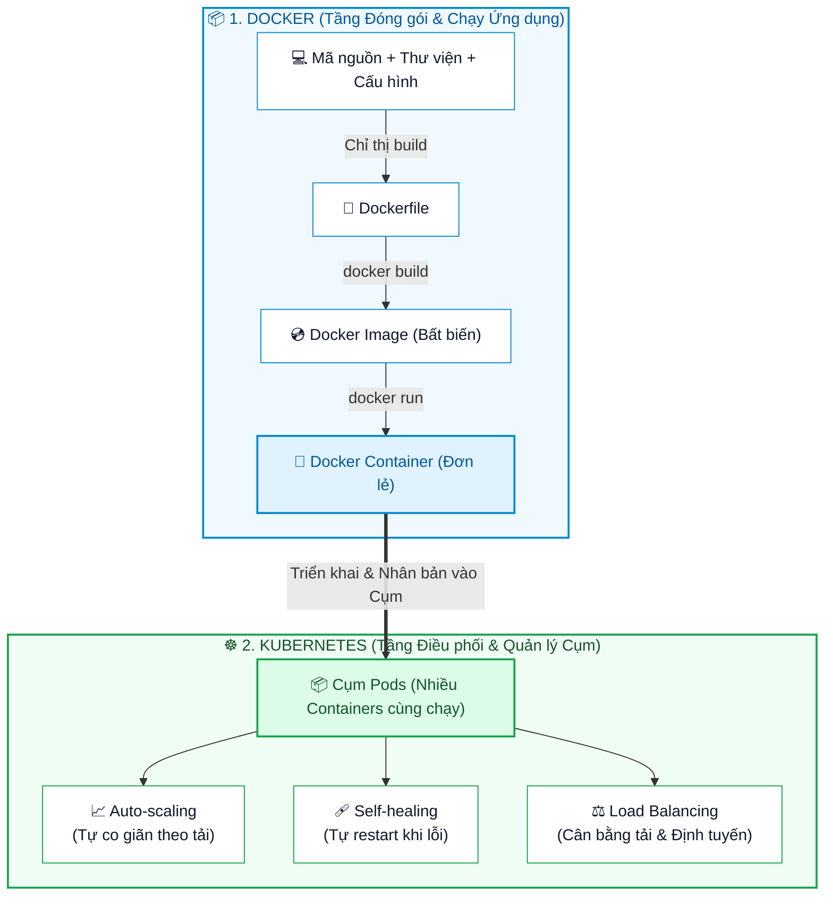
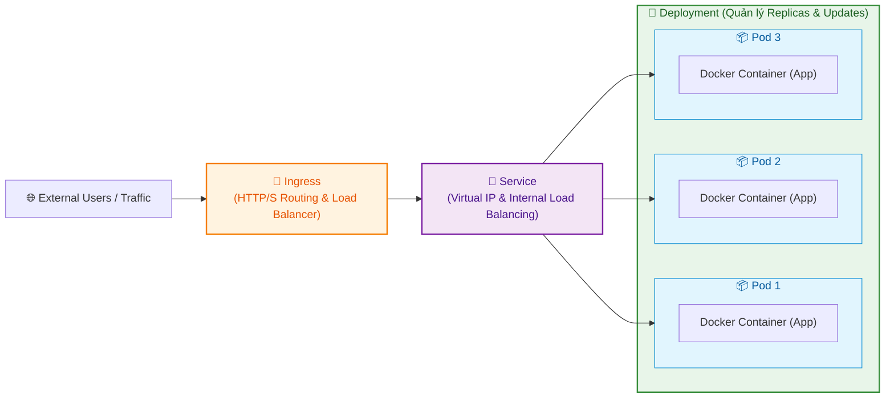

# Docker và Kubernetes (Kubernetes and Docker)

Tài liệu này tóm tắt nội dung bài đọc **Kubernetes and Docker** trong **Module 3: Containers and Containerization** thuộc khóa học **Cloud Native, Microservices, Containers, DevOps, and Agile** do IBM cung cấp.

---

## 1. Mối quan hệ giữa Docker và Kubernetes (Overview & Analogy)

Trong kỷ nguyên ứng dụng đám mây (*Cloud-Native*) và kiến trúc Vi dịch vụ (*Microservices*):
* **Docker** chịu trách nhiệm **đóng gói và chạy ứng dụng** trong môi trường nhất quán.
* **Kubernetes (K8s)** chịu trách nhiệm **điều phối, quản lý và mở rộng quy mô** của hàng loạt container trên cụm máy chủ (*Cluster*).

### Phép loại suy thực tế (Analogy)
* **Docker như chiếc Container chở hàng**: Chứa mọi thứ mà ứng dụng cần (ví dụ: mã nguồn Java Spring Boot, JDK, thư viện, file cấu hình) để đảm bảo ứng dụng chạy đồng nhất trên mọi máy (Dev, Test, Staging, Production), loại bỏ triệt để vấn đề *"Chạy được trên máy tôi nhưng lỗi trên server"*.
* **Kubernetes như Người điều khiển giao thông & Cảng biển**: Khi hệ thống có hàng trăm container hoạt động, việc vận hành thủ công là bất khả thi. Kubernetes tự động hóa:
  * **Tự phục hồi (*Self-healing*)**: Tự khởi động lại khi một container bị crash.
  * **Tự động co giãn (*Auto-scaling*)**: Tự tạo thêm container khi lưu lượng truy cập tăng đột biến (*Scale Up*) và thu hồi khi lưu lượng giảm (*Scale Down*).

---

## 2. Các thành phần cốt lõi của Docker (Key Docker Components)

| Thành phần | Vai trò & Ý nghĩa |
| :--- | :--- |
| **Dockerfile** | Tệp kịch bản văn bản mô tả từng bước xây dựng Image. |
| **Docker Images** | Bản chụp (*Snapshot*) chỉ đọc chứa mã nguồn ứng dụng và toàn bộ thư viện phụ thuộc. |
| **Docker Containers** | Thực thể thực thi (*Running instance*) được sinh ra từ Docker Image. |
| **Docker Compose** | Công cụ định nghĩa và chạy **đa container cùng lúc** trên một máy host (ví dụ: chạy một app Java cùng một CSDL PostgreSQL). |

---

## 3. Các khái niệm cốt lõi của Kubernetes (Key Kubernetes Concepts)

Kubernetes tổ chức và trừu tượng hóa các container thông qua các đối tượng chính sau:

| Khái niệm | Mô tả chi tiết |
| :--- | :--- |
| **Pods** | Đơn vị nhỏ nhất có thể triển khai trong Kubernetes, chứa một hoặc nhiều container cùng chia sẻ tài nguyên mạng (IP) và bộ nhớ. |
| **Deployments** | Đối tượng khai báo trạng thái mong muốn (*Desired State*), xác định số lượng bản sao (*Replicas*) container cần chạy và quản lý cập nhật phiên bản không gián đoạn (*Zero-downtime Rolling Updates*). |
| **Services** | Điểm đầu mối mạng cung cấp IP nội bộ cố định và cân bằng tải (*Internal Load Balancer*) để expose các Pods tới người dùng hoặc các service khác. |
| **Ingress** | Cổng quản lý lưu lượng truy cập từ bên ngoài Internet vào cụm K8s, đóng vai trò như bộ cân bằng tải HTTP/HTTPS (Reverse Proxy, SSL termination, URL routing). |

---

## 4. So sánh nhanh Docker vs. Kubernetes

| Tiêu chí | Docker | Kubernetes (K8s) |
| :--- | :--- | :--- |
| **Mục đích chính** | Đóng gói ứng dụng (*Packaging & Containerization*) | Điều phối container (*Container Orchestration*) |
| **Phạm vi hoạt động** | Từng container đơn lẻ hoặc cụm nhỏ trên 1 máy host (Docker Compose) | Cụm máy chủ phân tán quy mô lớn (*Distributed Cluster*) |
| **Khả năng tự phục hồi** | Khởi tạo lại thủ công hoặc cơ bản qua restart policy | Tự động giám sát, phát hiện lỗi và restart/reschedule linh hoạt |
| **Mở rộng quy mô (Scaling)** | Mở rộng thủ công | Tự động co giãn theo tải CPU/RAM/Request (HPA/VPA) |
| **Cân bằng tải & Mạng** | Port mapping cơ bản | Quản lý mạng phức tạp, Service Discovery, Ingress Controller |

---

## 5. Tổng kết ghi nhớ nhanh (Key Takeaways)

1. **Docker** giúp tạo ra môi trường chạy nhất quán, giải quyết bài toán đóng gói và tính di động của phần mềm.
2. **Kubernetes** giải quyết bài toán vận hành, tự động hóa cân bằng tải, tự phục hồi và co giãn cho các hệ thống vi dịch vụ lớn gồm hàng trăm container.
3. Khi kết hợp với nhau, **Docker + Kubernetes** tạo nên nền tảng vững chắc và tiêu chuẩn công nghiệp cho các ứng dụng **Cloud-Native**.
