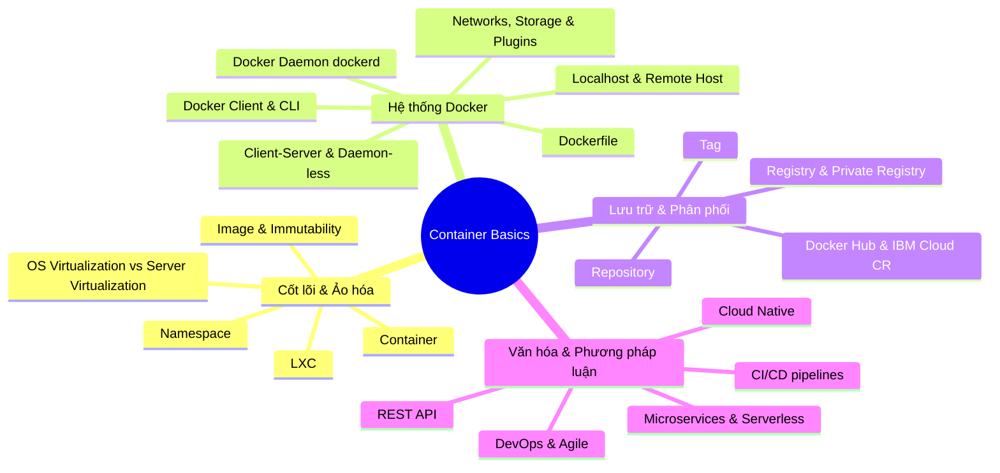

# Thuật ngữ Cốt lõi về Container (Glossary: Container Basics)

Tài liệu này tổng hợp và giải thích chi tiết các thuật ngữ nền tảng trong bài đọc **Glossary: Container Basics** thuộc **Module 3: Containers and Containerization** của khóa học **Cloud Native, Microservices, Containers, DevOps, and Agile** (IBM).

---

## 1. Bảng tra cứu thuật ngữ đầy đủ (Alphabetical Glossary Table)

| Thuật ngữ (Term) | Định nghĩa gốc (Definition) | Giải thích nghĩa tiếng Việt |
| :--- | :--- | :--- |
| **Agile** | An iterative approach to project management and software development that helps teams deliver value to customers faster with fewer issues. | Phương pháp phát triển phần mềm lặp (*iterative*), chia nhỏ chu kỳ phát triển để chuyển giao giá trị nhanh chóng và linh hoạt thích ứng với thay đổi. |
| **Client-server architecture** | A distributed application structure that partitions tasks between resource providers (servers) and service requesters (clients). | Kiến trúc phân tán phân chia khối lượng công việc giữa bên yêu cầu dịch vụ (*Client*) và bên cung cấp/xử lý dịch vụ (*Server*). |
| **Container** | A standard unit of software that encapsulates application code, runtime, system tools, libraries, and settings to build, ship, and run apps. | Đơn vị phần mềm chuẩn hóa đóng gói trọn gói mã nguồn, runtime, công cụ hệ thống, thư viện và cấu hình để chạy độc lập và nhất quán ở mọi nơi. |
| **Container Registry** | A service used for storing and distributing named container images. | Kho dịch vụ lưu trữ, quản lý phiên bản và phân phối các Container Images (như Docker Hub, IBM Cloud CR). |
| **CI/CD pipelines** | A series of automated steps performed to deliver a new software version throughout the SDLC. | Quy trình Tích hợp liên tục & Triển khai liên tục (CI/CD) tự động hóa các bước build, test và deploy phần mềm. |
| **Cloud Native** | Applications designed specifically for cloud computing architectures to leverage cloud delivery characteristics. | Tư duy và kiến trúc phát triển ứng dụng tối ưu riêng cho môi trường điện toán đám mây (khả năng co giãn, tự phục hồi, microservices). |
| **Daemon-less** | A container runtime that does not rely on a long-running background daemon process to create/manage container objects. | Cơ chế runtime container (như Podman, crun) không cần tiến trình daemon chạy ngầm liên tục để quản lý tài nguyên. |
| **DevOps** | A set of practices, tools, and cultural philosophy that automates and integrates processes between software development and IT teams. | Sự kết hợp giữa văn hóa, quy trình và công cụ nhằm tích hợp, tự động hóa luồng làm việc giữa đội Phát triển (Dev) và Vận hành (Ops). |
| **Docker** | An open container platform for developing, shipping, and running applications in containers. | Nền tảng mở chuẩn công nghiệp để phát triển, đóng gói và chạy ứng dụng dưới dạng Container. |
| **Dockerfile** | A text document containing instructions to build a Docker image automatically. | Tệp văn bản kịch bản chứa các chỉ thị từng bước để Docker tự động hóa quá trình đóng gói Image. |
| **Docker client** | The primary interface (CLI/API) that users interact with to send commands to the Docker daemon (`dockerd`). | Công cụ giao tiếp chính của người dùng, chuyển đổi lệnh gõ thành API request gửi tới Docker Daemon xử lý. |
| **Docker CLI** | The Command Line Interface provided by the Docker client to issue commands like `build`, `run`, `stop`. | Giao diện dòng lệnh (`docker ...`) giúp lập trình viên điều khiển và thao tác trực tiếp với Docker Engine. |
| **Docker daemon (`dockerd`)** | The background service that creates and manages Docker objects (images, containers, networks, volumes). | "Trái tim" của Docker Host, tiến trình chạy ngầm thực hiện các tác vụ nặng: build, run, quản lý tài nguyên container. |
| **Docker Hub** | A hosted public registry service for creating, finding, managing, and delivering container applications. | Kho lưu trữ Image công cộng (Public Registry) lớn nhất và phổ biến nhất thế giới do Docker quản lý. |
| **Docker localhost** | A host networking mode where a container shares the host network stack, resolving localhost to the physical host. | Chế độ mạng (`--net=host`) cho phép container chia sẻ trực tiếp stack mạng của máy host; `localhost` trong container chính là `localhost` của máy host. |
| **Docker remote host** | A machine running Docker Engine with exposed API ports accessible across the local network or internet. | Máy chủ Docker nằm từ xa, cho phép Docker Client từ máy cục bộ kết nối và gửi lệnh điều khiển qua mạng. |
| **Docker networks** | Network drivers and configurations that isolate container communications. | Hệ thống mạng ảo giúp cô lập, định tuyến và bảo vệ các luồng giao tiếp giữa các container với nhau và với bên ngoài. |
| **Docker plugins** | Modular extensions (e.g., storage plugins) that connect Docker to external platforms. | Các module bổ trợ mở rộng tính năng của Docker (ví dụ: kết nối hệ thống lưu trữ ngoài SAN/NAS, Cloud Storage). |
| **Docker storage** | Persistent data mechanisms using volumes and bind mounts that survive container termination. | Cơ chế lưu trữ dữ liệu bền vững (Volumes / Bind Mounts), giữ lại dữ liệu ngay cả khi container bị hủy. |
| **IBM Cloud Container Registry**| A fully managed private registry for storing and distributing container images securely. | Dịch vụ Registry riêng tư (Private) được IBM quản lý toàn diện, tích hợp bảo mật và quét lỗ hổng ảnh chụp container. |
| **Image** | An immutable read-only template containing source code, libraries, and dependencies needed to run an application. | Bản chụp/khuôn mẫu chỉ đọc bất biến chứa mã nguồn và môi trường để khởi tạo Container. |
| **Immutability** | The characteristic of images being read-only; changing an image results in creating a completely new image. | Tính bất biến: Image không thể bị sửa đổi trực tiếp sau khi đã build; mọi thay đổi đều tạo ra image mới. |
| **LXC (Linux Containers)** | An OS-level virtualization technology allowing multiple isolated Linux virtual environments on a single host. | Công nghệ ảo hóa cấp OS trên Linux sơ khai, tiền đề phát triển của Docker, cho phép tạo nhiều môi trường ảo cô lập. |
| **Microservices** | A cloud-native architectural approach structuring an app as a collection of loosely coupled, independently deployable services. | Kiến trúc chia nhỏ một ứng dụng lớn thành nhiều dịch vụ nhỏ, liên kết lỏng (*loosely coupled*) và triển khai độc lập. |
| **Namespace** | A Linux kernel feature that isolates and virtualizes system resources (PID, Net, Mount, User, IPC, UTS). | Tính năng nhân Linux giúp chia tách và cô lập tài nguyên hệ thống cho từng tiến trình/container. |
| **Operating System Virtualization** | An OS paradigm where the kernel allows multiple isolated user-space instances (containers/zones/jails). | Ảo hóa cấp độ Hệ điều hành: Chia sẻ chung nhân Kernel nhưng cô lập hoàn toàn không gian người dùng (*user space*). |
| **Private Registry** | A registry that restricts access to images so only authorized users can view and pull them. | Kho lưu trữ Image riêng tư nội bộ, có phân quyền truy cập chặt chẽ dành riêng cho doanh nghiệp. |
| **REST API** | An API conforming to REST architectural constraints for interacting with web services over HTTP. | Giao diện lập trình ứng dụng tuân thủ chuẩn REST, dùng HTTP request để tương tác dữ liệu dạng chuẩn (JSON). |
| **Registry** | A hosted service containing image repositories that responds to the Registry API. | Máy chủ dịch vụ lưu trữ các repository image và phục vụ các lệnh pull/push thông qua Registry API. |
| **Repository** | A collection of related Docker images, usually tagged with different version numbers. | Tập hợp các Docker Image có cùng tên/chức năng nhưng khác nhau về phiên bản nhãn tag (ví dụ: `ubuntu:20.04`, `ubuntu:22.04`). |
| **Server Virtualization** | The process of dividing a physical server into multiple isolated virtual machines (VMs), each running its own OS. | Ảo hóa cấp độ Máy chủ/Phần cứng: Dùng Hypervisor chia máy vật lý thành nhiều máy ảo (VM), mỗi VM chạy OS riêng biệt. |
| **Serverless** | A cloud development model allowing developers to build and run code without provisioning or managing servers. | Mô hình điện toán không máy chủ: Lập trình viên chỉ cần tải code/hàm lên (FaaS), hạ tầng đám mây tự động cấp phát và co giãn. |
| **Tag** | A label applied to a Docker image in a repository to distinguish variants or version numbers. | Nhãn phiên bản gắn vào image trong repository (ví dụ: `v1.0`, `latest`, `alpine`). |

---

## 2. Phân loại thuật ngữ theo nhóm chủ đề (Categorized Terminology)

### 1. Nhóm Cốt lõi & Ảo hóa (Core Virtualization)
* **OS Virtualization vs. Server Virtualization**: Ảo hóa OS (Container) dùng chung kernel nên siêu nhẹ, khởi động tức thì; trong khi Ảo hóa Server (VM) phải gánh thêm một Guest OS riêng cho mỗi máy ảo.
* **Namespace**: Công nghệ của Linux Kernel (PID, NET, IPC, MNT, UTS, USER) giúp tạo ranh giới cô lập cho mỗi Container.
* **Immutability (Tính bất biến)**: Một khi Docker Image đã build, nội dung của nó là cố định vĩnh viễn (*read-only*). Muốn đổi code hay cấu hình, bạn phải build ra Image mới.

### 2. Nhóm Kiến trúc & Thành phần Docker (Docker Architecture)
* **Docker Client $\leftrightarrow$ Docker Daemon (`dockerd`)**: Hoạt động theo mô hình Client-Server thông qua Docker REST API.
* **Daemon-less**: Xu hướng công nghệ mới (như Podman) loại bỏ daemon tập trung để tăng cường bảo mật và tránh điểm lỗi đơn lẻ (*Single Point of Failure*).
* **Storage (Volumes/Bind Mounts)**: Cung cấp giải pháp lưu trữ bền vững (*Stateful*) cho các ứng dụng cơ sở dữ liệu.

### 3. Nhóm Phân phối & Quản lý Image (Registry & Distribution)
* Cấu trúc phân cấp lưu trữ:
  $$\text{Registry (Server)} \longrightarrow \text{Repository (App Name)} \longrightarrow \text{Image Tag (Version)}$$

### 4. Nhóm Phương pháp luận Hiện đại (Methodologies)
* **Cloud Native & Microservices**: Phong cách kiến trúc phân rã hệ thống thành các module nhỏ, triển khai bằng container và tự động hóa điều phối.
* **Agile & DevOps / CI-CD**: Triết lý và chuỗi công cụ tự động hóa vòng đời phần mềm từ commit mã nguồn đến khi chạy trên production.

---

## 3. Tổng kết ghi nhớ nhanh (Key Takeaways)

1. **Container** là đơn vị đóng gói chuẩn hóa; **Image** là khuôn mẫu bất biến (*immutable blueprint*); **Dockerfile** là kịch bản tự động hóa build.
2. Bản chất kỹ thuật của Container dựa trên **Linux Namespaces** và **OS-level Virtualization**.
3. **Docker Host (`dockerd`)** xử lý toàn bộ tác vụ nặng, nhận lệnh từ **Docker Client/CLI** và giao tiếp với **Registry** để kéo/đẩy Images.
4. **Volume & Bind Mount** giải quyết bài toán mất dữ liệu của Container; **Network** đảm bảo cô lập luồng giao tiếp.
