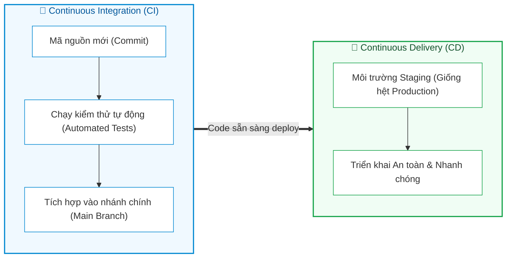

# Giới thiệu về DevOps và CI/CD (Introduction to DevOps & CI/CD)

Tài liệu này tóm tắt nội dung bài học **Introduction to DevOps & CI/CD** trong **Module 4: DevOps and CI/CD** thuộc khóa học **Cloud Native, Microservices, Containers, DevOps, and Agile** do IBM cung cấp.

---

## 1. Bối cảnh & Sự cần thiết của DevOps (Why DevOps & CI/CD?)

Trong bối cảnh công nghệ thay đổi nhanh chóng và cạnh tranh khốc liệt ngày nay:
* Doanh nghiệp bắt buộc phải có tính linh hoạt (**Agile**) cao và khả năng chuyển giao phần mềm chất lượng nhanh chóng tới tay khách hàng để duy trì lợi thế cạnh tranh.
* Sự xuất hiện của **DevOps** và **CI/CD (Continuous Integration / Continuous Delivery)** giúp loại bỏ các rào cản truyền thống giữa lập trình và vận hành, tối ưu hóa toàn diện chu kỳ phát triển phần mềm (SDLC).

---

## 2. Bản chất của Văn hóa & Phương pháp luận DevOps (What is DevOps?)

**DevOps** không đơn thuần chỉ là tập hợp công cụ, mà là **sự chuyển dịch toàn diện về Văn hóa (Cultural Shift) và Công nghệ (Technological Shift)**:

### Đặc trưng & Giá trị cốt lõi của DevOps:
1. **Phá bỏ rào cản giao tiếp (*Breaking down communication barriers*)**: Thúc đẩy sự hợp tác bình đẳng, liên tục giữa kỹ sư phát triển (*Dev*) và kỹ sư vận hành (*Ops*) ở mọi giai đoạn của vòng đời phần mềm.
2. **Tối ưu hóa & Tự động hóa (*Streamlining & Automation*)**: Tự động hóa các tác vụ lặp lại (build, test, deploy, monitor) để giảm thiểu sai sót thủ công và tăng tốc độ phát hành.
3. **Yếu tố thành công của tổ chức**: Kỹ năng kỹ thuật chỉ là một phần; thành công bền vững đòi hỏi **sự học hỏi không ngừng của tổ chức (*Organizational Learning*)** và **sự chuyển dịch văn hóa làm việc**.
4. **Ba giá trị nền tảng**:
   * 👥 **Tinh thần đồng đội (*Teamwork*)**
   * 🎯 **Trách nhiệm giải trình (*Accountability*)**
   * 🤝 **Sự tin cậy lẫn nhau (*Trust*)**

---

## 3. Khái niệm & Vai trò của CI/CD (Continuous Integration & Continuous Delivery)

Niềm tin nền tảng của DevOps là **tự động hóa việc phân phối phần mềm**. Cặp đôi **CI/CD** chính là xương sống kỹ thuật hiện thực hóa mục tiêu này:

### 1. Continuous Integration (CI - Tích hợp liên tục)
* **Khái niệm**: Cơ chế tự động kiểm tra và tích hợp các thay đổi mã nguồn của lập trình viên vào nhánh chính một cách thường xuyên.
* **Mục đích**:
  * Đảm bảo mọi commit đều vượt qua các bài kiểm thử tự động cần thiết trước khi được merge.
  * Phát hiện sớm lỗi xung đột mã nguồn (*merge conflicts*) hoặc lỗi logic (*bugs*).
  * Giữ mã nguồn ở trạng thái luôn sẵn sàng để triển khai (*ready for deployment*).

### 2. Continuous Delivery (CD - Chuyển giao liên tục)
* **Khái niệm**: Tự động hóa quy trình đưa các bản build mã nguồn đã qua kiểm thử đến các môi trường thử nghiệm và sẵn sàng đưa lên Production.
* **Mục đích**:
  * Triển khai mọi thay đổi lên một môi trường kiểm thử **giống hệt môi trường Production (*environment resembling production setup*)**.
  * Đảm bảo việc phát hành phần mềm diễn ra nhanh chóng, an toàn và có thể lặp lại được (*repeatable & reliable*).

---

## 4. Các kỹ thuật & chủ đề trọng tâm trong Module

1. **Thích ứng với sự gián đoạn (*Adapt to Disruption*)**: Ứng dụng văn hóa DevOps để doanh nghiệp phản ứng linh hoạt trước biến động thị trường.
2. **Kỹ thuật phát triển đảm bảo chất lượng code cao**:
   * **TDD (Test-Driven Development)**: Phát triển hướng kiểm thử (viết test trước, viết code sau).
   * **BDD (Behavior-Driven Development)**: Phát triển hướng hành vi (đặc tả hành vi hệ thống bằng ngôn ngữ tự nhiên).
3. **Hệ sinh thái công cụ CI/CD phổ biến**: Khảo sát và ứng dụng các công cụ hàng đầu trong việc xây dựng pipeline phân phối phần mềm đáng tin cậy.

---

## 5. Tổng kết ghi nhớ nhanh (Key Takeaways)

1. **DevOps** là sự kết hợp giữa **Văn hóa + Quy trình + Công nghệ**, thúc đẩy sự hợp tác chặt chẽ giữa Dev và Ops.
2. Giá trị cốt lõi của DevOps là **Teamwork (Đồng đội)**, **Accountability (Trách nhiệm)**, và **Trust (Tin cậy)**.
3. **CI (Continuous Integration)**: Tự động chạy test và tích hợp code vào nhánh chính $\rightarrow$ Giữ code luôn sẵn sàng deploy.
4. **CD (Continuous Delivery)**: Tự động đưa code lên môi trường giống Production $\rightarrow$ Đảm bảo việc phát hành nhanh chóng, an toàn và nhất quán.
