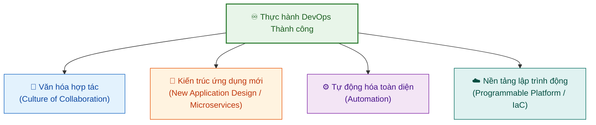

# Định nghĩa về DevOps (Definition of DevOps)

Tài liệu này tóm tắt bài học **Definition of DevOps** trong **Module 4: DevOps and CI-CD** thuộc khóa học **Cloud Native, Microservices, Containers, DevOps, and Agile** của IBM.

---

## 1. Nguồn gốc & Bối cảnh ra đời (Inception of DevOps)

* **Patrick Debois (2009)** là người đưa ra thuật ngữ **"Development Operations" (DevOps)**.
* **Định nghĩa ban đầu**: *"DevOps là một sự mở rộng của môi trường phát triển Agile nhằm nâng cao toàn bộ quy trình phân phối phần mềm (software delivery)."*
* **Bối cảnh thực tế**:
  * **Agile** đã thay đổi và tối ưu hóa cách các lập trình viên (**Dev**) làm việc (lặp nhanh, phản hồi liên tục).
  * Tuy nhiên, Agile ban đầu **gần như không tác động hay hỗ trợ gì cho đội Vận hành (Ops)**.
  * Vì vậy, DevOps bản chất chính là **"Agile for Ops"** — áp dụng các nguyên lý Agile & Lean cho cả vận hành để Dev và Ops cùng hướng tới một mục tiêu chung, chấm dứt tình trạng làm việc biệt lập trong các "silo" (*working in silos*).

---

## 2. Bản chất và Định nghĩa cốt lõi của DevOps

> **DevOps** là thực hành trong đó các kỹ sư phát triển (*Development*) và kỹ sư vận hành (*Operations*) **cùng làm việc với nhau xuyên suốt toàn bộ vòng đời phát triển phần mềm (SDLC)**, tuân theo các nguyên lý **Lean & Agile** nhằm phân phối phần mềm một cách **nhanh chóng (rapid) và liên tục (continuous)** với độ ổn định cao.

### 4 Yếu tố cốt lõi để triển khai DevOps thành công:

1. **Văn hóa hợp tác (Culture of Collaboration)**:
   * Xây dựng môi trường dựa trên sự cởi mở (*openness*), tin tưởng (*trust*) và minh bạch (*transparency*).
2. **Kiến trúc ứng dụng hiện đại (Modern Application Design)**:
   * Chuyển đổi từ các khối nguyên khối (*monolith*) khó deploy nhiều lần/ngày sang kiến trúc vi dịch vụ (*Microservices*).
   * Thay đổi nhỏ ở một chức năng không bắt buộc phải deploy lại toàn bộ hệ thống.
3. **Tự động hóa (Automation)**:
   * Khi chia nhỏ thành hàng trăm microservices, con người không thể triển khai thủ công.
   * Tự động hóa giúp tăng tốc, đảm bảo tính nhất quán, đem lại cả **tốc độ (speed)** lẫn **sự ổn định (stability)**.
4. **Nền tảng hạ tầng lập trình được (Dynamic Programmable Platform)**:
   * Sử dụng nền tảng Cloud/Hạ tầng định nghĩa bằng phần mềm (*Infrastructure as Code - IaC*).
   * Cung cấp môi trường tức thì (*on-demand*), loại bỏ việc phải chờ đợi vài ngày/vài tuần để cấp phát và cấu hình máy chủ vật lý.

---

## 3. Hiểu đúng: DevOps KHÔNG PHẢI là gì? (What DevOps is NOT)

Bài học nhấn mạnh các ngộ nhận phổ biến trong doanh nghiệp:

| Điều ngộ nhận | Bản chất thực tế của DevOps |
| :--- | :--- |
| **❌ DevOps là một đội riêng biệt (*DevOps Team*)** | **Không tạo ra một đội DevOps riêng biệt.** Giống như Agile (không ai tạo "đội Agile"), cả tổ chức cùng chuyển đổi. DevOps là sự cộng tác thống nhất giữa Dev và Ops. |
| **❌ DevOps là một công cụ (*A Tool*)** | **Công cụ chỉ hỗ trợ văn hóa, không tạo nên văn hóa.** Bạn không thể mua một bộ công cụ rồi tự nhận mình đã là DevOps. |
| **❌ DevOps là một công thức chung (*One-size-fits-all*)** | Không có chiến lược duy nhất cho mọi công ty. Doanh nghiệp cần linh hoạt tùy theo sản phẩm mình cung cấp (SaaS, phần mềm đóng gói, dịch vụ số,...). |
| **❌ DevOps chỉ là Tự động hóa Ops (*Ops Automation*)** | Thuê một kỹ sư công cụ để tự động hóa việc của Ops trong khi Dev vẫn làm việc theo cách cũ không phải là DevOps. |

---

## 4. Tóm tắt ghi nhớ (Key Takeaway)

> **"DevOps: One word, one team, one set of measurements."**
> 
> * DevOps không phải là Dev và Ops ngồi làm việc cạnh nhau nhưng vẫn giữ tư duy "ốc đảo" (*silos*).
> * DevOps là một **sự chuyển dịch văn hóa toàn diện** nơi Dev và Ops hợp tác xuyên suốt toàn bộ vòng đời phần mềm với cùng một mục tiêu và bộ đo lường chung.
