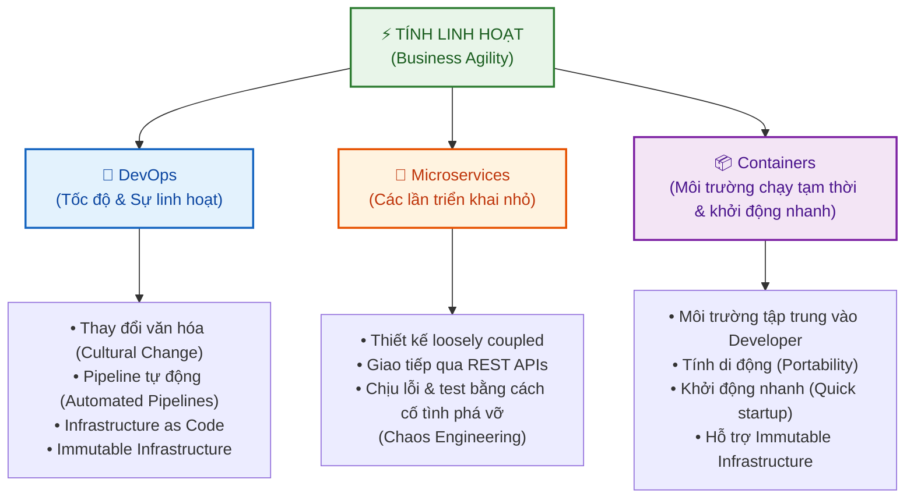
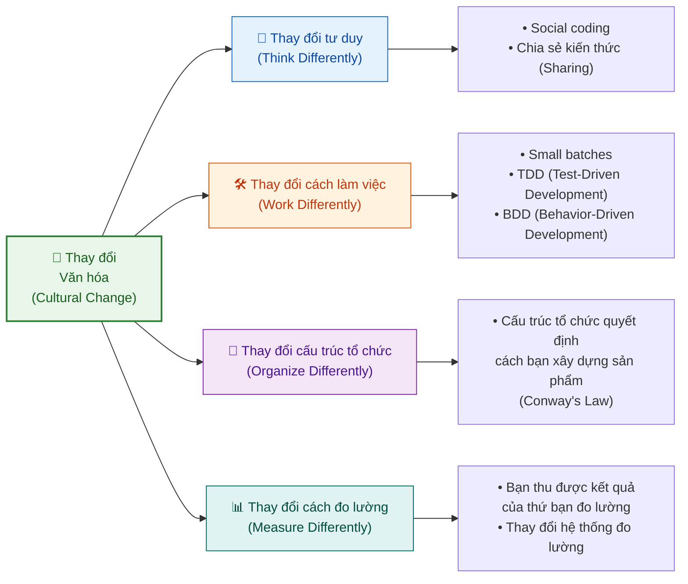

# Các Đặc Trưng Cốt Lõi của DevOps (Essential Characteristics of DevOps)

Tài liệu này tóm tắt bài học **Essential Characteristics of DevOps** trong **Module 4: DevOps and CI-CD** thuộc khóa học **Cloud Native, Microservices, Containers, DevOps, and Agile** của IBM.

---

## 1. Ba Trụ Cột của Tính Linh Hoạt (Three Pillars of Agility)

Để thành công trên thị trường cạnh tranh, doanh nghiệp phải có tính **Agile**: di chuyển nhanh và chấp nhận rủi ro tối thiểu. Ba trụ cột sau đây cùng nhau tạo nên tính linh hoạt đó:



| Trụ cột | Vai trò |
| :--- | :--- |
| **DevOps** | Mang lại **tốc độ (speed) & sự linh hoạt (agility)** cho toàn bộ quá trình phân phối |
| **Microservices** | Cho phép **triển khai độc lập từng phần nhỏ** mà không ảnh hưởng toàn hệ thống |
| **Containers** | Cung cấp **môi trường chạy nhẹ, tạm thời (ephemeral)** với thời gian khởi động cực nhanh |

> 🔑 **Sức mạnh thực sự** không nằm ở từng công nghệ riêng lẻ, mà khi **kết hợp cả ba trụ cột lại với nhau** — đó là lúc sự thay đổi thực sự xảy ra.

---

## 2. Ba Chiều Kích của DevOps (Three Dimensions of DevOps)

DevOps không chỉ là công cụ. Nó bao gồm **3 chiều kích** theo thứ tự ưu tiên:

```mermaid
pyramid
    title Thứ Tự Ưu Tiên trong DevOps
```

| Thứ tự ưu tiên | Chiều kích | Ghi chú |
| :---: | :--- | :--- |
| 🥇 **Quan trọng nhất** | **Văn hóa (Culture)** | Nền tảng của mọi tổ chức DevOps hiệu suất cao |
| 🥈 Quan trọng | **Phương pháp (Methods)** | Cách thức làm việc: TDD, BDD, small batches,... |
| 🥉 Hỗ trợ | **Công cụ (Tools)** | Tự động hóa pipeline, CI/CD,... |

> ⚠️ Hầu hết các công ty và nhà cung cấp chỉ tập trung vào **công cụ** vì đó là thứ có thể bán được. Nhưng **Văn hóa mới là yếu tố thành công số 1 của DevOps.**

---

## 3. Tại Sao Văn Hóa Là Yếu Tố Quan Trọng Nhất? (Culture is #1)

**Atlassian** khẳng định:

> *"Culture is the number one success factor in DevOps. Building a culture of shared responsibility, transparency, and faster feedback is the foundation of every high-performing DevOps team."*

* **Văn hóa** bao gồm ngôn ngữ, giá trị, câu chuyện và phương thức làm việc đặc trưng của tổ chức.
* Nhiều doanh nghiệp cố gắng chuyển đổi DevOps nhưng **thất bại vì không thay đổi được văn hóa**.
* **Điều kiện để thay đổi văn hóa thành công**: Phải đến từ **trên xuống (top-down)** và được chấp nhận từ **dưới lên (bottom-up)**.

---

## 4. Cách Thay Đổi Văn Hóa (How to Change Culture)

Thay đổi văn hóa đòi hỏi 4 sự chuyển dịch song song:



1. **Thay đổi tư duy (*Think Differently*)**: Áp dụng tư duy *social coding* — chia sẻ code, chia sẻ trách nhiệm.
2. **Thay đổi cách làm việc (*Work Differently*)**: Làm việc theo từng lô nhỏ (*small batches*), áp dụng **TDD** (Test-Driven Development) và **BDD** (Behavior-Driven Development).
3. **Thay đổi cấu trúc tổ chức (*Organize Differently*)**: Cơ cấu tổ chức trực tiếp ảnh hưởng đến cách xây dựng sản phẩm (**Conway's Law**). Nhiều công ty bỏ qua điều này và thất bại.
4. **Thay đổi cách đo lường (*Measure Differently*)**: *"You always get what you measure"* — đo lường điều sai sẽ dẫn đến kết quả sai. Phải thay đổi hệ thống KPI/đo lường để khuyến khích đúng hành vi.

---

## 5. Tổng Kết: Các Đặc Trưng Cốt Lõi của DevOps (Summary)

Để trở thành một tổ chức DevOps hiệu suất cao, cần thay đổi đồng thời về **văn hóa, phương pháp và công cụ**. Các đặc trưng cốt lõi bao gồm:

| # | Đặc trưng | Mô tả |
| :---: | :--- | :--- |
| 1 | **Thay đổi văn hóa** (*Cultural Change*) | Hợp tác, minh bạch, trách nhiệm chung |
| 2 | **Pipeline tự động** (*Automated Pipelines*) | CI/CD: build, test, deploy tự động |
| 3 | **Hạ tầng như là Code** (*Infrastructure as Code*) | Quản lý hạ tầng bằng code, tái sử dụng được |
| 4 | **Microservices** | Dịch vụ nhỏ, độc lập, giao tiếp qua REST APIs |
| 5 | **Containers** | Môi trường nhẹ, tính di động cao, khởi động nhanh |
| 6 | **Hạ tầng bất biến** (*Immutable Infrastructure*) | Không sửa server hiện có; thay thế hoàn toàn khi deploy |
